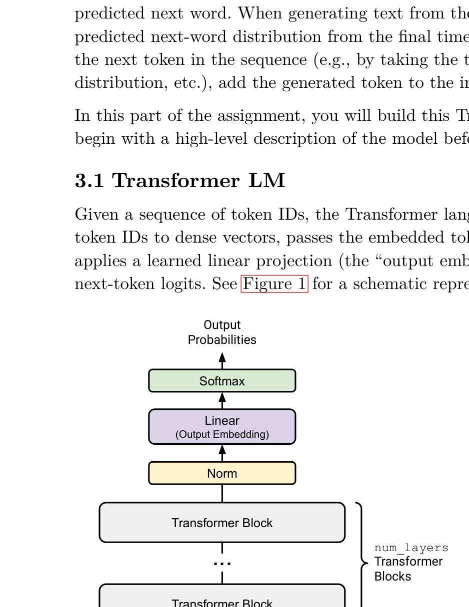
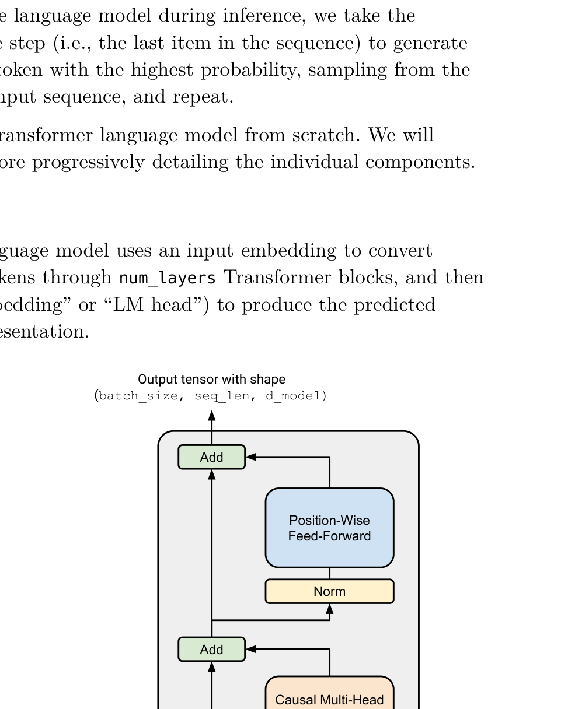

# CS336 Assignment 1 - Part 4: Transformer 基础组件

> 对应原始 PDF Section 3.1-3.3 (pages 13-19)

## 3 Transformer 语言模型架构

语言模型接收整数 token ID 的批量序列作为输入（shape 为 `(batch_size, sequence_length)` 的 `torch.Tensor`），输出词汇表上的（批量）归一化概率分布（shape 为 `(batch_size, sequence_length, vocab_size)` 的 PyTorch Tensor）。

- **训练时**：计算模型预测分布与真实 token 之间的交叉熵损失
- **推理时**：从最后一个位置的预测分布中采样下一个 token

---

## 3.1 Transformer LM

Transformer 语言模型的整体架构如下：

1. **Token Embedding**：将 token ID 映射为向量表示
2. **num_layers 个 Transformer Block**：堆叠的 Transformer 层
3. **最终 Layer Norm**：最后一个 Transformer block 的输出经过 RMSNorm
4. **Output Embedding (LM Head)**：线性变换将隐藏状态映射到词汇表大小的 logits
5. **Logits**：未归一化的对数概率



*Figure 1: Transformer 语言模型的整体架构。输入 token ID 通过 embedding 层映射为向量，经过多个 Transformer block 处理后，通过最终 layer norm 和线性变换得到词汇表上的 logits。*



*Figure 2: 单个 Transformer block 的内部结构。每个 block 包含两个子层：multi-head self-attention 和 position-wise feed-forward network，每个子层前有 RMSNorm，子层输出通过残差连接。*

### Token Embeddings

Token embedding 层将 token ID 的批量序列嵌入为向量序列。

- **输入 shape**: `(batch_size, sequence_length)` — 每个元素是一个整数 token ID
- **输出 shape**: `(batch_size, sequence_length, d_model)` — 每个 token 被映射为一个 d_model 维的向量

### Pre-norm Transformer Block

模型包含 `num_layers` 个结构相同的 Transformer block。每个 block 的输入和输出 shape 均为 `(batch_size, sequence_length, d_model)`。

每个 block 包含两个主要操作：
1. **Self-Attention**：通过注意力机制聚合序列中不同位置的信息
2. **Feed-Forward Network (FFN)**：对每个位置独立进行非线性变换

最后一个 Transformer block 的输出经过 RMSNorm 归一化，然后通过一个线性变换（不带偏置）将 `d_model` 维隐藏状态映射为 `vocab_size` 维的 logits。

---

## 3.2 Batching, Einsum 和高效计算

### Einstein Summation (Einsum)

`einsum` 是一种简洁而强大的记法，可以表达各种张量运算（矩阵乘法、外积、转置、迹等）。推荐使用 `einsum` 替代手动的 `view`/`reshape`/`transpose` 操作，因为 `einsum` 更具自文档性 (self-documenting) 且不易出错。

在 PyTorch 中，batch-like dimensions 放在前面。我们推荐使用 `einops` 库，它提供了更具可读性的 `einsum` 和 `rearrange` 接口。

### Example (einstein_example1): 使用 einops.einsum 的批量矩阵乘法

```python
import torch
from einops import rearrange, einsum

## 基本实现
Y = D @ A.T

## Einsum 更具自文档性且更健壮
Y = einsum(D, A, "batch sequence d_in, d_out d_in -> batch sequence d_out")

## 或者，使用 ... 表示任意数量的 batch dimensions
Y = einsum(D, A, "... d_in, d_out d_in -> ... d_out")
```

### Example (einstein_example2): 使用 einops.rearrange 的广播操作

```python
images = torch.randn(64, 128, 128, 3)  # (batch, height, width, channel)
dim_by = torch.linspace(start=0.0, end=1.0, steps=10)

## 手动 reshape 并乘法
dim_value = rearrange(dim_by, "dim_value -> 1 dim_value 1 1")
images_rearr = rearrange(images, "b height width channel -> b 1 height width channel")
dimmed_images = images_rearr * dim_value

## 或者用 einsum 一步完成：
dimmed_images = einsum(
    images, dim_by,
    "batch height width channel, dim_value -> batch dim_value height width channel"
)
```

### Example (einstein_example3): 使用 einops.rearrange 的像素混合

```python
import torch
from einops import einsum, rearrange

images = torch.randn(64, 128, 128, 3)  # channels last: (batch, height, width, channel)
B = torch.randn(3, 3)  # 3x3 混合矩阵

## 原始 PyTorch：需要手动转换维度顺序
images_cf = images.permute(0, 3, 1, 2)  # (batch, channel, height, width)
result_cf = torch.mm(B, images_cf.reshape(3, -1)).reshape(images_cf.shape)
result = result_cf.permute(0, 2, 3, 1)

## einops：一步完成
result = einsum(images, B, "batch height width c_in, c_out c_in -> batch height width c_out")

## einx.dot 写法（更简洁）
import einx
result = einx.dot("b h w [c_in], [c_out c_in]", images, B)
```

---

## 3.2.1 数学记法和内存顺序

线性变换可以用两种等价的记法表示：

**行向量记法**（PyTorch 默认内存布局）：

$$\mathbf{y}^\top = \mathbf{x}^\top W^\top \tag{1}$$

**列向量记法**（本作业使用的数学记法）：

$$\mathbf{y} = W \mathbf{x} \tag{2}$$

对于批量输入 $X \in \mathbb{R}^{d_\text{model} \times \text{seq\_len}}$：

$$Y = W X \tag{3}$$

**本作业使用列向量数学记法**，但 PyTorch 使用行优先内存顺序。这意味着在 PyTorch 代码中，线性变换写作 `x @ W.T` 或等价地使用 einsum。

**类型提示**：可以使用 `jaxtyping` 库为 Tensor 添加 shape 类型提示：

```python
from jaxtyping import Float
import torch

def my_function(x: Float[torch.Tensor, "batch seq d_model"]) -> Float[torch.Tensor, "batch seq d_out"]:
    ...
```

---

## 3.3.1 参数初始化

不同类型的参数使用不同的初始化方式：

| 参数类型 | 初始化方式 |
|---|---|
| Linear 权重 | $\mathcal{N}(\mu=0, \sigma^2=\frac{2}{d_\text{in}+d_\text{out}})$，截断到 $[-3\sigma, 3\sigma]$ |
| Embedding 权重 | $\mathcal{N}(\mu=0, \sigma^2=1)$，截断到 $[-3, 3]$ |
| RMSNorm gain | 初始化为 1 |

使用 `torch.nn.init.trunc_normal_` 进行截断正态分布初始化：

```python
import torch

# Linear 权重初始化示例
std = (2.0 / (d_in + d_out)) ** 0.5
torch.nn.init.trunc_normal_(weight, mean=0.0, std=std, a=-3*std, b=3*std)

# Embedding 权重初始化示例
torch.nn.init.trunc_normal_(embedding, mean=0.0, std=1.0, a=-3.0, b=3.0)
```

---

## 3.3.2 Linear Module

### Problem (linear): Implementing the Linear Module (1 point)

实现自定义的 Linear 模块（不使用 `nn.Linear` 或 `nn.functional.linear`）。

```python
class Linear(nn.Module):
    def __init__(
        self,
        in_features: int,
        out_features: int,
        device: torch.device | None = None,
        dtype: torch.dtype | None = None,
    ):
        """
        线性变换模块。

        Args:
            in_features: int
                输入张量最后一维的大小。
            out_features: int
                输出张量最后一维的大小。
            device: torch.device | None = None
                参数存储的设备。
            dtype: torch.dtype | None = None
                参数的数据类型。
        """
        ...

    def forward(self, x: torch.Tensor) -> torch.Tensor:
        """
        前向传播：计算 y = Wx（列向量记法）。

        Args:
            x: torch.Tensor  输入张量，最后一维大小为 in_features。

        Returns:
            torch.Tensor  输出张量，最后一维大小为 out_features。
        """
        ...
```

**注意事项**：
- 继承 `nn.Module`，调用父类的 `__init__` 方法
- 权重矩阵 $W$ 的 shape 为 `(out_features, in_features)`（**不是** $W^\top$）
- 将权重存储为 `nn.Parameter`
- **不要**使用 `nn.Linear` 或 `nn.functional.linear`
- 使用 `torch.nn.init.trunc_normal_` 初始化权重
- 不包含偏置项 (bias)

**测试方法**：

```bash
# 通过 adapter 运行
adapters.run_linear

# 运行测试
uv run pytest -k test_linear
```

---

## 3.3.3 Embedding Module

### Problem (embedding): Implement the Embedding Module (1 point)

实现自定义的 Embedding 模块（不使用 `nn.Embedding` 或 `nn.functional.embedding`）。

```python
class Embedding(nn.Module):
    def __init__(
        self,
        num_embeddings: int,
        embedding_dim: int,
        device: torch.device | None = None,
        dtype: torch.dtype | None = None,
    ):
        """
        嵌入模块：将整数 token ID 映射为密集向量。

        Args:
            num_embeddings: int
                词汇表大小（嵌入字典的行数）。
            embedding_dim: int
                每个嵌入向量的维度，即 d_model。
            device: torch.device | None = None
                参数存储的设备。
            dtype: torch.dtype | None = None
                参数的数据类型。
        """
        ...

    def forward(self, token_ids: torch.Tensor) -> torch.Tensor:
        """
        前向传播：查找 token ID 对应的嵌入向量。

        Args:
            token_ids: torch.Tensor
                整数 token ID 张量，shape 为 (batch_size, sequence_length)。

        Returns:
            torch.Tensor
                嵌入向量张量，shape 为 (batch_size, sequence_length, embedding_dim)。
        """
        ...
```

**注意事项**：
- 继承 `nn.Module`
- 嵌入矩阵存储为 `nn.Parameter`，shape 为 `(num_embeddings, embedding_dim)`（`d_model` 为最后一维）
- **不要**使用 `nn.Embedding` 或 `nn.functional.embedding`
- 使用截断正态分布初始化：$\mathcal{N}(0, 1)$，截断到 $[-3, 3]$

**测试方法**：

```bash
# 通过 adapter 运行
adapters.run_embedding

# 运行测试
uv run pytest -k test_embedding
```
