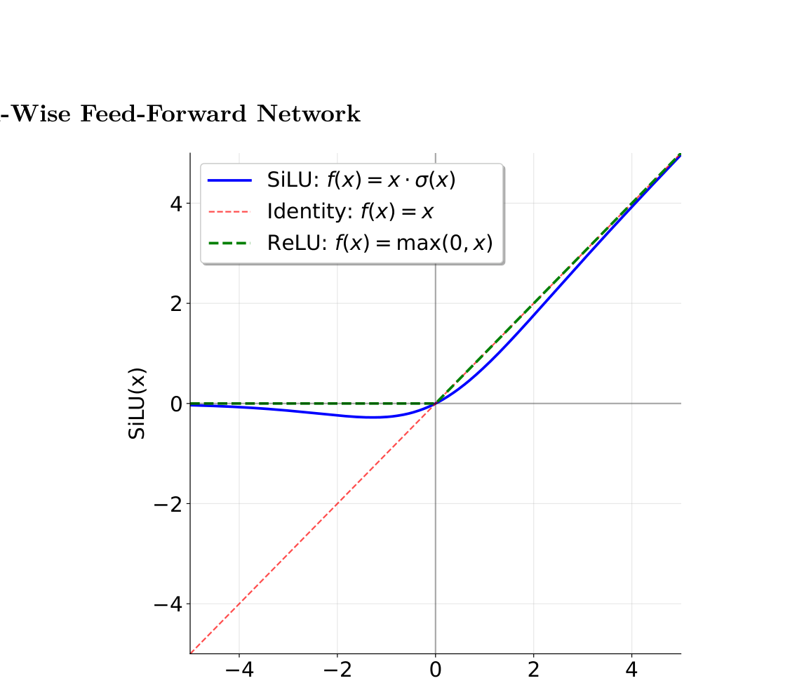

# CS336 Assignment 1 - Part 6: Position-Wise Feed-Forward Network

> 对应原始 PDF Section 3.4.2 (pages 21-22)

## 3.4.2 Position-Wise Feed-Forward Network

### 背景

原始 Transformer（Vaswani et al. [8] section 3.3）中的 Feed-Forward Network (FFN) 由两个线性变换和一个 ReLU 激活函数组成，内层维度 (intermediate dimension) 通常设为输入维度的 4 倍。

现代大型语言模型在 FFN 上做了两个主要改进：

1. **使用不同的激活函数**：用 SiLU (Swish) 替代 ReLU
2. **采用门控机制**：引入 Gated Linear Units (GLU)

我们将实现 **Llama 3** (Grattafiori et al., 2024) 和 **Qwen 2.5** (Yang et al., 2024) 采用的 **"SwiGLU"** 激活函数，它结合了 SiLU 和 GLU。

---

### SiLU (Swish) 激活函数

SiLU (Sigmoid Linear Unit)，也称为 Swish（Hendrycks et al., 2016; Elfwing et al., 2017），定义为：

$$\text{SiLU}(x) = x \cdot \sigma(x) = \frac{x}{1 + e^{-x}}$$

其中 $\sigma(x)$ 是 sigmoid 函数。



*Figure 3: SiLU 与 ReLU 的对比。SiLU 类似 ReLU 但在零点附近是平滑的，没有 ReLU 的不连续导数。SiLU 在负值区域有一个小的负弯曲，而不是像 ReLU 那样直接截断为零。*

---

### Gated Linear Units (GLU)

Gated Linear Units（Dauphin et al. [19]）引入了门控机制：

$$\text{GLU}(\mathbf{x}, W_1, W_2) = \sigma(W_1 \mathbf{x}) \odot W_2 \mathbf{x}$$

其中 $\odot$ 表示逐元素乘法 (element-wise multiplication / Hadamard product)。

GLU 的核心思想是通过一个"门" $\sigma(W_1 \mathbf{x})$ 来控制信息流。这提供了一条**线性梯度路径** (linear gradient path)，有助于缓解深层架构中的梯度消失问题。

---

### SwiGLU

SwiGLU 将 SiLU 激活函数和 GLU 门控机制结合在一起：

$$\text{FFN}(\mathbf{x}) = \text{SwiGLU}(\mathbf{x}, W_1, W_2, W_3) = W_2 \big( \text{SiLU}(W_1 \mathbf{x}) \odot W_3 \mathbf{x} \big)$$

其中：
- $\mathbf{x} \in \mathbb{R}^{d_\text{model}}$ — 输入向量
- $W_1 \in \mathbb{R}^{d_\text{ff} \times d_\text{model}}$ — 第一个线性变换权重（门控路径）
- $W_3 \in \mathbb{R}^{d_\text{ff} \times d_\text{model}}$ — 第三个线性变换权重（值路径）
- $W_2 \in \mathbb{R}^{d_\text{model} \times d_\text{ff}}$ — 第二个线性变换权重（输出投影）

**计算流程**：
1. 将输入 $\mathbf{x}$ 分别通过 $W_1$ 和 $W_3$ 做线性变换
2. 对 $W_1 \mathbf{x}$ 的结果应用 SiLU 激活
3. 将 SiLU 的输出与 $W_3 \mathbf{x}$ 逐元素相乘（门控）
4. 通过 $W_2$ 做最终线性变换，投影回 $d_\text{model}$ 维

### $d_\text{ff}$ 的选择

标准设置下，$d_\text{ff}$ 约为 $\frac{8}{3} \times d_\text{model}$。

> **注意**：在实际实现中，$d_\text{ff}$ 通常取 **64 的整数倍**，以保证硬件计算效率（GPU/TPU 的矩阵运算在维度为 64 倍数时最高效）。

### Shazeer 的名言

Shazeer [20] 在提出 SwiGLU 的论文中写道：

> "We offer no explanation as to why these architectures seem to work; we attribute their success, as all else, to divine benevolence."
>
> （"我们无法解释为什么这些架构似乎能work；我们将它们的成功，如同万物一样，归因于上天的仁慈。"）

---

### Problem (positionwise_feedforward): Implement the Position-Wise Feed-Forward Network (2 points)

实现基于 SwiGLU 的 position-wise feed-forward network（SiLU 激活 + GLU 门控）。

```python
class SwiGLU(nn.Module):
    def __init__(
        self,
        d_model: int,
        d_ff: int | None = None,
        device: torch.device | None = None,
        dtype: torch.dtype | None = None,
    ):
        """
        SwiGLU Feed-Forward Network.

        Args:
            d_model: int
                模型隐藏维度大小。
            d_ff: int | None
                FFN 内层维度。
                如果为 None，则设为约 8/3 * d_model，
                同时确保是 64 的倍数。
            device: torch.device | None = None
                参数存储的设备。
            dtype: torch.dtype | None = None
                参数的数据类型。
        """
        ...

    def forward(self, x: torch.Tensor) -> torch.Tensor:
        """
        前向传播。

        计算: W2 * (SiLU(W1 @ x) * (W3 @ x))

        Args:
            x: torch.Tensor
                输入张量，shape 为 (..., d_model)。

        Returns:
            torch.Tensor
                输出张量，shape 为 (..., d_model)。
        """
        ...
```

**实现要点**：

1. **三个线性变换**：
   - $W_1$: `(d_ff, d_model)` — 门控路径
   - $W_3$: `(d_ff, d_model)` — 值路径
   - $W_2$: `(d_model, d_ff)` — 输出投影
   
2. **SiLU 激活**：可以使用 `torch.sigmoid` 手动实现 $\text{SiLU}(x) = x \cdot \sigma(x)$，这样可以保证数值稳定性。也可以使用 `torch.nn.functional.silu`。

3. **$d_\text{ff}$ 计算**：如果未指定 `d_ff`，按以下方式计算：
   ```python
   d_ff = int(8 / 3 * d_model)
   # 向上取整到 64 的倍数
   d_ff = ((d_ff + 63) // 64) * 64
   ```

4. **使用之前实现的 Linear 模块**（不使用 `nn.Linear`）。

5. **权重初始化**：使用与 Linear 模块相同的截断正态分布初始化。

**测试方法**：

```bash
# 通过 adapter 运行
adapters.run_swiglu

# 运行测试
uv run pytest -k test_swiglu
```
