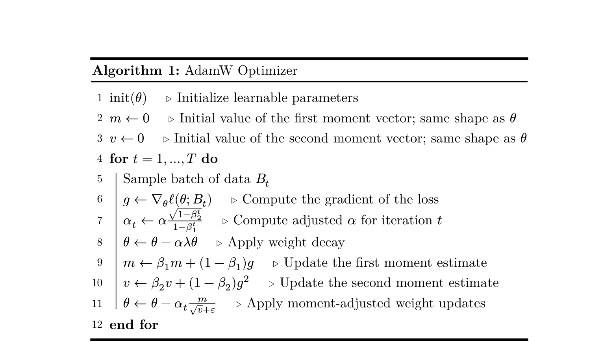

# 4.1-4.3 Loss 函数与优化器

## Section 4: 训练 Transformer LM

训练流程的三大组成部分：
1. **Loss 函数** — 交叉熵 (Cross-entropy)
2. **Optimizer** — AdamW
3. **Training loop** — 加载数据、保存 checkpoint、管理训练过程

---

## 4.1 Cross-Entropy Loss

### 交叉熵损失函数

对数据集 $D$ 上的损失（公式 16）：

$$\ell(\theta; D) = \frac{1}{|D| \cdot m} \sum_{x \in D} \sum_{i=1}^{m} -\log p_\theta(x_{i+1} \mid x_{1:i})$$

其中条件概率由 softmax 给出（公式 17）：

$$p(x_{i+1} \mid x_{1:i}) = \text{softmax}(o_i)[x_{i+1}] = \frac{\exp(o_i[x_{i+1}])}{\sum_{a=1}^{\text{vocab\_size}} \exp(o_i[a])}$$

> **注意：** 实现时需要特别关注数值稳定性。

---

### Problem: 实现 Cross-Entropy (1 point)

计算每个位置的损失 $\ell_i = -\log \text{softmax}(o_i)[x_{i+1}]$。

**要求：**
- 减去最大元素以保证数值稳定性
- 尽可能消除 $\log$ 和 $\exp$ 的冗余计算（提示：$\log(\exp(\cdot))$ 可以简化）
- 能够处理额外的 batch 维度，返回整个 batch 的平均值
- 输入张量中，batch-like 维度在前，`vocab_size` 维度在最后

**测试：**
- Adapter: `adapters.run_cross_entropy`
- 测试命令：

```bash
uv run pytest -k test_cross_entropy
```

---

### Perplexity（困惑度）

Perplexity 是交叉熵损失的指数形式（公式 18）：

$$\text{perplexity} = \exp\left(\frac{1}{m} \sum_{i=1}^{m} \ell_i\right)$$

Perplexity 可以直观理解为模型在每一步"困惑"于多少个 token 之间。

---

## 4.2 SGD Optimizer

### SGD 更新规则

随机梯度下降的更新规则（公式 19）：

$$\theta_{t+1} \leftarrow \theta_t - \alpha_t \nabla L(\theta_t; B_t)$$

其中 $\alpha_t$ 是学习率，$B_t$ 是当前 mini-batch。

### PyTorch Optimizer API

PyTorch Optimizer 子类需要实现两个方法：
- `__init__` — 初始化超参数
- `step` — 执行一步参数更新

以下是完整的 SGD 示例代码（带学习率衰减，公式 20：$\alpha_t = \alpha / \sqrt{t+1}$）：

```python
from collections.abc import Callable, Iterable
from typing import Optional
import torch
import math

class SGD(torch.optim.Optimizer):
    def __init__(self, params, lr=1e-3):
        if lr < 0:
            raise ValueError(f"Invalid learning rate: {lr}")
        defaults = {"lr": lr}
        super().__init__(params, defaults)

    def step(self, closure: Optional[Callable] = None):
        loss = None if closure is None else closure()
        for group in self.param_groups:
            lr = group["lr"]
            for p in group["params"]:
                if p.grad is None:
                    continue
                state = self.state[p]
                t = state.get("t", 0)
                grad = p.grad.data
                p.data -= lr / math.sqrt(t + 1) * grad
                state["t"] = t + 1
        return loss
```

### 训练循环示例

```python
weights = torch.nn.Parameter(5 * torch.randn((10, 10)))
opt = SGD([weights], lr=1)

for t in range(100):
    opt.zero_grad()
    loss = (weights**2).mean()
    print(loss.cpu().item())
    loss.backward()
    opt.step()
```

---

### Problem: 调优学习率 (1 point)

用三个学习率（`1e1`, `1e2`, `1e3`）运行上面的 SGD 示例各 **10 次迭代**。观察每个学习率下 loss 的行为。

**Deliverable**: 一到两句话描述你的观察结果。

---

## 4.3 AdamW

### 概述

AdamW (Loshchilov et al. [23]) 是 Adam (Kingma et al. [22]) 的改进版本，添加了 **weight decay 正则化**。

AdamW 是**有状态的**：对每个参数维护以下运行估计：
- **一阶矩 ($m$)** — 梯度的指数移动平均
- **二阶矩 ($v$)** — 梯度平方的指数移动平均

### 超参数

| 超参数 | 含义 |
|--------|------|
| $\alpha$ | 学习率 |
| $\beta_1, \beta_2$ | 动量参数（矩估计的衰减率）|
| $\lambda$ | Weight decay 系数 |
| $\varepsilon$ | 数值稳定性常数 |

### Algorithm 1: AdamW Optimizer



**伪代码：**

```
1.  init(θ)                              // 初始化可学习参数
2.  m ← 0                               // 一阶矩向量初始值
3.  v ← 0                               // 二阶矩向量初始值
4.  for t = 1, ..., T do
5.      采样 batch B_t
6.      g ← ∇_θ ℓ(θ; B_t)              // 计算梯度
7.      α_t ← α · √(1 - β₂ᵗ) / (1 - β₁ᵗ) // 计算 bias-corrected 学习率
8.      θ ← θ - α λ θ                   // 应用 weight decay
9.      m ← β₁ m + (1 - β₁) g           // 更新一阶矩估计
10.     v ← β₂ v + (1 - β₂) g²          // 更新二阶矩估计
11.     θ ← θ - α_t · m / √(v + ε)      // 应用矩调整的权重更新
12. end for
```

> **注意：** $t$ 从 **1** 开始（不是 0）。

---

### Problem: 实现 AdamW (2 points)

将 AdamW 实现为 `torch.optim.Optimizer` 子类。

**要求：**
- `__init__` 接受超参数 $\alpha$, $(\beta_1, \beta_2)$, $\varepsilon$, $\lambda$
- 使用 `self.state` 存储每个参数的矩估计（$m$ 和 $v$）

**测试：**
- Adapter: `adapters.get_adamw_cls`
- 测试命令：

```bash
uv run pytest -k test_adamw
```

---

### Problem: AdamW 训练资源计算 (2 points)

假设所有张量使用 **float32**（每个元素 4 字节）。

**(a) 峰值内存分解**

列出峰值内存的各组成部分：

| 组件 | 说明 |
|------|------|
| **参数** | 模型所有可学习参数 |
| **梯度** | 每个参数对应的梯度 |
| **优化器状态** | AdamW 的一阶矩 $m$ 和二阶矩 $v$ |
| **激活** | 前向传播中需要保留用于反向传播的中间结果 |

激活需要考虑 Transformer block 的各组件：

**Attention 子层：**
- RMSNorm 输出
- QKV 投影
- $QK^T$ 注意力分数
- Softmax 输出
- 加权求和（Attention × V）
- 输出投影

**SwiGLU FFN 子层：**
- $W_1 x$, $W_2 x$（两个并行线性层）
- SiLU 激活
- 逐元素乘法
- $W_3$ 输出投影

**顶层：**
- 最终 RMSNorm
- Output embedding (LM head)
- Cross-entropy 相关

假设 $d_{ff} = \frac{8}{3} \times d_{model}$。

**(b)** 使用 GPT-2 XL 配置代入，得到只依赖 `batch_size` 的表达式。在 **80GB 内存**限制下，最大 `batch_size` 是多少？

**(c)** AdamW 优化器一步更新（step）需要多少 FLOPs？

**(d) MFU (Model FLOPs Utilization) 计算**

$$\text{MFU} = \frac{\text{观测吞吐量 (FLOP/s)}}{\text{硬件理论峰值 (FLOP/s)}}$$

已知条件：
- NVIDIA H100 理论峰值：**495 TF/s**（float32，实际为 TensorFloat-32 即 bfloat19 精度）
- 假设 **50% MFU**
- 反向传播 FLOPs ≈ **2× 前向传播 FLOPs**

问题：训练 GPT-2 XL **400K steps**，`batch_size = 1024`，需要多长时间？
