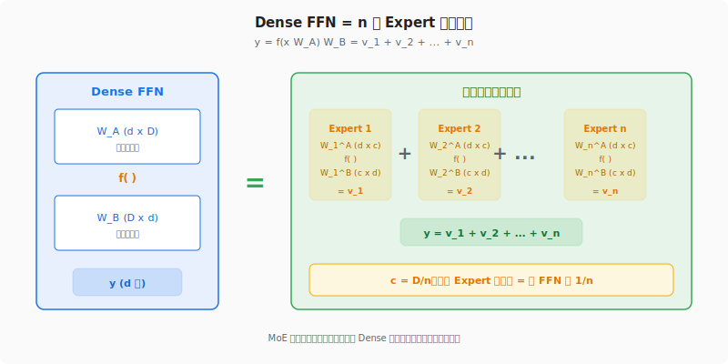
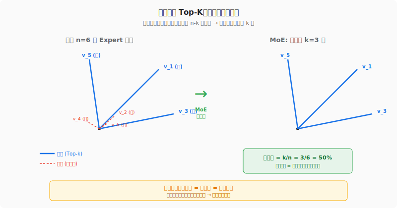
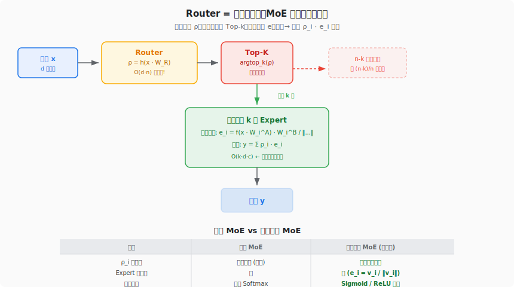

# MoE 环游记 #1：从几何意义出发

> 原文：[MoE环游记：1、从几何意义出发](https://kexue.fm/archives/10699)
> 作者：苏剑林（Jianlin Su）
> 发表日期：2025-02-08
> 系列定位：奠基篇——用几何直觉重新理解 MoE 的本质

---

## 一、这篇文章要解决什么问题？

MoE（Mixture of Experts）在 2024-2025 年爆发式流行——DeepSeek-V3、GPT-4（传闻）、Mixtral 等大模型纷纷采用。MoE 的优势人尽皆知：**参数量大，但训练和推理成本低**（只激活 top-k 个 expert）。

但一个根本性的问题始终没有被清晰回答：

> **为什么 top-k 选择能 work？Router 凭什么能学会正确排序 expert？**

传统解释是"Router 学会了给相关 expert 打高分"，但这是循环论证——我们在问"为什么它能学会"，答案却是"因为它学会了"。苏剑林在第一篇文章中给出了一个**从几何学出发的严格推导**，让 MoE 的合理性有了理论根基。

## 二、思想源泉：从低秩近似到向量选择

### 2.1 低秩近似的启发

苏剑林在文章中引用了自己更早的文章《低秩近似之路（三）：CR》，这个系列讨论的是矩阵分解中的 Column-Row 分解问题：给定一个大矩阵，如何选择少量列（或行）来近似整个矩阵？

这个问题的数学形式是：从 n 个列向量中挑 k 个，使得它们的线性组合尽可能逼近全部 n 个列向量的和。这恰好就是 MoE 要做的事——从 n 个 expert 中挑 k 个来近似 Dense 模型的输出。

### 2.2 概率采样的连接

在低秩近似理论中，有两种选择策略：

1. **确定性选择**：挑"最重要"的 k 个（本文主线）
2. **依概率采样**：按某种概率分布随机选 k 个（方差最小 → 概率正比于模长）

两种策略殊途同归——**都指向"按模长排序"**。这不是巧合，而是因为模长在几何上代表了该向量对求和结果的贡献度。

## 三、核心推导：五步走向 MoE

这是文章的核心链条，每一步都有清晰的数学动机。

### 第一步：Dense FFN = n 个 Expert 之和



一个标准的 FFN 层：

```
y = f(x·W_A) · W_B
```

其中 x ∈ ℝ^d 是输入，W_A ∈ ℝ^(d×D)，W_B ∈ ℝ^(D×d) 是参数矩阵，f 是逐元素激活函数。

关键观察：如果把 W_A 按列分成 n 块、W_B 按行分成 n 块（每块宽度 c = D/n），那么：

```
y = Σ_{i=1}^{n} v_i，其中 v_i = f(x·W_i^A) · W_i^B
```

**一个 Dense FFN 天然就是 n 个小模型输出的加和。** 每个小模型 v_i 就是一个 "expert"。这不是人为定义，而是分块矩阵乘法的等价改写。

> **洞察**：MoE 不是凭空发明的架构，而是 Dense 模型内部就蕴含着的结构。

### 第二步：提出优化问题——用 k 个近似 n 个

既然 Dense = n 个 expert 之和，那么核心问题变成：

> 能否只挑 k 个向量的和来逼近 n 个向量的和？

数学形式化：

```
argmin_{λ_1,...,λ_n ∈ {0,1}} ‖Σ λ_i·v_i - Σ v_i‖²
s.t. Σ λ_i = k
```

即：在 n 个向量中选恰好 k 个（λ_i = 0 或 1），使选出向量的和与全部向量的和之间的距离最小。

### 第三步：正交近似下，最优解 = 按模长选 top-k



精确求解上述组合优化问题是 NP-hard 的。但如果假设 v_i 两两正交（或近似正交），问题大幅简化。

令 γ_i = 1 - λ_i（γ_i = 1 表示丢弃第 i 个向量），目标变为：

```
min ‖Σ γ_i·v_i‖²   s.t. Σ γ_i = n-k
```

当 v_i 正交时：

```
‖Σ γ_i·v_i‖² = Σ γ_i² · ‖v_i‖² = Σ γ_i · ‖v_i‖²  （因为 γ_i ∈ {0,1}，所以 γ_i² = γ_i）
```

最优解显然是：让模长最小的 n-k 个向量的 γ_i = 1（即丢弃），等价于**保留模长最大的 k 个向量**。

> **几何直觉**：模长越大的向量，在求和时贡献越大、越不容易被其他向量抵消。丢弃模长小的向量，损失最小。

即使 v_i 不严格正交，这仍然是一个合理的近似——高维空间中随机向量趋近正交。

### 第四步：矛盾——要知道模长就得先算完所有 expert

到这里出现了一个致命矛盾：

- 要挑模长最大的 k 个 → 得知道所有 v_i 的模长
- 要知道 v_i 的模长 → 得先算出所有 v_i
- 但我们的目的就是**不算全部 v_i**来省计算量！

### 第五步：重新参数化——Router 预测模长



解决方案：**把 expert 拆成"模长"和"方向"两部分**。

1. 归一化：e_i = v_i / ‖v_i‖（方向向量，模长 = 1）
2. 引入 Router：ρ = h(x·W_R) ∈ ℝ≥0^n（一个轻量线性层 + 非负激活函数）
3. 完整 expert 重新定义为：ρ_i · e_i（模长 × 方向）

MoE 公式：

```
y = Σ_{i ∈ argtop_k(ρ)} ρ_i · e_i
```

**计算流程**：
1. 算 ρ（d → n 的线性变换，计算量很小，O(d·n)）
2. 选 top-k（O(n log n) 排序）
3. 只算被选中的 k 个 e_i（每个 O(d·c)，总共 O(k·d·c)）
4. 乘上 ρ_i 并求和

总计算量：O(d·n + k·d·c) ≈ O(k·d·D/n) ≈ (k/n) × Dense FFN

## 四、本文的独特贡献：与传统 MoE 的区别

### 4.1 传统 MoE 公式

传统 MoE（如 GShard、Switch Transformer）的形式是：

```
y = Σ_{i ∈ argtop_k(ρ)} ρ_i · v_i
```

注意：这里 v_i 没有归一化。ρ_i 只是一个打分（通常经过 softmax），它**没有几何意义**——你不知道为什么乘上一个打分就能让 Router 学会正确排序。

### 4.2 苏剑林版 MoE 公式

```
y = Σ_{i ∈ argtop_k(ρ)} ρ_i · e_i    （e_i 是归一化的方向向量）
```

区别只有一个 normalize 步骤，但带来了**根本性的理论解释**：

- ρ_i 不是抽象的"打分"，而是具体的**向量模长预测**
- top-k 选择不是启发式，而是**最小化逼近误差的最优策略**
- MoE 不是独立发明的架构，而是**Dense 模型的最优稀疏近似**

### 4.3 对 Router 激活函数的启示

传统 MoE 中 Router 通常用 softmax（输出概率分布）。但在几何视角下，ρ_i 是模长，模长之间没有"概率"的约束，所以：

- **不需要归一化**（softmax 不是必须的）
- **Sigmoid、ReLU 都可以用**
- 避免了 softmax 下 k > 1 时 expert 之间的恶性竞争

这个观点后来被大规模验证——DeepSeek V3 用 Sigmoid、ReMoE 用 ReLU、Kimi K3 用 SiTU = σ(x)·tanh(x)、DeepSeek V4 用 Sqrt-Softplus = √ln(1+exp(x))，效果都差不多。

有趣的是，苏剑林在第 9 篇中从另一个方向——**概率论第一性原理**——重新审视了这个问题，得出了一个更精细的结论：如果你想要概率框架（KL 散度最小化），那门控**应该**归一化（Softmax 理论最优）；但如果你只要几何框架（本文），那任意非负激活都行。两个视角不矛盾——理论最优解和工程最优解之间的差异小到可以被其他因素（精度、量化、均衡兼容性）主导。

## 五、前世今生：这个思路从何而来？

### 5.1 学术谱系

苏剑林的推导链条是：

```
矩阵低秩近似 (Numerical Linear Algebra)
    ↓
Column-Row 分解：选哪些列能最好地表示整个矩阵？
    ↓
向量选择问题：从 n 个向量中选 k 个近似全体之和
    ↓
正交条件下的最优解 = 按模长排序
    ↓
MoE = 用 Router 预测模长 + 按模长 top-k 选择
```

这条路径在 MoE 文献中是**前所未有的**。之前最接近的工作是 Shen et al. 2023（《Sparse Backpropagation for MoE Training》），但苏剑林评价其"稍欠直观"。

### 5.2 与 Transformer 升级之路的关系

苏剑林之前写过著名的"Transformer 升级之路"系列（37 篇），其中 RoPE 就是在那个系列中提出的。MoE 环游记可以看作姊妹系列——用同样的"从第一性原理出发"的风格来拆解 MoE。

### 5.3 Dense-to-Sparse 的视角统一

文章最深刻的贡献不是某个具体公式，而是建立了 Dense 和 Sparse 模型之间的**连续性**：

- Dense 模型 = 所有 n 个 expert 之和 = k = n 的 MoE
- Sparse MoE = Dense 模型的 top-k 近似
- Router = 模长预测器，是近似所需的辅助工具

**MoE 不是一种新架构，而是 Dense 模型在计算约束下的最优退化形式。** 后续文章会从多个角度强化这个认知：第 5 篇说明 Shared Expert 就是保留 Dense 模型的"公共方向"，第 6 篇的 QB 证明最优均衡等价于线性规划，番外篇的 Hash Routing 甚至说明浅层 Router 可以退化为编译时查表——Dense→MoE 是一个连续谱，不同层可以在这个谱上选择不同的稀疏程度。

## 六、结合我们的知识沉淀：从理论到实战

苏剑林这篇文章是纯理论推导，但放到我们的 TPU 训练实战经验中，每一步都能看到工程落地的投影。以下结合 wiki 知识库中的实战积累来做交叉解读。

### 6.1 "n 个 expert 之和"→ Expert Parallelism 的起点

第一步推导说 Dense FFN = n 个 expert 之和。在实际训练中，这个"分块"直接映射到 **Expert Parallelism (EP)** 的硬件切分——每个 expert 分布在不同设备上，通过 All-to-All 通信将 token 路由到对应 expert 所在的设备。

我们在蚂蚁 ALModel（百灵 MoE，17B 参数，256 experts + top-4）的 TPU v7 训练中实际操作过这套切分。EP 与 FSDP 需要平衡：`EP × FSDP = 总设备数`，增大 EP 就要减小 FSDP。256 个 expert 在 64 chip 上做 EP=8 意味着每个设备承载 32 个 expert。

> **Wiki 参考**：[Expert Parallelism (EP)](https://cc.higcp.com/wiki-v2/concepts/expert-parallelism) · [ALModel (百灵 MoE)](https://cc.higcp.com/wiki-v2/entities/almodel) · [ALModel EP Sweep Results](https://cc.higcp.com/wiki-v2/sources/almodel-ep-sweep-results-20260307)

### 6.2 "按模长选 top-k"→ 负载均衡的历史难题

苏剑林证明了 top-k 选择是最优策略，但他也暗示了一个工程困境：模长大的 expert 总被选中，模长小的总被丢弃。这正是 MoE 训练中最头疼的**负载不均衡问题**。

我们在 wiki 中详细记录了传统方案的三大痛点：

1. **Capacity Factor + Padding**：GShard（2020）给每个 expert 预留 1.5× 容量，不足补零、超出丢弃。在 TPU 上这意味着 ~33% 的 MXU 算力浪费在零向量计算上
2. **Token Dropping**：热门 expert 超容量的 token 被直接丢弃，不可恢复的信息损失
3. **辅助 Loss**：额外损失项与主 loss 冲突，引入更多超参数

蚂蚁团队在 2048 chip 规模训练时，MoE 的稀疏路由引发偶发 hang，排查时采用 64 chip 二分法逐步缩小范围——这是负载不均在大规模下的真实代价。

> **Wiki 参考**：[MoE (Mixture of Experts)](https://cc.higcp.com/wiki-v2/concepts/moe) · [Quantile Balancing](https://cc.higcp.com/wiki-v2/concepts/quantile-balancing)
> **原始报告**：[ALModel 17B MoE 训练全面分析](https://cc.higcp.com/pages/almodel-training-comprehensive-20260308.html)

### 6.3 "Router 不需要 softmax"→ Sigmoid Gating 的理论根基

苏剑林指出 ρ_i 是模长而非概率，所以不需要 softmax 归一化。这个观点在发表时（2025.02）可能显得激进，但仅仅一年后就被大规模验证：

- **DeepSeek-V3**（256 expert Top-8）：使用 Sigmoid routing，总参 671B 激活 37B
- **Kimi K3**（896 expert Top-8）：使用 Sigmoid + Quantile Balancing

我们在 TPU v7 上跑过 DeepSeek V3.2 的完整验证（64 chips，4×4×4），MoE routing 全部通过。Sigmoid routing 的关键修复（PR #1891）将 MMLU 从 67 提升到 80——根因就在 DeepSeek 的 Sigmoid routing 实现细节上。

> **Wiki 参考**：[DeepSeek V3](https://cc.higcp.com/wiki-v2/entities/deepseek-v3) · [DeepSeek V3.2 TPU v7 验证报告](https://cc.higcp.com/wiki-v2/sources/deepseek-v3.2-tpu-v7-report-20260416)
> **原始报告**：[DeepSeek V3.2 TPU v7 Complete Report](https://cc.higcp.com/pages/deepseek-v3.2-tpu-v7-complete-20260416.html) · [DeepSeek-R1 TPU 推理指南](https://cc.higcp.com/pages/deepseek-r1-tpu-inference-guide-20260418.html)

### 6.4 几何视角在 TPU 上的终极兑现：Quantile Balancing + 静态形状

苏剑林的几何推导在第 6 篇达到高潮——**Quantile Balancing**。它从线性规划的对偶推导出：最优负载均衡 = 取分位数，零超参数，数学精确均衡。

这个"精确均衡"对 TPU 意义重大。XLA 的核心约束是**所有 tensor 形状必须在编译时确定**。传统 MoE 的 top-k 直接违反这一约束（每个 expert 每 step 收到的 token 数不同），需要 GShard 的 capacity_factor padding 来勉强适配。

Quantile Balancing 从根源消除了这个矛盾：每个 expert **恰好**收到 `total_tokens / num_experts` 个 token → All-to-All 的 tensor 形状**静态** → XLA 可以将整个 MoE forward 编译成一个优化的 HLO 图，计算和通信完美 overlap。

在 TPU v7 上，这还意味着 SparseCore（每 chip 4 个，独立于 TensorCore）可以完全接管 routing + All-to-All 通信，TensorCore 利用率接近 100%。

```
SparseCore 负责：              TensorCore 负责：
├─ Router logit 计算           ├─ Expert FFN 计算
├─ Quantile 排序               ├─ Attention
├─ Token dispatch              └─ 其余 dense 计算
└─ All-to-All 通信 (ICI 5,376 Gbps)
```

> **Wiki 参考**：[K3 on TPU 兼容性分析](https://cc.higcp.com/wiki-v2/analyses/k3-tpu-compatibility) · [TPU v7 SparseCore 架构](https://cc.higcp.com/wiki-v2/sources/tpu-v7-sparsecore-architecture-20260323) · [Static-Shape Expert Parallel](https://cc.higcp.com/wiki-v2/concepts/static-shape-expert-parallel)
> **原始报告**：[TPU v7 SparseCore 架构深度解析](https://cc.higcp.com/pages/tpu-v7-sparsecore-architecture-20260323.html) · [GPU→TPU 迁移实战指南](https://cc.higcp.com/assets/gpu-to-tpu-migration-guide-20260402.html)

### 6.5 从理论到产品的时间线

```
2025-02  苏剑林发表几何视角 MoE（本文）
2025-02  苏剑林发表 Aux Loss 分析（#2）
2025-03  苏剑林分析 DeepSeek Loss-Free（#3）
  ～ 深度思考 9 个月 ～
2026-02  苏剑林提出 Quantile Balancing（#6、#7）
2026-06  Kimi K3 发布，2.8T 参数，直接采用 Quantile Balancing
```

从几何直觉到工业落地，整整 16 个月。第一篇的"按模长选 top-k"看似简单，但它铺设的理论框架直接通向了 Quantile Balancing——后者正是 K3 在 TPU 上"天赐良缘"的核心。

## 七、对后续文章的铺垫

第一篇建立了 MoE 的几何基础，但留下了几个核心问题没有讨论：

**问题 1: 负载均衡。** top-k 选择意味着不同 expert 被激活的频率不同。如果某些 expert 长期不被激活，参数永远不更新（梯度为零），变成"死 expert"；如果少数 expert 被过度激活，又会导致计算负载不均衡。这是整个系列最核心的主题，从第 2 篇开始展开，经过三代方案的演化最终在第 6 篇的 Quantile Balancing 达到理论最优。

**问题 2: Router 到底有多必要？** 本文把 Router 定义为"模长预测器"，但这是否意味着每一层都需要一个学习出来的 Router？番外篇会揭示一个惊人的答案——在浅层，Token ID 本身就足以决定路由（Hash Routing），完全不需要 Router 网络。这是"模长预测器"概念的极致简化：如果浅层的"模长"几乎只取决于 Token ID，那直接查表就是最优的 Router。

**问题 3: ρ 的双重身份。** 本文把 ρ 定义为"模长"（几何角色），但 ρ 在 MoE 中还有另一个身份——**门控权重**（概率角色）。这两个角色之间的张力会在第 9 篇展开：苏剑林用概率论证明 ρ 应该满足归一化条件（概率视角），但本文的几何视角说不需要。两者的统一是理解 MoE 门控设计的关键。

均衡问题的演化路线：

- #2 Aux Loss：加惩罚项（会干扰模型梯度）
- #3 Loss-Free：用偏置隔离均衡和学习（不干扰梯度但有超参数）
- #6 Quantile Balancing：线性规划对偶，无超参数的精确最优解
- #8 MQB：从全局均衡扩展到序列级均衡（防止单序列坍缩）
- 番外 Hash Routing：前几层直接跳过 Router，编译时确定路由

## 八、关键数学符号速查

| 符号 | 含义 | 维度 |
|------|------|------|
| x | 输入 token 的隐藏表示 | ℝ^d |
| W_A, W_B | FFN 的上投影和下投影矩阵 | ℝ^(d×D), ℝ^(D×d) |
| n | Expert 数量 | 标量 |
| k | 每个 token 激活的 Expert 数 | 标量 |
| c = D/n | 每个 Expert 的中间维度 | 标量 |
| v_i | 第 i 个 Expert 的输出向量（未归一化） | ℝ^d |
| e_i | 第 i 个 Expert 的方向向量（归一化后） | ℝ^d, ‖e_i‖=1 |
| W_R | Router 的参数矩阵 | ℝ^(d×n) |
| ρ_i | Router 对第 i 个 Expert 的模长预测 | ℝ≥0 |
| h(·) | Router 的激活函数（非负） | ℝ → ℝ≥0 |
| λ_i | 选择指示变量（1=选中，0=丢弃） | {0, 1} |
| γ_i | 丢弃指示变量（= 1 - λ_i） | {0, 1} |

## 九、一句话总结

**Dense FFN 天然是 n 个 expert 之和；MoE 就是在正交近似下按模长选 top-k 来逼近这个和；Router 的本质是"模长预测器"。这个几何框架最终通向两个工程突破：Quantile Balancing（第 6 篇，精确均衡 → TPU Static-Shape EP 的天作之合）和 Hash Routing（番外篇，浅层 Router 退化为查表 → XLA 编译时确定路由，零运行时开销）。几何视角和概率视角（第 9 篇）共同构成了理解 MoE 门控设计的完整理论基础。**

---

**下一篇**：[#2 不患寡而患不均](02-aux-loss.md) — 负载均衡的第一代方案：Aux Loss 与 STE 推导
