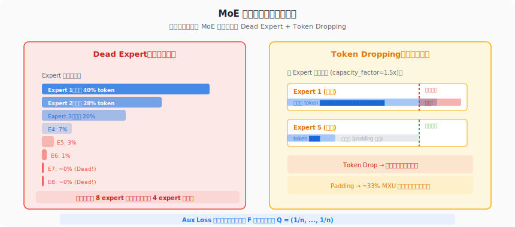
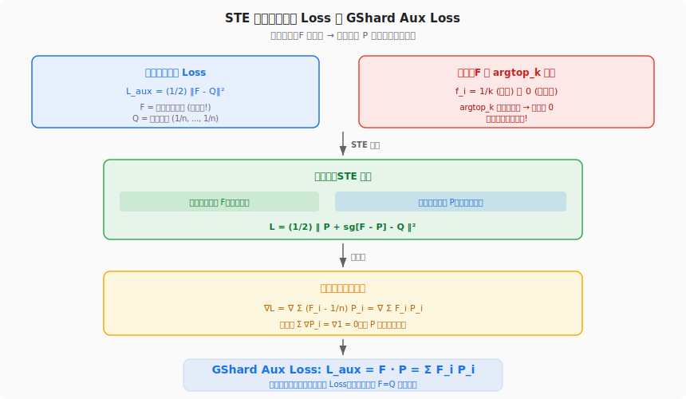
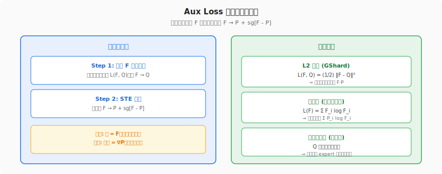

# MoE 环游记 #2：不患寡而患不均

> 原文：[MoE环游记：2、不患寡而患不均](https://kexue.fm/archives/10735)
> 作者：苏剑林（Jianlin Su）
> 发表日期：2025-02
> 系列定位：负载均衡的第一代方案——Aux Loss 的推导与一般化

---

## 一、这篇文章要解决什么问题？

上一篇建立了 MoE 的几何直觉——Dense FFN 是 n 个 expert 之和，MoE 是按模长选 top-k 的最优近似。但那篇文章回避了一个关键的工程问题：

> **如果 Router 总是把 token 集中到少数几个 expert，其他 expert 就会饿死。**



这就是"不患寡而患不均"——MoE 训练中最核心的工程挑战：

1. **Dead Expert**：某些 expert 长期不被激活 → 梯度为零 → 参数永远不更新 → 花了大参数的显存成本，只训出小参数的效果
2. **Token Dropping**：热门 expert 处理不过来 → 超出容量的 token 被丢弃 → 不可恢复的信息损失
3. **Padding 浪费**：为应对不均，每个 expert 预留 1.5× 容量 → 冷门 expert 的空位用零填充 → ~33% 算力白费

本文给出了解决这些问题的第一代方案：**Aux Loss（辅助损失）**。

## 二、思想源泉：为什么 GShard Aux Loss 长那个样子？

### 2.1 一个被所有人跳过的问题

苏剑林在文中指出了一个令人惊讶的事实：

> "不管是最早出处、后续文献还是科普文章，笔者阅读过的资料中，对 Aux Loss 的引用都是**不加证明的**。"

GShard（2020）给出的 Aux Loss 是 `L_aux = F · P = Σ F_i P_i`，但从来没人解释过**为什么这个公式能促进均衡**。所有人都把它当作"显然成立"的事实来引用。

苏剑林说"反正笔者是没看出来"，然后给出了完整的推导。

### 2.2 推导的思想起点：STE（Straight-Through Estimator）

STE 是深度学习中处理"不可导操作"的标准技巧，最早用于二值神经网络（BinaryConnect, 2015）。核心思想：

> 前向传播用真实值（不可导），反向传播用一个可导的近似替代。

在 MoE 的场景下：
- **F**（负载分布）= 真实值，由 argtop_k 产生 → 不可导
- **P**（路由概率）= F 的光滑近似 → 可导

STE 的处理：`F → P + sg[F - P]`（sg = stop gradient）

这个表达式的巧妙之处在于：
- 前向传播时：`P + sg[F - P]` = `P + (F - P)` = **F**（真实值不变）
- 反向传播时：sg 部分梯度为零，只剩 **P** 的梯度（可导）

> **后见之明**：苏剑林在第 9 篇中从概率论第一性原理重新推导了 MoE 梯度，发现 STE 实际上是 REINFORCE 梯度估计器的 Taylor 近似。完整推导链是：REINFORCE（方差太大）→ Baseline 减方差 → Taylor 展开 → STE（本文使用的）。所以 STE 不是一个"技巧"，而是有严格的概率论根基。但它引入的 Stop Gradient 是一个理论瑕疵——第 9 篇通过将 Expert 定义改为 p_i·e_i 消除了这个瑕疵。

## 三、核心推导：从直觉到 GShard



### 3.1 符号定义

先引入三组关键符号：

| 符号 | 定义 | 含义 |
|------|------|------|
| ρ | Router 原始输出 | 未归一化的打分 |
| p_i = ρ_i / Σρ_i | 归一化后的概率 | Router 对 expert i 的偏好 |
| f_i | 1/k (选中) 或 0 (未选中) | 单个 token 的路由指示 |
| P = E[p] | 全体 token 的 p 均值 | 光滑的负载近似 |
| F = E[f] | 全体 token 的 f 均值 | **真实的负载分布** |
| Q = (1/n, ..., 1/n) | 均匀分布 | 均衡的目标分布 |

**关键关系**：F 是离散的（由 argtop_k 产生），P 是连续的（由 softmax 产生）。P_i 大时 F_i 通常也大——P 是 F 的光滑近似。

### 3.2 第一步：直觉 Loss

最直觉的做法——让 F 尽可能接近均匀分布 Q：

```
L_aux = (1/2) ‖F - Q‖² = (1/2) Σ (F_i - 1/n)²
```

**问题**：F 由 argtop_k 产生，argtop_k 是离散操作，梯度为零。这个 Loss 无法用于反向传播。

### 3.3 第二步：STE 替换

把 F 替换为 `P + sg[F - P]`：

```
L_aux = (1/2) ‖ P + sg[F - P] - Q ‖²
      = (1/2) Σ (P_i + sg[F_i - P_i] - 1/n)²
```

现在这是一个合法的、可微分的损失函数了。

### 3.4 第三步：求梯度 → 发现等价

对 L_aux 关于参数 θ 求梯度：

```
∇L = Σ (F_i - 1/n) · ∇P_i         （sg 部分梯度归零，前向值用 F）
   = ∇ Σ (F_i - 1/n) · P_i         （F 对 θ 无梯度，可提到 ∇ 外面）
   = ∇ (Σ F_i P_i - (1/n)Σ P_i)
   = ∇ (Σ F_i P_i - 1/n)           （因为 Σ P_i = 1，P 是概率分布）
   = ∇ Σ F_i P_i
```

**惊人结论**：STE 版 Loss 的梯度 = `F · P` 的梯度！所以直接用 `L_aux = F · P = Σ F_i P_i` 作为 Aux Loss 就行了。

### 3.5 一个微妙但重要的 caveat

苏剑林特别指出：`F · P` 只有**梯度等价**的意义，**不是一个真正的 Loss**。

- 当 F = P 时，F · P = 1/n（不是最小值！）
- 可以构造一个 F ≠ P 使得 F · P < 1/n
- 所以不能用 F · P 的绝对值来判断均衡程度

这解释了为什么很多人直觉上觉得 GShard 的 Aux Loss "说不通"——因为它确实不是一个 well-defined 的损失函数，只是一个梯度等价的简化形式。

## 四、一般化框架：不止 F·P



苏剑林的推导不止于解释 GShard，他提供了一个**一般化框架**——可以构建任意形式的 Aux Loss。

### 4.1 两步构造法

1. **设计目标**：基于 F 选择任意损失函数 L(F, Q)
2. **STE 替换**：实现时把 F → `P + sg[F - P]`

### 4.2 最大熵变体

除了 L2 距离，最大熵也可以将分布推向均匀：

```
L_aux = Σ (P_i + sg[F_i - P_i]) log(P_i + sg[F_i - P_i])
```

求梯度后简化为：`∇L = ∇ Σ P_i log F_i`

### 4.3 放宽约束

一般框架还揭示了两个可以放宽的约束：

1. **P 不必是概率分布**：只要"P_i 大时 F_i 也大"成立即可。非归一化的 E[ρ] 也可以用——这对几何 MoE（ρ 没有 softmax）尤其重要
2. **目标 Q 不必是均匀分布**：可以让某些 expert 承载更多负载（例如 Shared Expert 应该处理更多 token）

## 五、结合我们的知识沉淀：Aux Loss 的实战代价

### 5.1 Aux Loss 系数：最难调的超参数之一

Aux Loss 在总 Loss 中的权重通常写为 `L_total = L_main + α · L_aux`。这个 α 极难调：

- **太大**：Aux Loss 主导训练，expert 强制均衡但模型质量大幅下降——模型学会了"均匀分配"但忘了"哪个 expert 更适合"
- **太小**：负载均衡效果不够，仍然出现 Dead Expert
- **最优值依赖架构**：expert 数量、k 值、训练阶段都会影响最优 α

我们在 ALModel（256 experts + top-4）的 TPU v7 训练中实际体会过这种痛苦。MoE 层的 loss 曲线和 Dense 层截然不同，Aux Loss 系数需要和学习率一起联合调优。

> **Wiki 参考**：[ALModel 17B MoE 训练分析](https://cc.higcp.com/wiki-v2/sources/almodel-training-analysis-20260304)
> **原始报告**：[ALModel Training Comprehensive](https://cc.higcp.com/pages/almodel-training-comprehensive-20260308.html)

### 5.2 Aux Loss 的 STE 梯度问题

STE 替换 F → P 是一个近似，它引入了"次优梯度"——反向传播的方向并不精确指向最小化真实损失的方向。这个问题在 expert 数量很多（如 256、896）时更严重，因为 P 和 F 之间的差距会更大。

这正是后续 Loss-Free（第 3 篇）和 Quantile Balancing（第 6 篇）要解决的核心动机——**完全不碰模型梯度**，用外部机制实现均衡。

### 5.3 设备级 Aux Loss vs 全局 Aux Loss

苏剑林提到"有些大型 MoE 可能会按设备来算 Aux Loss"。在 TPU 训练中这是一个关键的工程决策：

- **按设备（local）**：减少 All-to-All 通信量（只在设备内均衡），但可能导致全局不均衡
- **全局（global）**：更好的均衡效果，但需要跨设备通信来计算 F 和 P

我们的 wiki 记录了蚂蚁团队在 EP 配置上的实验：EP 与 FSDP 的比例直接影响 All-to-All 的通信开销和负载均衡效果。苏剑林也提到"较新的实验显示，强行局部均衡极有可能影响模型最终效果"——这与蚂蚁的大规模训练经验一致。

> **Wiki 参考**：[Expert Parallelism (EP)](https://cc.higcp.com/wiki-v2/concepts/expert-parallelism) · [ALModel EP Optimization Plan](https://cc.higcp.com/wiki-v2/sources/almodel-ep-optimization-plan-20260307)
> **原始报告**：[ALModel EP Optimization Plan](https://cc.higcp.com/pages/almodel-ep-optimization-plan-20260307.html)

### 5.4 Aux Loss 在 TPU 上的特殊代价：capacity_factor 与静态形状

Aux Loss 方案天然需要 **capacity_factor**——给每个 expert 预留缓冲容量以防止 token dropping。在 TPU/XLA 上，这意味着：

```python
# GShard 方案：capacity_factor = 1.5
capacity = tokens_per_expert * 1.5          # 预留 50% 余量
expert_input = pad_to_capacity(tokens, capacity)  # 不足补零
```

- 零填充的 token 仍然经过 MXU 计算 → **~33% 的 4,611 FP8 TFLOPS 浪费在零向量上**
- capacity_factor 是另一个需要调优的超参数
- 即使有 capacity_factor，极端不均时仍会 token drop

这就是为什么 Quantile Balancing（第 6 篇）对 TPU 是"天赐良缘"——它直接消除了 capacity_factor 的需求，让所有 tensor 形状在编译时精确已知。

> **Wiki 参考**：[K3 on TPU 兼容性分析](https://cc.higcp.com/wiki-v2/analyses/k3-tpu-compatibility) · [Quantile Balancing](https://cc.higcp.com/wiki-v2/concepts/quantile-balancing)

### 5.5 三代负载均衡方案速览

| 维度 | Aux Loss (本文) | Loss-Free (#3) | Quantile Balancing (#6) |
|------|-----------------|-----------------|-------------------------|
| 核心思路 | STE 梯度推 F → Q | bias 调排序 | LP 对偶取分位数 |
| 对模型梯度的干扰 | 有 (STE 次优梯度) | 无 | 无 |
| 超参数 | α (难调) | γ (与激活函数耦合) | 无 |
| capacity_factor | 需要 | 需要 | **不需要** |
| 代表模型 | GShard, Switch Transformer | DeepSeek V3 | **Kimi K3** |

## 六、对后续文章的铺垫

Aux Loss 的根本局限在于：**它修改了模型的梯度**。不管 STE 替换做得多巧妙，`α · ∇L_aux` 这个梯度项总会干扰主任务的学习。expert 数量越多、α 越大，干扰越严重。

从后续系列的高度回看，Aux Loss 的问题可以分成三个层面，后续文章分别给出了解答：

1. **参数冲突** → #3 Loss-Free 解决：用独立的偏置 b 承担均衡，主梯度零干扰
2. **超参数依赖** → #6 Quantile Balancing 解决：线性规划对偶给出精确解，无超参数
3. **STE 近似的理论不完美** → #9 门控归一化之争解决：用概率框架推导出 p_i·e_i 形式，消除 Stop Gradient

下一篇（#3 换个思路来分配）先解决第一个问题——DeepSeek 的 **Loss-Free** 方案完全不动模型梯度，用偏置向量隔离均衡和学习。

## 七、关键数学符号速查

| 符号 | 含义 |
|------|------|
| ρ | Router 原始输出（未归一化）|
| p = softmax(ρ) | 归一化的路由概率 |
| f_i | 单 token 的路由指示：1/k 或 0 |
| P = E[p] | 全体 token 的平均路由概率 |
| F = E[f] | 全体 token 的平均路由指示 = **真实负载分布** |
| Q = (1/n, ..., 1/n) | 均匀目标分布 |
| sg[·] | Stop gradient 算子：前向不变，梯度为零 |
| L_aux = F · P | GShard Aux Loss（梯度等价形式）|
| α | Aux Loss 权重系数（超参数）|

## 八、一句话总结

**Aux Loss 的本质是"用可导的 P 替代不可导的 F 来计算梯度"——一个 STE 技巧。GShard 的 F·P 不是真正的 Loss，而是梯度等价的简化形式。它能用，但代价是次优梯度干扰模型学习 + capacity_factor 浪费算力。**

---

**上一篇**：[#1 从几何意义出发](01-geometric-interpretation.md) — Dense FFN 天然是 n 个 expert 之和
**下一篇**：[#3 换个思路来分配](03-loss-free.md) — DeepSeek Loss-Free：不碰梯度的均衡方案
