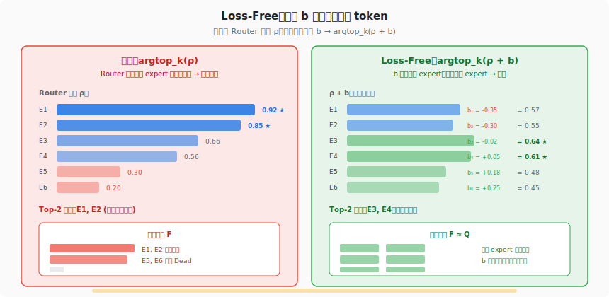
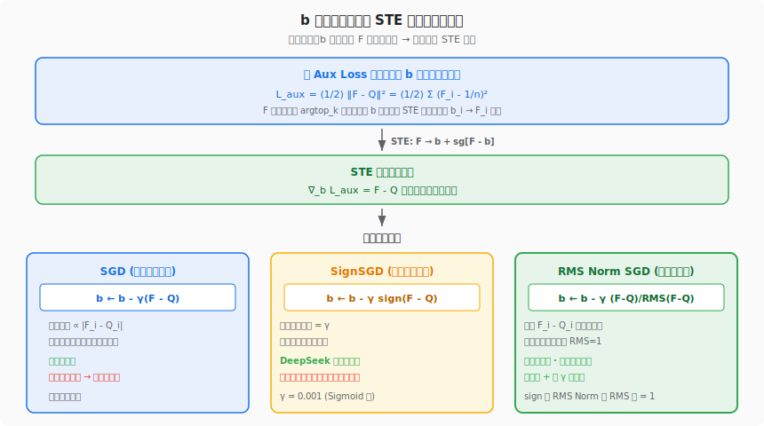
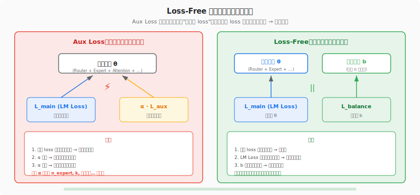

# MoE 环游记 #3：换个思路来分配

> 原文：[MoE环游记：3、换个思路来分配](https://kexue.fm/archives/10757)
> 作者：苏剑林（Jianlin Su）
> 发表日期：2025-03-05
> 系列定位：负载均衡的第二代方案——DeepSeek Loss-Free 的推导、改良与深层理解

---

## 一、这篇文章要解决什么问题？

上一篇推导了 Aux Loss 的完整数学框架，但也揭示了它的核心缺陷：

> **Aux Loss 修改了模型的梯度。** 不管 STE 替换做得多巧妙，`α · ∇L_aux` 这个梯度项总会干扰主任务的学习。

具体来说，Aux Loss 有三个绕不开的痛点：

1. **权重 α 极难调**：太大 → 均衡好但模型烂；太小 → 模型好但 expert 死。最优值与 expert 数量、k 值、训练阶段全部耦合
2. **STE 梯度是次优的**：用 P 替代 F 的反向传播方向并不精确，expert 越多误差越大
3. **两个 loss 争抢同一组参数**：L_main 想让 Router 把 token 送到"最合适"的 expert，L_aux 想让 Router "雨露均沾"——二者在参数空间中方向冲突

本文介绍的 **Loss-Free** 方案，由 DeepSeek 在论文《Auxiliary-Loss-Free Load Balancing Strategy for Mixture-of-Experts》中提出，用一个极其简洁的思路彻底解决了上述问题。

## 二、思想源泉：从"改打分"到"改排序"

### 2.1 一个关键的视角转换

Aux Loss 的策略是：**改变 Router 的打分 ρ**，让它给出更均衡的分数 → 从而 argtop_k(ρ) 的结果更均衡。

Loss-Free 换了一个方向：**不碰 Router 打分**，而是在排序时加一个偏置 b → argtop_k(ρ + b) 的结果更均衡。

这个视角转换的精妙之处在于：ρ 由 Router 网络产生，改 ρ 就是改模型参数，必然影响 LM Loss；而 b 是一个与模型无关的外部向量，改 b 不影响任何模型参数。

### 2.2 之前的尝试：线性指派问题

苏剑林提到，这个"改分配方式"的方向此前有过尝试。Facebook 在 2021 年提出了 BASE Layer，将 expert 分配建模为**线性指派问题**（Linear Assignment Problem），用匈牙利算法求解。

但 BASE Layer 有两个致命限制：
1. 需要知道全体 token 的打分 → 自回归 LLM 推理时不可用（训练推理不一致）
2. 匈牙利算法只适用于 k=1（一对一分配）

Loss-Free 比 BASE Layer 简单得多，也通用得多。

## 三、核心推导：从 Aux Loss 到偏置更新



### 3.1 核心观察

苏剑林指出了一个关键事实：

> **总存在一个偏置向量 b，使得 argtop_k(ρ + b) 的分配是均衡的。**

这个直觉很自然：如果某个 expert 太热门，给它的 b_i 减小一点，排序时它的得分就降低，被选中的概率就下降；反之，冷门 expert 加大 b_i，就更容易被选中。

于是 MoE 的形式从

```
y = Σ_{i ∈ argtop_k(ρ)} ρ_i · e_i
```

变为

```
y = Σ_{i ∈ argtop_k(ρ + b)} ρ_i · e_i
```

**关键细节**：乘以 expert 输出 e_i 的还是原始打分 ρ_i，而**不是** ρ_i + b_i。也就是说，b 只参与"谁被选中"的决定（排序），不参与"被选中后的加权"（前向计算）。这意味着对 b 的正负性没有任何要求。

### 3.2 用上一篇的框架推导 b 的更新规则



苏剑林用上一篇建立的 STE 框架来推导 b 的更新规则。步骤如下：

**第一步：定义目标。** 负载均衡等价于最小化 F 与均匀分布 Q 的距离：

```
L_aux = (1/2) ‖F - Q‖² = (1/2) Σ (F_i - 1/n)²
```

其中 F_i 是 expert i 在偏置 b 下的实际负载：

```
f_i = 1/k (如果 i ∈ argtop_k(ρ + b))，否则为 0
F = E[f]
```

**第二步：发现 b 天然满足 STE 条件。** STE 需要一个可导的量，它与 F 同增减。b 恰好具备这个性质：增大 b_i → expert i 更容易被选中 → F_i 更大。所以 b 本身就是 F 的光滑近似！

直接做 STE 替换：F → b + sg[F - b]

```
L_aux = (1/2) ‖ b + sg[F - b] - Q ‖²
```

**第三步：求梯度。**

```
∇_b L_aux = F - Q
```

梯度极其简洁：哪个 expert 负载偏高（F_i > 1/n），就减小 b_i；偏低就增大 b_i。

### 3.3 三种更新规则

从梯度 `∇_b = F - Q` 出发，有三种可选的更新方式：

**标准 SGD**：
```
b ← b - γ(F - Q)
```
理论上最直接，但没有归一化，尺度不稳定。

**SignSGD（DeepSeek 原论文选择）**：
```
b ← b - γ sign(F - Q)
```
符号梯度下降：不论偏离多少，每步更新幅度都是 γ。简洁粗暴。

**RMS Norm SGD（苏剑林改良）**：
```
b ← b - γ (F - Q) / RMS(F - Q)
```
保留 F_i - Q_i 的相对大小，但用 RMS 归一化到单位尺度。

苏剑林指出：sign 版本的问题在于，即使某个维度已经接近均衡（F_i ≈ Q_i），它也用同样的幅度 γ 去更新，容易导致震荡。RMS Norm 版本保留了相对大小，更新幅度自适应，实测效果更好。

两个版本之所以可以复用同一个 γ，是因为 sign(F-Q) 和 (F-Q)/RMS(F-Q) 的 RMS 都等于 1——尺度是匹配的。

## 四、Loss-Free 的本质创新：参数隔离



### 4.1 "Loss-Free"名字的误导

原论文取名 Loss-Free（无损失），暗示这个方法不需要 Aux Loss。但苏剑林的推导表明，b 的更新规则**完全可以从 Aux Loss 视角推出**——它本质上就是用 STE 框架对 b 做梯度下降。

所以 Loss-Free 并不是真的没有 Aux Loss，它是把 Aux Loss 的优化对象从全体参数 θ 缩小到了仅仅一个偏置向量 b。

### 4.2 参数隔离才是本质

苏剑林一针见血地指出了 Loss-Free 的真正创新：

> **隔离了 Aux Loss 和 LM Loss 的优化参数。**

在传统 Aux Loss 方案中：
- L_main 优化全体参数 θ（包括 Router）→ 让模型学好语言建模
- L_aux 也优化全体参数 θ（包括 Router）→ 让 Router 给出均衡的打分
- 两个优化目标共享参数 → **方向冲突** → 需要 α 来平衡

在 Loss-Free 方案中：
- L_main 优化全体参数 θ → 让模型学好语言建模
- L_balance 只优化偏置 b → 让排序结果均衡
- **两组参数完全不重叠** → **零干扰**

这就像是：传统方案让一个员工同时满足两个上司的矛盾要求（做好本职工作 vs. 到处帮忙），而 Loss-Free 给均衡任务单独雇了一个"调度员"（b），主力员工（θ）只需要专心做好本职工作。

### 4.3 关键洞察：一个偏置向量就够了

Loss-Free 最深刻的贡献不在于具体的更新规则，而在于证明了：

> **一个输入无关的 n 维偏置向量 b，足以将任意不均衡的 argtop_k 分配调整为均衡的。**

这个事实看似简单，但它是整个方案的基石。有了这个认知，把均衡的"成本"从 O(全体参数) 降到了 O(expert 数量)，从根本上解耦了模型学习和负载均衡。

> **后见之明**：苏剑林在第 6 篇中证明了一个更强的结论——Loss-Free 的 SignSGD 更新实际上就是 Quantile Balancing 的一阶近似。QB 的 β 向量和 Loss-Free 的 b 向量在数学上是同一个东西（Lagrange 乘子），只是 QB 直接用分位数给出了精确解，而 Loss-Free 用 SignSGD 迭代逼近。所以 Loss-Free 的核心贡献不是 SignSGD——而是**发现了偏置向量这个正确的优化对象**。后续所有方案（QB、MQB、甚至 Hash Routing 的 tid2eid 表）都建立在这个洞察之上。

## 五、实用细节：苏剑林的使用建议

### 5.1 更新顺序：先模型，后偏置

每个 batch 应当先用 LM Loss 更新模型参数 θ，**然后**再更新 b。原因：b 的更新依赖全体 token 的统计信息 F，先更新 b 再更新 θ，理论上有泄漏未来信息的风险。

虽然一个向量 b 泄漏不了多少信息，但这个风险是可以零成本避免的——调换一下更新顺序就行。

### 5.2 γ 与激活函数的耦合

原论文给出 γ = 0.001 的默认值，但这个值与 Router 使用 Sigmoid 激活函数绑定。原因：Sigmoid 后的每个 ρ_i 在 (0, 1) 内，γ = 0.001 意味着每步更新约千分之一。如果换 Softmax 或 ReLU，打分的尺度不同，需要重调 γ。

苏剑林建议的解法是**解耦 Gate 和 Bias 的激活函数**：

```
y = Σ_{i ∈ argtop_k(σ(x·W) + b)} h(x·W)_i · e_i
```

- 排序用 Sigmoid（σ）→ 可以复用 γ = 0.001
- Gate 用任意单调非负函数 h（如 ReLU、SiLU 等）

这样不管 Gate 用什么激活函数，b 的更新规则都不受影响。

### 5.3 b 的自由度与绝对值

由于 sign 函数的存在，b_i 可能训出绝对值大于 1 甚至持续增长的值。这是正常的，因为 argtop_k(ρ + b) 只看相对大小——全体 b_i 加上同一个常数后，排序结果不变。这个额外的自由度在后续文章中被用来做其他事情（第 4 篇的动态激活）。

## 六、结合我们的知识沉淀：Loss-Free 在实践中的位置

### 6.1 DeepSeek V3 的实际采用

我们的 wiki 记录了 DeepSeek V3 的完整架构：671B 参数，256 routed experts + 1 shared expert，Top-8 Sigmoid routing。V3 正是 Loss-Free 方案的提出者和第一个大规模验证者。

在我们 TPU v7 上的 DeepSeek V3.2 验证测试中，MoE routing 的正确性是精度验证的关键一环——PR #1891 将 MMLU 从 67 提升到 80，根因就在 Sigmoid routing 的实现细节。这印证了苏剑林提到的"γ 与 Sigmoid 绑定"的重要性：routing 机制的任何细节变化都可能显著影响模型质量。

> **Wiki 参考**：[DeepSeek V3](https://cc.higcp.com/wiki-v2/entities/deepseek-v3) · [DeepSeek V3.2 TPU v7 验证报告](https://cc.higcp.com/wiki-v2/sources/deepseek-v3.2-tpu-v7-report-20260416)
> **原始报告**：[DeepSeek V3.2 TPU v7 Complete](https://cc.higcp.com/pages/deepseek-v3.2-tpu-v7-complete-20260416.html)

### 6.2 Loss-Free 仍有 capacity_factor 问题

苏剑林在文中没有强调，但从 TPU 训练的角度看，Loss-Free 虽然解决了参数冲突问题，**并没有消除 capacity_factor 的需求**。

原因：b 只能在统计意义上让 F ≈ Q，但单个 batch 内的分配仍然是不均匀的——某些 step 某些 expert 仍会收到更多 token。所以仍然需要预留缓冲容量，冷门 expert 仍然有 padding 浪费。

这正是第三代方案 Quantile Balancing 的动机：它不是"大致均衡"，而是**数学精确均衡**——每个 expert 收到的 token 数恒等于 total/n。在 TPU/XLA 上，这意味着所有 tensor 形状在编译时已知，无需 capacity_factor，零 padding，零 dropping。

> **Wiki 参考**：[Quantile Balancing](https://cc.higcp.com/wiki-v2/concepts/quantile-balancing) · [Static-Shape Expert Parallel](https://cc.higcp.com/wiki-v2/concepts/static-shape-expert-parallel)

### 6.3 从 DeepSeek V3 到 V4：Loss-Free 的后续演化

在 DeepSeek V4（1.6T MoE）中，Loss-Free 的偏置思想被继续沿用，并与 Mega MoE（dispatch/compute/combine 三步融合单 kernel）结合。V4 的 tid2eid Hash Routing 映射表生成则是另一条路线——直接用确定性映射取代概率性路由，完全消除了运行时的路由计算。

苏剑林在 MoE 环游记番外篇专门分析了 V4 的 tid2eid 方案，我们在后续第 8 篇解读中会详细展开。

> **Wiki 参考**：[DeepSeek V4 技术报告深度解读](https://cc.higcp.com/wiki-v2/sources/deepseek-v4-technical-report-20260424)

### 6.4 三代方案在 TPU 上的代价对比

| 维度 | Aux Loss (#2) | Loss-Free (#3) | Quantile Balancing (#6) |
|------|---------------|-----------------|-------------------------|
| 对模型梯度的干扰 | 有 (STE 次优) | **无** | **无** |
| 超参数 | α (极难调) | γ (与激活函数耦合) | **无** |
| capacity_factor | 需要 (~1.5×) | 需要 (~1.5×) | **不需要** |
| XLA 静态形状 | 靠 padding | 靠 padding | **天然满足** |
| 算力浪费 | ~33% padding | ~33% padding | **0%** |
| Token dropping | 可能 | 可能 | **不可能** |
| 训推一致性 | 一致 | **一致** | **一致** |
| 代表模型 | GShard | **DeepSeek V3** | **Kimi K3** |

Loss-Free 相比 Aux Loss 是巨大进步（解决了参数冲突），但从 TPU/XLA 编译效率看，Quantile Balancing 才是终极方案。

### 6.5 Loss-Free 的数学延伸：指派问题的梯度下降解法

苏剑林在文末给出了一个有深度的数学延伸：Loss-Free 的偏置调整本质上是用梯度下降求解**线性指派问题**。

经典指派问题：给 n 个任务分配 n 个人，使总成本最小。传统解法是匈牙利算法（O(n³) 多项式时间），但需要全局信息。

Loss-Free 的做法相当于：先用贪心给出最优但不均衡的解（f(i) = argmin_j c_ij），然后引入偏置 b，用 SignSGD 迭代调整 b 直到分配均衡。这提供了一种新的、可微分的、在线的指派问题求解思路，适用于自回归场景（不需要看到全部 token）。

这个延伸也解释了为什么 Loss-Free 的学术价值可能远超 DeepSeek 的其他工作——它提供了一个通用的算法范式。

## 七、对后续文章的铺垫

Loss-Free 解决了 Aux Loss 的参数冲突问题，但留下了一系列递进的开放问题：

1. **均匀分布是最优目标吗？** 所有 expert 负载相同真的最好吗？有些 token 更难处理，是否应该给它们更多 expert？（→ #4 动态激活提出问题，#7 动态 QB 给出精确解）
2. **偏置 b 的自由度怎么利用？** 全体 b_i 加常数不影响排序，这个多余的自由度能用来做什么？（→ #4 用它控制每 token 的 expert 预算）
3. **能否完全消除 capacity_factor？** Loss-Free 的统计均衡在单 batch 内仍有波动，能否做到精确均衡？（→ #6 QB 用线性规划精确求解，每个 expert 恰好 mk/n 个 token）
4. **全局均衡够吗？** 全局 F ≈ Q 不等于每个序列内部都均衡——某个序列可能 80% token 涌向同一个 expert（→ #8 MQB 用序列级分位数+EMA 解决）
5. **门控函数重要吗？** Loss-Free 的 bias 与 Sigmoid 耦合——但第 9 篇证明门控函数选择（Softmax vs Sigmoid vs ReLU）对最终效果影响很小，真正重要的是均衡算法本身

## 八、关键数学符号速查

| 符号 | 含义 |
|------|------|
| ρ | Router 原始输出 |
| b | 偏置向量（输入无关，训练确定）|
| argtop_k(ρ + b) | 加偏置后的 top-k 选择 |
| f_i | 单 token 路由指示：1/k 或 0 |
| F = E[f] | 真实负载分布 |
| Q = (1/n, ..., 1/n) | 均匀目标分布 |
| γ | b 的学习率（原论文 γ = 0.001）|
| sign(·) | 符号函数：正→+1，负→-1 |
| RMS(·) | 均方根：√(Σx²/n) |
| sg[·] | Stop gradient 算子 |
| σ(·) | Sigmoid 函数 |

## 九、一句话总结

**Loss-Free 的核心不是"没有 Aux Loss"，而是"参数隔离"——用一个偏置向量 b 独立承担均衡任务，让 Aux Loss 的梯度不再污染模型的主梯度。这是 MoE 负载均衡从"调参地狱"到"几乎免维护"的关键一步，但在 TPU/XLA 的静态形状要求下，第三代 Quantile Balancing 才是最终答案。**

---

**上一篇**：[#2 不患寡而患不均](02-aux-loss.md) — Aux Loss 的 STE 推导与一般化框架
**下一篇**：[#4 难处应当多投入](04-dynamic-activation.md) — 动态激活：难 token 该分更多资源吗？
