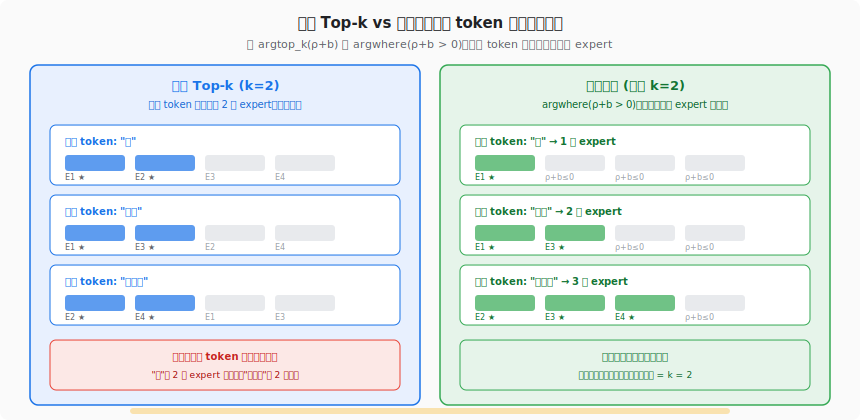
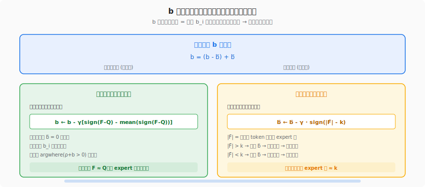
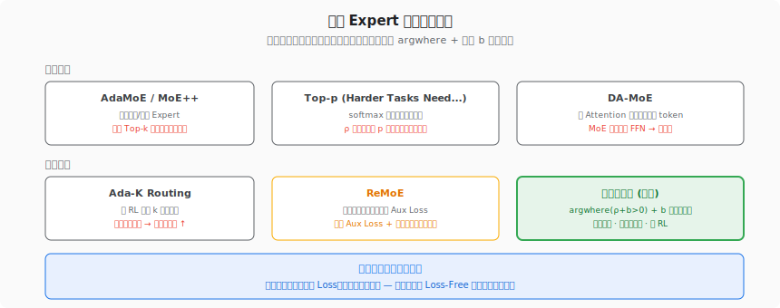

# MoE 环游记 #4：难处应当多投入

> 原文：[MoE环游记：4、难处应当多投入](https://kexue.fm/archives/10815)
> 作者：苏剑林（Jianlin Su）
> 发表日期：2025-03-28
> 系列定位：利用 Loss-Free 偏置的冗余自由度，实现动态 Expert 数目

---

## 一、这篇文章要解决什么问题？

前三篇文章一直在解决"怎么均衡"，但都默认了一个前提：**每个 token 固定选 k 个 expert**。苏剑林在这篇文章中质疑了这个前提本身：

> **每个 token 的难度并不一样。简单的 token（如"的"、"了"）可能 1 个 expert 就够了，复杂的 token（如"纠缠态"、"量子退相干"）可能需要 3-4 个 expert 才能处理好。**

固定 top-k 相当于给所有学生布置同样多的作业——学霸浪费时间，学渣做不完。更合理的方案是：**难 token 多分配计算资源，简单 token 少分配，但总预算不变**。

而实现这个目标的工具，就在上一篇文章中已经准备好了——Loss-Free 的偏置 b 有一个冗余的自由度。



## 二、思想源泉：b 的冗余自由度

### 2.1 一个被悬而未决的伏笔

上一篇结尾留了一个悬念：argtop_k(ρ + b) 只看相对排序，全体 b_i 加上同一个常数后排序不变。这意味着 b 有一个"多余的维度"——它的均值 b̄ 可以随意设置而不影响负载均衡。

苏剑林在本文揭晓了这个自由度的用途：**控制总预算**。

### 2.2 从排序到阈值

Loss-Free 的 argtop_k(ρ + b) 是"选得分最高的 k 个"。苏剑林将其改为一个更灵活的形式：

```
argtop_k(ρ + b) → argwhere(ρ + b > 0)
```

即：**只要 ρ_i + b_i > 0 的 expert 就被选中**。这个改动的效果是：
- 如果某个 token 的 ρ 打分整体偏高（Router 对多个 expert 都有信心），那么满足 > 0 的 expert 就多 → 动态分配更多 expert
- 如果某个 token 的 ρ 打分整体偏低（Router 只对少数 expert 有信心），满足 > 0 的就少 → 动态分配更少 expert

而 b̄ 的大小决定了阈值的高低：b̄ 大 → 阈值低 → 平均激活更多 expert → 预算增大。

## 三、核心推导：双目标更新规则



### 3.1 两个优化目标

b 现在要同时满足两个目标：

1. **负载均衡**：所有 expert 的负载分布 F 趋近均匀分布 Q
2. **预算控制**：每个 token 平均激活的 expert 数 |F̃| 趋近 k

如果只追求均衡而不控制预算，最简单的方案就是 b_i = +∞，所有 expert 全选中——负载完美均衡但计算量爆炸。所以预算控制是必须的。

### 3.2 自由度分解

苏剑林的做法极其巧妙：**把 b 的自由度一分为二**。

先定义 f_i = 1（如果 ρ_i + b_i > 0）或 0（否则），以及 F̃ = E[f]。

注意这里的 f_i 定义和 Loss-Free 的区别：Loss-Free 中 f_i = 1/k（选中）或 0（未选中），而这里 f_i = 1 或 0——因为每个 token 选中的 expert 数不再固定，用 1/k 归一化没有意义了。

然后将更新规则分解为两个正交的分量：

**均衡分量**（零均值，不改变 b̄）：

```
b ← b - γ [sign(F - Q) - mean(sign(F - Q))]
```

减去均值后，这个更新只改变各 b_i 之间的相对大小，不影响 b̄ → 不影响阈值 → 不影响预算。

**预算分量**（全局偏移，只改变 b̄）：

```
b ← b - γ sign(|F̃| - k)
```

|F̃| 是 F̃ 各分量之和 = 平均每 token 激活的 expert 数。如果 > k，就给所有 b_i 减去 γ（抬高阈值，减少激活）；如果 < k，就加 γ（降低阈值，增加激活）。

### 3.3 合并后的更新公式

将两个分量合并：

```
b ← b - γ [sign(F - Q) - mean(sign(F - Q)) + sign(|F̃| - k)]     ... (7)
```

这就是完整的更新规则。三个项各司其职：
- sign(F - Q)：推负载趋均匀
- -mean(sign(F - Q))：去均值，确保均衡不干扰预算
- sign(|F̃| - k)：控制总预算

### 3.4 能否简化？

苏剑林观察到：让 F ≈ Q 且 |F̃| ≈ k，等价于让 F̃ ≈ Q̃ = (k/n, ..., k/n)。于是更新规则可以简化为：

```
b ← b - γ sign(F̃ - Q̃)                                            ... (9)
```

实验表明，简化版 (9) 和完整版 (7) 在**最终效果**上大同小异，但 (9) 在**训练前期的抖动**更大——均衡和预算两个目标被压缩到同一个更新项里，互相干扰。

追求稳定性用 (7)，追求简洁用 (9)。

### 3.5 RMS Norm 改良（同上一篇）

sign 替换为 RMS Norm 是通用的稳定性改良技巧：

```
b ← b - γ (F̃ - Q̃) / RMS(F̃ - Q̃)
```

保留偏离程度的相对大小，波动略小。和 sign 版本可以复用同一个 γ（两者的 RMS 都 = 1）。

## 四、初始化：一个有趣但不关键的细节

### 4.1 问题

如果 b 全零初始化且 ρ 用 Sigmoid 激活，那么初始阶段所有 ρ_i ∈ (0, 1)，全部 > 0 → n 个 expert 全被选中 → 预算严重超标。

### 4.2 自然修复

苏剑林指出这不是严重问题：模型的其他参数通常有 warmup 但 b 不加 warmup，所以预算控制的 sign(|F̃| - k) 项会在前几步就把 b̄ 拉到合适的值，自动修复超标。

### 4.3 精确初始化

如果介意初始几步的浪费，可以用二分法估算初始 b：假设 Router 输入满足零均值单位方差、权重初始化方差为 σ²，那么 logits 近似 N(0, σ²d)。用蒙特卡洛模拟找到使平均激活数 ≈ k 的初始 b。

苏剑林给出了完整的 Python 代码（参见原文），核心是对 sigmoid(random_logits) + b > 0 做二分搜索。

## 五、后续演化：从启发式到精确解

本文提出的 argwhere(ρ+b>0) 方案是动态激活的**首个完整设计**，但它本质上仍是启发式的——b 的更新用 SignSGD，没有最优性保证。

苏剑林在 9 个月后（第 6、7 篇）给出了精确的数学解答：

| 维度 | 本文方案 (argwhere + SignSGD) | 第 7 篇 Dynamic QB |
|------|----------------------------|-------------------|
| 理论根基 | 启发式偏置调整 | 线性规划对偶精确求解 |
| 超参数 | γ (与激活函数耦合) | 无 |
| k 的含义 | 预算目标 (平均激活 k 个) | 同样是预算目标，但由精确分位数保证 |
| TPU 兼容性 | 动态 shape 需要 padding | 同样需要 padding，但 QB 保证最小方差 |

本文的核心贡献在于**提出了问题和设计方向**（利用 b 的自由度），第 7 篇给出了**数学最优的解法**。二者是"问题定义"和"精确求解"的关系。

## 六、相关工作：动态 Expert 选择的全景



苏剑林以相当坦率的个人审美对几个相关工作做了评析：

| 方案 | 核心思路 | 苏剑林评价 |
|------|----------|-----------|
| AdaMoE / MoE++ | 混入空白/常数 Expert，选中它们 ≈ 少用 Expert | 可复用 Top-k 基建，但灵活性不足 |
| Top-p | 类似 NLP 采样的 Top-p 截断 | ρ 接近均匀时 p 爆炸，需额外熵损失修补 |
| Ada-K Routing | RL 训练 k 预测模块 | 原理正确，但引入 RL 增加复杂性 |
| DA-MoE | 用 Attention 分数识别重要 token | MoE 不局限于 FFN → 不通用 |
| ReMoE | 零阈值 + Aux Loss | 同样基于零阈值，但用 Aux Loss + 手搓梯度，"多了点糅合感" |
| **本文** | argwhere(ρ+b>0) + b 自由度分解 | 最小改动，纯复用 Loss-Free 框架 |

苏剑林方案的设计哲学非常明确：**不加新模块、不加新 Loss、不加新训练范式——只利用已有框架的冗余自由度**。

## 七、结合我们的知识沉淀：动态激活与 TPU 训练

### 6.1 动态激活对 XLA 的挑战

动态激活意味着每个 token 选中的 expert 数不固定 → 每个 expert 收到的 token 数更加不确定 → All-to-All 通信形状更加动态。这在 TPU/XLA 上比固定 top-k 更难处理。

固定 top-k 下，虽然 token 分配不均，但至少知道总共有 batch_size × k 次 expert 调用。动态激活下，这个总数也是不确定的。这对 capacity_factor 的设置提出了更大的挑战——需要更大的缓冲才能避免 token dropping。

从这个角度看，动态激活虽然理论上能提升模型效果，但在 TPU/XLA 的静态形状要求下会引入更多的 padding 浪费。这也是为什么 K3 最终选择了 Quantile Balancing（精确固定每个 expert 的 token 数）而不是动态激活路线。

> **Wiki 参考**：[Static-Shape Expert Parallel](https://cc.higcp.com/wiki-v2/concepts/static-shape-expert-parallel) · [Expert Parallelism](https://cc.higcp.com/wiki-v2/concepts/expert-parallelism)

### 6.2 ALModel 训练中的实际观察

在我们 ALModel 17B MoE（256 experts + top-4）的 TPU v7 训练中，capacity_factor 设为 1.5 已经是比较保守的选择。如果换成动态激活，某些 step 可能有 token 需要 6-8 个 expert，capacity_factor 可能需要设到 2.0 甚至更高——这意味着 50%+ 的算力浪费在 padding 上。

当然，动态激活的支持者会说"省下简单 token 的算力正好给困难 token 用"，总量是守恒的。但在 EP（Expert Parallelism）的分布式设置下，这种"局部节省、局部超支"的模式会导致设备间负载不均——某些设备的 expert 收到超量 token，其他设备空闲等待。

> **Wiki 参考**：[ALModel 17B Training Analysis](https://cc.higcp.com/wiki-v2/sources/almodel-training-analysis-20260304)
> **原始报告**：[ALModel Training Comprehensive](https://cc.higcp.com/pages/almodel-training-comprehensive-20260308.html)

### 6.3 动态激活的"后续去向"

值得注意的是，在整个 MoE 环游记的后续文章中，苏剑林并没有在 Quantile Balancing（#6）中采用动态激活。K3 最终使用的是固定 k + 精确均衡的路线。

这并不意味着动态激活没有价值——它是一个正交的维度。但从工程落地的角度看，**精确均衡 + 固定 k** 比 **大致均衡 + 动态 k** 对硬件更友好。动态激活更适合那些对硬件利用率不那么敏感、但对模型效果极度追求的场景。

### 6.4 Mega MoE 的另一种思路

DeepSeek V4 的 Mega MoE 走了另一条路：不是让每个 token 动态选 expert 数，而是将 dispatch/compute/combine 三步融合成单 kernel，在硬件层面把通信开销藏起来。这样即使有动态分配的波动，kernel 内部的调度也能吸收。

> **Wiki 参考**：[DeepGEMM PR #304：Mega MoE](https://cc.higcp.com/wiki-v2/sources/deepgemm-pr304-mega-moe-20260426)

## 八、对后续文章的铺垫

本文和前三篇一起构成了 MoE 环游记的"基础建设"阶段。到这里，苏剑林已经建立了：

1. **几何直觉**（#1）：Dense FFN 天然是 n 个 expert 之和，MoE 是选 top-k
2. **Aux Loss 框架**（#2）：STE 处理不可导操作的一般方法
3. **参数隔离**（#3）：Loss-Free 用偏置 b 隔离均衡和学习
4. **动态激活**（#4）：b 的自由度还能控制每 token 的 expert 数

下一篇（#5 均匀分布的反思）会质疑一个更基础的假设：**均匀分布真的是最优目标吗？** Shared Expert 和 Fine-Grained Expert 的出现表明，也许有些 expert 就应该承载更多负载。而第 8 篇的 MQB 会从另一个维度质疑均匀性——全局均匀不等于每个序列内部均匀。

## 九、关键数学符号速查

| 符号 | 含义 |
|------|------|
| ρ | Router 原始输出 |
| b | 偏置向量 |
| b̄ | b 的均值（全体 b_i 的平均值）|
| argwhere(ρ+b > 0) | 所有满足 ρ_i + b_i > 0 的 expert 集合 |
| f_i | 1（选中）或 0（未选中）|
| F̃ = E[f] | 未归一化的负载分布 |
| \|F̃\| | F̃ 各分量之和 = 平均每 token 激活的 expert 数 |
| F = F̃ / \|F̃\| | 归一化的负载分布 |
| Q = (1/n, ..., 1/n) | 均匀目标分布 |
| Q̃ = (k/n, ..., k/n) | 未归一化的均匀目标 |
| γ | b 的学习率 |
| σ(·) | Sigmoid 函数 |

## 十、一句话总结

**动态激活的本质是"让 token 自主决定自己需要多少 expert"——通过把 Loss-Free 的 argtop_k 改为 argwhere(ρ+b>0)，利用 b 的冗余自由度同时控制负载均衡和总预算。设计哲学是"不加新东西，只用已有框架的冗余维度"。但从 TPU/XLA 硬件角度看，动态 k 带来的形状不确定性比固定 k 更难处理，这也是 K3 最终选择 Quantile Balancing 的原因之一。**

---

**上一篇**：[#3 换个思路来分配](03-loss-free.md) — DeepSeek Loss-Free：参数隔离的偏置均衡方案
**下一篇**：[#5 均匀分布的反思](05-rethinking-uniform.md) — 均匀分布真的是最优目标吗？
