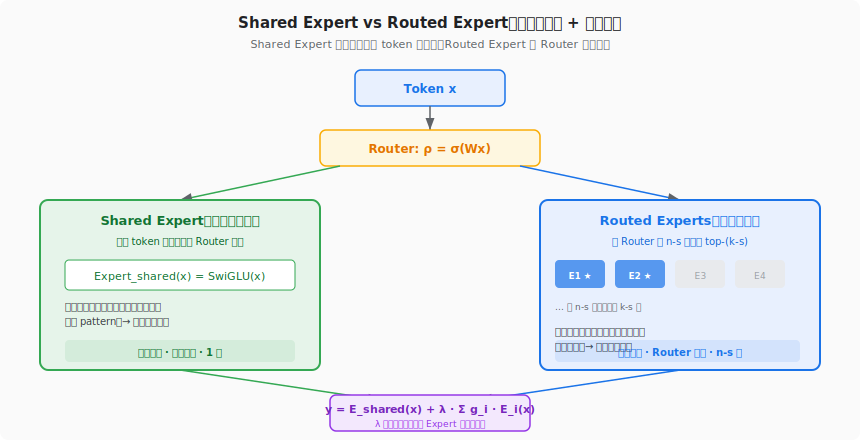
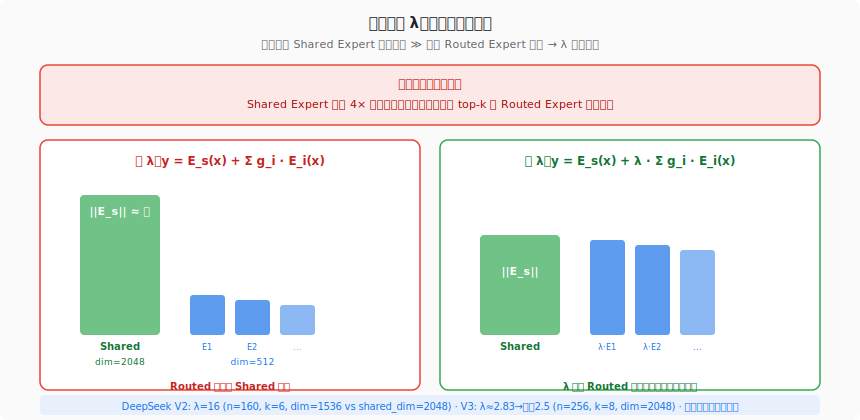
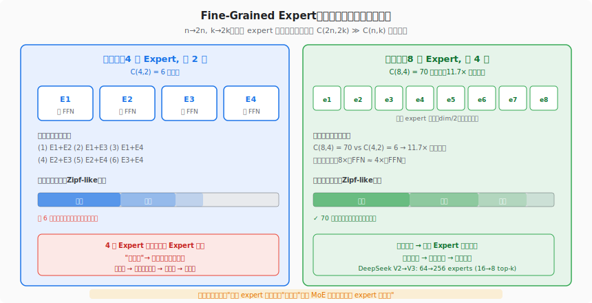

# MoE 环游记 #5：均匀分布的反思

> 原文：[MoE环游记：5、均匀分布的反思](https://kexue.fm/archives/10945)
> 作者：苏剑林（Jianlin Su）
> 发表日期：2025-05-16
> 系列定位：质疑均匀分布的最优性，从 Shared Expert 和 Fine-Grained Expert 两个方向突破

---

## 一、这篇文章要解决什么问题？

前四篇文章的出发点一直是"怎么让 expert 的负载均匀"——不管是 Aux Loss 的惩罚、Loss-Free 的偏置、还是动态激活的阈值，目标函数中的 Q 始终是均匀分布 (1/n, ..., 1/n)。

苏剑林在这篇文章中挑战了这个根本假设：

> **知识的分布本来就不均匀。有些知识（通用语法、常识推理）几乎每个 token 都需要，有些知识（量子力学术语、古生物分类）只有极少 token 需要。强制均匀分布意味着给语法分配的 expert 容量，和给古生物分类的一样多——这显然不是最优的。**

文章从两个已有的设计——**Shared Expert** 和 **Fine-Grained Expert**——出发，给出了"非均匀才是正确方向"的理论论证。

## 二、Shared Expert：常任理事国

### 2.1 什么是 Shared Expert？

在标准 MoE 中，所有 n 个 expert 地位平等，Router 从中选 top-k 个。DeepSeekMoE（2024）引入了一个新设计：**拿出 s 个 expert 作为 Shared Expert，它们对每个 token 始终激活，不经过 Router 选择**。

苏剑林用了一个绝妙的类比：**联合国安理会的常任理事国**。

- 5 个常任理事国（Shared Expert）：每次投票都参与，不需要选举
- 10 个非常任理事国（Routed Expert）：通过选举产生，轮换上岗

类比到 MoE：有些知识（语法、标点、常见搭配）几乎每个 token 都要用，让它们走 Router 选举既浪费了选择的"带宽"（k 个名额被通用知识占掉，留给专业知识的少了），又增加了不稳定性（Router 可能偶尔不选它们，导致输出抖动）。

不如直接把它们设为"常任"——始终参与。



### 2.2 残差学习视角

苏剑林给 Shared Expert 一个更深的理论解释：**残差学习**。

标准 MoE 的输出是：
```
y = Σ_{i∈top-k} g_i · E_i(x)
```

加入 Shared Expert 后变成：
```
y = E_shared(x) + Σ_{i∈top-(k-s)} g_i · E_i(x)
```

这和 ResNet 的残差连接 y = F(x) + x 有着相同的结构：
- E_shared(x) 相当于"主干"，捕获通用模式
- Σ g_i · E_i(x) 相当于"残差"，修正细节

残差学习的核心思想是：**学一个函数和参考点之间的"差异"比从零开始学更容易**。Dense FFN 本身已经是一个很好的通用函数——Shared Expert 就扮演了这个"通用函数"的角色，Routed Expert 只需要学"这个 token 和通用模式的差异"，学习难度降低。

### 2.3 几何正交性论证

苏剑林进一步用第一篇文章的几何直觉做了论证。回顾 #1 的结论：Dense FFN 是 n 个向量的加权和 v = Σw_i · v_i，MoE 是选 top-k 个 v = Σ_{top-k} w_i · v_i。

如果将 n 个 expert 分为 s 个 Shared 和 n-s 个 Routed，那么最优的策略是：
- s 个 Shared Expert 的向量 v_1, ..., v_s **指向所有 token 共享的"公共方向"**
- n-s 个 Routed Expert 的向量 **在公共方向的正交补空间中**

只有当 Routed Expert 的向量和 Shared Expert 正交时，Routed Expert 才能提供 Shared Expert 无法提供的信息。否则 Routed Expert 会部分重复 Shared Expert 的功能，浪费参数。

这也解释了为什么 DeepSeek V2/V3 中 Shared Expert 的 FFN 维度（2048）和 Routed Expert 的维度（2048）不一样——它们在设计上就应该捕获不同的信息。

## 三、缩放因子 λ：被忽视的初始化细节

### 3.1 问题

苏剑林注意到了一个实践中容易被忽视的问题：**Shared Expert 和 Routed Expert 的输出量级不匹配**。

在标准初始化下，每个 FFN 的输出量级大致正比于 √(参数量)。如果 Shared Expert 的 FFN 中间维度是 m，n-s 个 Routed Expert 的中间维度是 d，那么：
- Shared Expert 输出量级 ∝ √m
- 单个 Routed Expert 输出量级 ∝ √d
- top-k 加权后的 Routed 总输出量级取决于 k 和 n 的关系

当 m ≫ d（比如 DeepSeek V2 中 m=4096, d=1536）时，Shared Expert 的输出会淹没 Routed Expert 的贡献，导致训练早期 Routed Expert 几乎不起作用。



### 3.2 蒙特卡洛估算 λ

苏剑林的解法是加一个缩放因子 λ：

```
y = E_shared(x) + λ · Σ g_i · E_i(x)
```

λ 的值通过蒙特卡洛模拟确定：随机生成 Router 输入，算出 Shared Expert 和 Routed Expert 加权和的期望输出量级之比。

原文给出了完整的 Python 代码。核心思路：
1. 随机采样 x ~ N(0, 1)
2. 用随机初始化的权重算 Shared 和 Routed 各自的输出范数
3. 取比值的期望作为 λ

对 DeepSeek V2（n=160, k=6, d=1536, m=2048）：λ ≈ 16
对 DeepSeek V3（n=256, k=8, d=2048, m=2048）：λ ≈ 2.83，实际取 2.5

V3 的 λ 比 V2 小很多，原因是 V3 的 Routed Expert 维度从 1536 涨到 2048（和 Shared 一样），且 k 从 6 增到 8——Routed 的总贡献增大了。

## 四、非均匀分布的合理性：现实世界的 Zipf 定律

### 4.1 为什么均匀分布不是最优？

苏剑林给出了一个直觉论证：**自然语言中的知识分布服从 Zipf 定律（幂律分布），而非均匀分布**。

- 少数高频 pattern（"的"、"是"、标点）占据了绝大部分 token
- 中频 pattern（常见动词、形容词）占一部分
- 长尾的低频 pattern（专业术语、罕见表达）数量众多但每个出现极少

如果 expert 的知识分布也服从这种幂律，那么"均匀分配 expert 容量"就意味着：
- 高频知识被分配到太少的 expert 中 → 这些 expert 过载
- 低频知识被分配到太多的 expert 中 → 这些 expert 空闲

最优策略应该是让 expert 的容量分配匹配知识的真实分布。而 **Shared Expert 正是这种非均匀分配的友好近似**：把最高频的知识显式地分给始终激活的 expert，剩下的知识再在 Routed Expert 中均匀分配。

### 4.2 Shared Expert 是妥协方案

苏剑林坦诚指出：Shared Expert 并不是知识非均匀分配的完美解——它只是一个两层近似：
1. 第一层：Shared Expert 捕获高频通用知识
2. 第二层：Routed Expert 对剩余知识做均匀分配

理想情况下，应该让每个 expert 的负载匹配该类知识的真实频率。但这需要知道知识的频率分布，而这在训练前是未知的。Shared Expert 是一种"不需要提前知道分布"的保守方案——至少把最明显的非均匀性（通用 vs 专业）处理了。

## 五、Fine-Grained Expert：用组合数突破覆盖瓶颈

### 5.1 从粗粒度到细粒度

另一个和 Shared Expert 同时出现在 DeepSeekMoE 中的设计是 **Fine-Grained Expert**：把 n 个大 expert 拆成 2n 个小 expert（每个维度减半），同时 k 从 k 增到 2k。

苏剑林用组合数学解释了为什么这有用：

```
粗粒度：C(n, k) 种不同的 expert 组合
细粒度：C(2n, 2k) 种不同的 expert 组合
```

以 n=4, k=2 为例：
- 粗粒度：C(4, 2) = 6 种组合
- 细粒度：C(8, 4) = 70 种组合 → **11.7 倍提升**

更极端的例子：n=64, k=6：
- 粗粒度：C(64, 6) ≈ 7.4×10⁷
- 细粒度：C(128, 12) ≈ 2.4×10¹⁴ → **320 万倍提升**

而总参数量几乎不变（2n 个半维度的 expert ≈ n 个全维度的 expert）。



### 5.2 为什么组合数多 = 表达力强？

每种 expert 组合可以看作一个"知识配方"。n 个 expert 中选 k 个，就像 k 种原料配一道菜。

- 如果只有 6 种配方，那就只能做 6 道菜——面对 Zipf 分布的长尾需求，很多冷门菜做不出来
- 如果有 70 种配方，长尾覆盖好得多
- 如果有 2.4×10¹⁴ 种配方，几乎任何需求都能找到一个足够接近的匹配

Fine-Grained Expert 的代价是什么？每个 expert 更小 → 单个 expert 的表达力降低。但苏剑林认为这是值得的：**多个小 expert 的组合比单个大 expert 更灵活**，正如多种调料混搭比一种万能调料更适应多样化的口味。

### 5.3 实践中的演进

DeepSeek 系列完美体现了这个思路：

| 模型 | Routed Expert | Top-K | Expert Dim | C(n,k) |
|------|--------------|-------|------------|--------|
| DeepSeek V2 | 160 | 6 | 1536 | ~1.5×10⁹ |
| DeepSeek V3 | 256 | 8 | 2048 | ~4.3×10¹³ |
| **DeepSeek V4** | **384** | **6** | **3072** | **~2.1×10¹² ** |

V2→V3：expert 数翻倍、k 增大 → 组合数暴增。
V3→V4：expert 数再增（384），但 k 反而从 8 降到 6 → 计算量不增但组合数仍然极高。

## 六、结合我们的知识沉淀：从理论到工程

### 6.1 ALModel 的 Shared Expert 实践

我们 ALModel 17B MoE 的架构中有一个关键细节验证了苏剑林的分析：

- 256 Routed Experts（维度 512，每个 3.15M 参数）
- **1 Shared Expert（维度 2048，12.6M 参数）**

注意 Shared Expert 的维度（2048）是 Routed Expert（512）的 4 倍——这正是"Shared Expert 承载更多通用知识，需要更大容量"的体现。而在 MFU 计算中，早期代码错误地用 Routed Expert 的维度算 Shared Expert 的 FLOPS，导致 MFU 虚高。这个 bug 从反面证明了 Shared Expert 的独立维度是架构设计的有意为之。

> **Wiki 参考**：[ALModel 17B MoE 架构全解](https://cc.higcp.com/wiki-v2/sources/almodel-architecture-guide-20260308) · [ALModel Benchmark](https://cc.higcp.com/wiki-v2/sources/almodel-benchmark-20260304)

### 6.2 DeepSeek V3 的实际配置

从我们的 Wiki 知识库确认，DeepSeek V3 的实际配置完全匹配苏剑林文中讨论的参数：

- 256 routed + 1 shared expert
- Top-8 Sigmoid routing
- Shared Expert 和 Routed Expert 维度均为 2048

而苏剑林用蒙特卡洛估算的 λ ≈ 2.83、DeepSeek 实际取 2.5，这个微小差异可能是 DeepSeek 通过实际训练实验微调的结果。

> **Wiki 参考**：[DeepSeek V3](https://cc.higcp.com/wiki-v2/entities/deepseek-v3) · [DeepSeek V3.2 TPU v7 验证报告](https://cc.higcp.com/wiki-v2/sources/deepseek-v3.2-tpu-v7-report-20260416)

### 6.3 V4 的进一步演进

DeepSeek V4 在 Shared Expert 和 Fine-Grained Expert 两个方向都做了推进：

**Expert 数量**：从 256 增加到 384 个 Routed Expert，但 top-k 从 8 降到 6。这正是苏剑林文章的预言——**expert 越多越好，即使减少 k 也值得**（因为 C(384,6) 的组合数已经足够大）。

**Expert 维度**：从 2048 增大到 3072。这看起来和"更小更精"的方向相反，但 V4 的总参数从 671B 增到 1.6T——scale up 的同时保持了 expert 数量的绝对优势。

**Shared Expert**：仍然保留 1 个 Shared Expert，说明 Shared Expert 作为"通用知识基线"的设计经受住了 V3→V4 的代际验证。

> **Wiki 参考**：[DeepSeek V4 技术报告](https://cc.higcp.com/wiki-v2/sources/deepseek-v4-technical-report-20260424)

### 6.4 EP 与 Fine-Grained Expert 的工程张力

从 TPU/GPU 并行训练的角度看，Fine-Grained Expert 引入了一个工程挑战：**expert 越多越小，EP 的通信效率越低**。

在我们 ALModel 训练中，单个 expert 只有 3.15M 参数（维度 512），all-to-all 通信量（∝ hidden_dim=2048）相对于 expert 计算量（∝ expert_dim=512）太大，compute/comm ratio 只有 263 FLOP/byte。这直接导致 EP 不如纯 FSDP。

苏剑林在本文没有讨论这个工程问题（他更关注理论），但它是 Fine-Grained Expert 在 TPU 等硬件上的核心瓶颈。Mega MoE（DeepSeek V4）通过 dispatch/compute/combine 三步 kernel 融合来缓解——但这需要 GPU 侧的深度优化（对称内存、信号单元等），TPU 上的等价方案尚待探索。

> **Wiki 参考**：[Expert Parallelism](https://cc.higcp.com/wiki-v2/concepts/expert-parallelism) · [DeepGEMM PR #304 Mega MoE](https://cc.higcp.com/wiki-v2/sources/deepgemm-pr304-mega-moe-20260426)

## 七、对后续文章的铺垫

这篇文章处于"基础建设"和"理论突破"之间的转折点。苏剑林在前五篇中完成了全部的概念储备：

1. **几何直觉**（#1）：MoE = 选 top-k 向量
2. **均衡的必要性**（#2）：负载不均 → expert collapse
3. **偏置隔离**（#3）：Loss-Free 的参数隔离方案
4. **动态激活**（#4）：偏置的冗余自由度 → 预算控制
5. **非均匀性**（#5）：均匀不是最优 → Shared Expert + Fine-Grained Expert

下一篇（#6 最优分配促均衡）将迎来理论高潮：**Quantile Balancing**——用线性规划的对偶问题推导出"无超参数的精确均衡方案"，直接被 Kimi K3 采用。从 #5 到 #6 之间有 **9 个月的沉寂**（2025.05→2026.02），苏剑林在这段时间想通了最后一块拼图。

## 八、关键概念速查

| 概念 | 含义 |
|------|------|
| Shared Expert | 始终被选中的 expert，不经 Router，捕获通用知识 |
| Routed Expert | 由 Router 动态选择的 expert，捕获专业知识 |
| s | Shared Expert 的数量（通常 = 1） |
| n-s | Routed Expert 的数量 |
| top-(k-s) | Routed Expert 中被选中的数量 |
| λ | 缩放因子，平衡 Shared 和 Routed 的输出量级 |
| 残差学习 | y = baseline + residual，Shared Expert 提供 baseline |
| Fine-Grained Expert | 把大 expert 拆成多个小 expert，总参数不变 |
| C(n, k) | 组合数，从 n 个 expert 选 k 个的方案数 |
| Zipf 分布 | 幂律分布，头部频率远高于尾部 |
| 正交性 | Shared 和 Routed Expert 的向量应指向正交方向 |

## 九、一句话总结

**均匀分布不是 MoE 负载均衡的最优目标——知识本身是非均匀的（Zipf 分布）。Shared Expert（"常任理事国"）通过残差学习将通用知识显式分离，λ 缩放因子解决初始化量级不匹配。Fine-Grained Expert 通过"更小更多"的策略让组合数 C(n,k) 爆炸式增长，更好地覆盖长尾知识。这两个设计都指向同一个方向：放弃均匀性假设，拥抱知识分布的真实结构。**

---

**上一篇**：[#4 难处应当多投入](04-dynamic-activation.md) — 动态激活：b 的冗余自由度控制每 token 的 expert 数
**下一篇**：[#6 最优分配促均衡](06-quantile-balancing.md) — Quantile Balancing：无超参数的精确均衡方案
