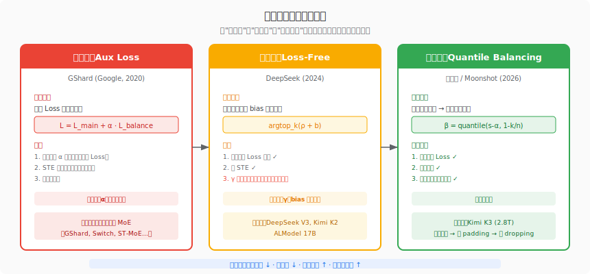
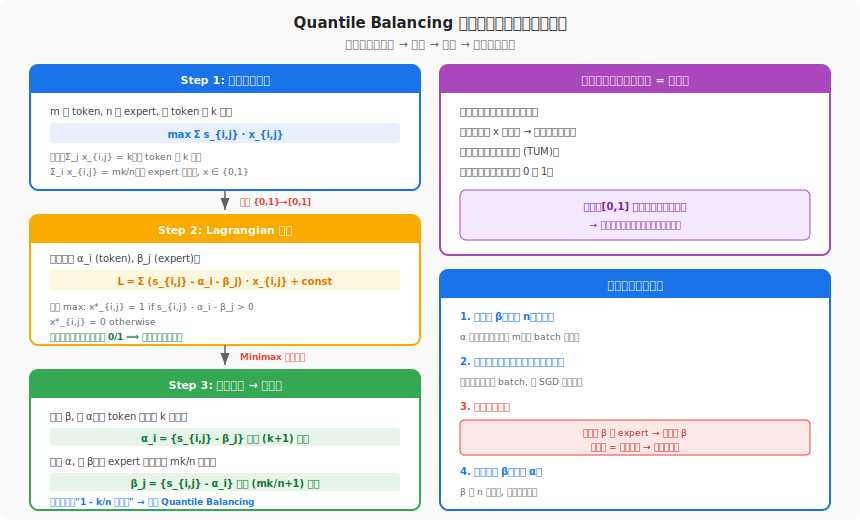
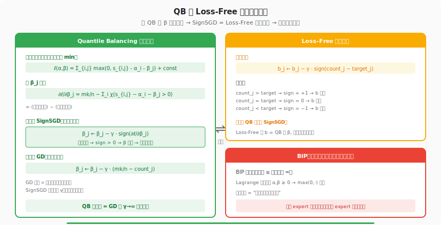

# MoE 环游记 #6：最优分配促均衡 · 深度解读

> **原文**：[MoE 环游记（六）：最优分配促均衡](https://kexue.fm/archives/11619)
> **作者**：苏剑林（Jianlin Su） · **日期**：2026-02-22
> **系列**：MoE 环游记 · 第 6 篇（共 9+1 篇）

---

## 一、前世今生

第 6 篇是整个 MoE 环游记系列的分水岭。

前五篇里，苏剑林用五篇文章系统梳理了 MoE 的几何直觉、Aux Loss、Loss-Free、动态激活和均匀分布反思。从第 2 篇的 Aux Loss 到第 3 篇的 Loss-Free，解决了"如何不干扰主 Loss"的问题；第 4、5 篇则分别质疑了"均匀激活"和"均匀分布"的最优性。

但到第 5 篇结束时（2025 年 5 月），一个核心问题悬而未决：**Loss-Free 虽然不干扰梯度，但它的更新步长 γ 与 Sigmoid 激活函数深度耦合——换个激活函数就得重新调参。有没有一种方法，既不干扰主 Loss，又完全没有超参数？**

然后是长达 9 个月的沉寂。

2026 年 2 月，苏剑林带着第 6 篇回归——这一次他没有再做工程上的小修小补，而是直接把问题推到了数学最优解：**如果我们把负载均衡看成一个线性规划问题，它的对偶解恰好是取分位数**。这就是 Quantile Balancing（QB）。

这篇文章的深远影响远超学术讨论：Kimi K3（Moonshot AI 的 2.8T 参数模型，896 个 expert）直接采用了 QB 作为其 MoE 训练的核心负载均衡方案，实现了零 token dropping、零 padding、零 aux loss 的训练。K3 技术报告明确致谢了苏剑林的 Quantile Balancing 工作。

## 二、产生原理：从 "该怎么调" 到 "为什么存在最优解"

理解 QB 的起源，需要先看前两代方案的思维局限：

**第一代 Aux Loss** 的思路是"犯错就罚"——如果 expert 分配不均，就在 loss 上加一个惩罚项。这是一种启发式方法：它不知道"最优均衡"是什么样的，只是通过惩罚推动系统朝均匀方向走。问题是惩罚系数 α 难调：太小不起作用，太大又干扰主 loss 的梯度。

**第二代 Loss-Free** 换了思路——不改打分，只在打分之上加一个 bias 来调整排序。这避免了对主 loss 的干扰，但引入了新的超参数 γ（bias 的学习率），而且这个 γ 跟激活函数的输出范围耦合：Sigmoid 输出在 [0,1]，Softmax 输出在不同量级，γ 的最优值完全不同。

苏剑林的洞察是：**这两代方案都在"怎么调"的层面打转，没有人问过"最优分配长什么样"**。

如果我们把"m 个 token 分配给 n 个 expert，每个 token 选 k 个，每个 expert 处理 mk/n 个"这件事当作一个优化问题来精确求解——答案是什么？

答案是一个**线性规划问题**。而线性规划有严格的数学理论保证最优解存在且可解。

## 三、要解决的问题

这篇文章要一举解决前两代方案遗留的三个核心难题：

### 3.1 超参数依赖

Aux Loss 的惩罚系数 α、Loss-Free 的 bias 学习率 γ，都是需要人工调节的超参数。在不同模型规模、不同 expert 数量、不同激活函数下，最优超参数值完全不同。对于 Kimi K3 这种 896 个 expert 的规模，调参成本极高。

### 3.2 激活函数耦合

Loss-Free 的 γ 与 Sigmoid 的输出范围耦合。苏剑林在文中明确指出，对于"畸形"的打分分布（比如所有 expert 打分都接近但略有差异），Loss-Free 的收敛性无法保证。

### 3.3 理论根基薄弱

前两代方案都是启发式的——它们朝着"均衡"的方向推动，但没有证明自己能收敛到最优解，甚至没有定义过"最优"是什么意思。QB 要给出一个精确的数学定义和精确的求解方法。

## 四、解决了什么

### 4.1 精确最优：线性规划建模

苏剑林把负载均衡问题建模为一个整数线性规划：

给定 m 个 token，n 个 expert，router 打分矩阵 $s \in \mathbb{R}^{m \times n}$，决策变量 $x_{i,j} \in \{0, 1\}$（token i 是否分配给 expert j）。

**目标**：最大化总打分（尽量把 token 分给最合适的 expert）

$$\max \sum_{i,j} s_{i,j} \cdot x_{i,j}$$

**约束**：
- 每个 token 恰好选 k 个 expert：$\sum_j x_{i,j} = k$
- 每个 expert 恰好处理 mk/n 个 token：$\sum_i x_{i,j} = mk/n$

### 4.2 松弛等价：整数 → 连续

直接求解整数规划是 NP-hard 的。但这里有一个关键的数学性质：

将 $x_{i,j} \in \{0, 1\}$ 松弛为 $x_{i,j} \in [0, 1]$，变成连续线性规划。由于约束矩阵具有**全幺模性（totally unimodular）**，LP 松弛的最优解自动是 0/1 整数——松弛不损失任何信息。

这意味着我们可以用连续优化的方法来精确求解这个整数问题。

### 4.3 Lagrangian 对偶

引入 Lagrange 乘子 $\alpha_i$（对应 token 约束）和 $\beta_j$（对应 expert 约束），构造 Lagrangian：

$$L = \sum_{i,j} (s_{i,j} - \alpha_i - \beta_j) \cdot x_{i,j} + \sum_i k\alpha_i + \sum_j \frac{mk}{n}\beta_j$$

内层对 x 求 max 的解是：$x^*_{i,j} = 1$ 若 $s_{i,j} - \alpha_i - \beta_j > 0$，否则为 0。

然后通过 **minimax 定理**交换内外层优化顺序（强对偶性保证交换合法），得到外层对 α, β 的 min 问题。

### 4.4 交替优化 → 分位数

对偶问题可以用交替优化求解：

**固定 β，求 α**：要求 token i 恰好选 k 个 expert，等价于找到阈值 α_i 使得恰好有 k 个 j 满足 $s_{i,j} - \beta_j > \alpha_i$。解：

$$\alpha_i = \{s_{i,j} - \beta_j\}_j \text{ 中第 } (k+1) \text{ 大值}$$

**固定 α，求 β**：要求 expert j 恰好处理 mk/n 个 token，等价于找到阈值 β_j 使得恰好有 mk/n 个 i 满足 $s_{i,j} - \alpha_i > \beta_j$。解：

$$\beta_j = \{s_{i,j} - \alpha_i\}_i \text{ 中第 } (mk/n + 1) \text{ 大值}$$

两步都是取 **1 - k/n 分位数**——这就是 "Quantile Balancing" 名字的由来。



### 4.5 训练中的实际简化

在实际训练中，苏剑林做了几个关键简化：

1. **只维护 β**：α 的维度是 m（batch size，每步变化），β 的维度是 n（expert 数，固定）。推理时只需要 n 维的 β 向量。

2. **每步只迭代一次**：不在当前 batch 上迭代到收敛（那会过拟合当前 batch），而是只做一次 α→β 更新，精神上类似 SGD 的单步更新。

3. **顺序很关键**：必须先用旧的 β 选 expert，前向传播完毕后再更新 β。如果先更新 β 再选 expert，就会出现信息泄露——你用了"未来的信息"来做当前的决策。

这三个简化把 QB 从一个理论上的线性规划求解器变成了一个实用的在线算法：每个训练步只需要两次 quantile 操作，计算开销几乎为零。



## 五、思想源泉

### 5.1 运筹学的经典方法

QB 的核心方法——Lagrangian 对偶 + 交替优化——是运筹学/凸优化的经典工具。苏剑林把一个看似 "机器学习" 的问题转化成了一个 "运筹学" 的问题来求解，体现了跨领域思维的力量。

### 5.2 从 BIP 到 QB 的修正

文章中特别讨论了为什么不用**不等式约束**（BIP, Balanced Integer Programming）。BIP 把"恰好 mk/n 个"放松为"至多 mk/n 个"，对应的 Lagrange 乘子要求 $\alpha, \beta \geq 0$（非负性约束），会被 $\max(0, \cdot)$ 截断。

截断的效果是"劫富可以，济贫不行"——过载的 expert 可以通过降低 β 来减少分配，但欠载的 expert 无法通过提高 β 来吸引更多 token（因为 β 被截断在 0）。这导致 BIP 的收敛速度比 QB 慢得多。

苏剑林通过等式约束避免了这个问题：α 和 β 可以取负值，正负双向都可以调节。

### 5.3 与梯度下降的桥接

文章最精彩的部分之一是证明了 **Loss-Free 就是 QB 的 SignSGD 近似**。

对 β 求导：$\partial\ell/\partial\beta_j = mk/n - \sum_i \chi(s_{i,j} - \alpha_i - \beta_j > 0)$

这就是"目标分配量减去实际分配量"。取 sign 后做 SGD：

$$\beta_j \leftarrow \beta_j - \gamma \cdot \text{sign}(\partial\ell/\partial\beta_j)$$

这恰好就是 Loss-Free 的更新规则！换句话说，**Loss-Free 是 QB 的一阶近似，QB 是 Loss-Free 的精确求解**。

当第 k 大和第 (k+1) 大的打分严格不等时（几乎必然成立），两者等价。但 QB 不需要指定 γ——它直接给出精确的分位数值。



## 六、知识库交叉印证

### 6.1 Kimi K3 的大规模验证

根据我们知识库中的 Kimi K3 技术报告分析：

- **规模**：2.8T 总参数，896 个 expert，每 token 选 8 个，单个 expert 参数约 3B
- **QB 应用效果**：实现了零 token dropping、零 padding、零 aux loss
- **10+ 创新协同**：AttnRes (attention residual)、Gated MLA、Per-Head Muon 优化器、SiTU (Sigmoid with Tunable Upper bound)、MXFP4 QAT 量化训练
- **对 QB 的评价**：K3 技术报告明确致谢苏剑林的 Quantile Balancing 工作

K3 的成功验证了 QB 在极端规模（896 expert）下的可行性——这是 Loss-Free 未曾在公开技术报告中被验证过的规模。

### 6.2 Static-Shape Expert Parallel 的连锁反应

QB 对 TPU 训练有一个深远的连锁效应，我们知识库中有详细记录：

**传统路径**（GShard/Switch 时代）：
- Aux Loss 做近似均衡 → 实际分配仍不均 → 需要 capacity_factor 兜底 → 约 33% MXU 浪费
- 动态形状 → All-to-All 通信不确定 → XLA 无法完全编译 → compute-comm 无法 overlap

**QB 路径**（K3 时代）：
- QB 精确均衡 → 每个 expert 恰好处理 mk/n 个 token → 固定 tensor shape
- 固定 shape → 静态 All-to-All → XLA 完全编译 → compute-comm 完美 overlap
- 无 capacity_factor → 零 padding → 零浪费

这对 TPU v7 等加速器的意义尤为重大：TPU 的 XLA 编译器对静态 shape 有极强偏好（动态 shape 会 fallback 到低效路径），QB 恰好满足了这一硬件需求。

### 6.3 ALModel 的对比参照

我们内部训练的 ALModel 17B 仍然使用传统的 Loss-Free 路由 + capacity_factor=1.5。与 K3 的 QB 方案对比：

| 维度 | ALModel 17B | Kimi K3 |
|------|-------------|---------|
| 路由方案 | Loss-Free (bias + γ) | Quantile Balancing |
| Expert 数 | 64 routed + 2 shared | 896 routed |
| 超参数 | γ 需针对 Sigmoid 调优 | 无 |
| Token dropping | 有 (capacity_factor 截断) | 无 |
| Padding 浪费 | ~33% (cap_factor=1.5) | 0% |
| XLA 编译 | 部分动态 shape | 全静态编译 |

这说明 QB 不仅是理论上更优雅，在工程上也有实打实的效率提升。

## 七、深度解读

### 7.1 为什么松弛等于精确？

文章中最不直觉的结论是：把 {0,1} 松弛为 [0,1] 之后，最优解自动就是 0/1。

数学上的原因是**约束矩阵的全幺模性**：这个线性规划的约束矩阵由 0 和 1 构成，且结构使得所有子行列式的值只能是 -1, 0, 1。这意味着 LP 可行域的所有顶点都是整数点。

直觉理解：每个 token 面对的是一个排序问题——"在减去 β_j 之后，选打分最高的 k 个 expert"。排序的结果天然是离散的（要么选、要么不选），不存在"选半个"的中间状态。

### 7.2 信息泄露陷阱

苏剑林特别强调了一个实现上的关键细节：必须用**旧的** β 来选 expert，前向传播完毕后再更新 β。

为什么？如果用当前 batch 的数据先更新 β，再用新 β 选 expert，那么 expert 的选择已经包含了当前 batch 的统计信息——这等于"偷看答案再做题"。模型会学到利用这个信息泄露来走捷径，训练不稳定。

这个陷阱在工程实现中很容易犯，因为"先更新再使用"在代码层面更自然（就像先 optimizer.step() 再 forward()）。苏剑林的提醒救了很多可能踩坑的实现者。

### 7.3 一步迭代的深层原因

为什么不在当前 batch 上迭代到 α, β 收敛，而是只做一步？

表面原因是效率——多次迭代增加计算量。但更深层的原因是**防止过拟合**：当前 batch 只是训练数据的一个采样，在这个采样上求出的"最优分配"未必是全局最优。只做一步更新，让 β 在多个 batch 间缓慢演化，精神上等价于用小学习率做 SGD——每步朝着当前 batch 的最优方向走一小步，而不是一步跳到当前 batch 的最优点。

这与 Loss-Free 的 γ 学习率有异曲同工之妙：两者都在"当前 batch 最优"和"全局稳定性"之间做平衡。

> **后见之明（来自 [第 8 篇](08-forced-sequence-balance.md)）**：一步迭代的 β 在 batch 粒度是合理的，但它隐含了一个假设——**同一 batch 中所有序列的 expert 偏好是相似的**。实际上代码序列和诗歌序列的偏好分布可能天壤之别。第 8 篇的 MQB 把 β 的更新推进到序列维度：用直方图近似分布 + EMA 做因果更新，使得 β 可以随序列内容动态调整，而非全 batch 共享。这解释了为什么一步迭代"够用但不完美"——它在 batch 粒度足够，但在序列粒度还有提升空间。

### 7.4 从三代方案看设计哲学的演进

| 代际 | 方法论 | 设计哲学 |
|------|--------|----------|
| Aux Loss | 罚不均（惩罚偏差） | 控制论——通过反馈信号纠偏 |
| Loss-Free | 调排序（加 bias） | 博弈论——通过调整"出价"影响竞争结果 |
| Quantile Balancing | 解方程（精确求解） | 运筹学——直接求最优分配 |

这个演进路径展示了一个常见的研究范式：**从启发式到精确解**。每一代都比上一代的理论根基更深。

> **后见之明（来自 [第 9 篇](09-gate-normalization.md)）**：三代方案解决的都是"如何把 token 均匀分配给 expert"，但有一个正交的问题被完全忽略了——**门控函数 ρ 本身应该如何设计？** Softmax、Sigmoid、ReLU 各有拥趸，QB 的 β 向量与门控函数的选择是完全解耦的（β 调的是排序阈值，与 ρ 的归一化方式无关）。第 9 篇从概率论第一性原理给出了 ρ 应满足的条件，补齐了 QB 框架中"门控设计"这块缺失的拼图。

### 7.5 苏剑林的 Demo 代码

文章附带了一段 numpy 实现的 QB 核心代码，展示了 `quantile_bias()` 函数和 `max_min_avg_vio()` 评估函数。代码精简到不超过 20 行，说明 QB 的工程实现极为简单——这是好理论的标志：**解决问题的复杂性应该在推导中，不在实现中**。

```python
def quantile_bias(scores, top_k, bias):
    """核心：用旧 bias 选 expert，再更新 bias"""
    adjusted = scores - bias  # 减去 expert bias
    alpha = np.partition(-adjusted, top_k, axis=1)[:, top_k]  # 第 (k+1) 大
    threshold = adjusted + alpha[:, None]  # s - alpha - beta
    mask = (threshold > 0).astype(float)  # 选择决策
    target = scores.shape[0] * top_k / scores.shape[1]
    # 更新 beta: 第 (mk/n + 1) 大的 (s - alpha)
    residual = scores - alpha[:, None]
    new_bias = np.partition(-residual, int(target), axis=0)[int(target)]
    return mask, new_bias
```

## 八、前后文关联

### 8.1 回顾

- **第 2 篇（Aux Loss）**：定义了问题——负载均衡的 STE 梯度推导。QB 在此基础上给出了"不需要 STE"的精确解。
- **第 3 篇（Loss-Free）**：给出了 "不干扰主 Loss" 的方向。QB 证明了 Loss-Free 是 QB 的 SignSGD 近似——统一了两代方案。
- **第 5 篇（均匀分布反思）**：讨论了 Shared Expert 和 Fine-Grained Expert。QB 的精确均衡让 Fine-Grained Expert（如 K3 的 896 个 expert）成为可能——如果均衡不精确，896 个 expert 的路由会极度不稳定。

### 8.2 前瞻

- **第 7 篇**将探讨 QB 的动态激活版本——当每个 token 的 k 不固定时如何用 QB。去掉"每 token 选 k 个"这一约束后，解的形式大幅简化：从两组乘子（α, β）的交替迭代变成只有一组乘子（β）的一步求解。
- **第 8 篇**将从 batch 级均衡推广到序列级均衡——本文的 β 是全局共享的（整个 batch 用同一组 β），这保证了全局均衡，但可能导致某些序列内部极度不均（代码序列 80% token 涌向同一个 expert）。MQB（Moving Quantile Balancing）用直方图近似 + EMA 把 QB 的精确均衡推广到因果序列维度。
- **第 9 篇**讨论门控归一化——QB 的 β 只管"选哪些 expert"，但选出来之后门控函数 ρ 如何设计（Softmax/Sigmoid/ReLU）是一个正交问题。第 9 篇从概率论第一性原理推导了 ρ 应该满足的条件。
- **番外篇**讨论 DeepSeek V4 的 Hash Routing，是另一种彻底不同的均衡思路（直接消除 router）。

## 九、概念速查表

| 概念 | 定义 | 文中角色 |
|------|------|----------|
| Quantile Balancing (QB) | 基于线性规划对偶的精确负载均衡方案 | 本文提出的核心方案 |
| 线性规划 (LP) | 目标和约束均为线性函数的优化问题 | QB 的数学建模工具 |
| Lagrangian 对偶 | 将约束优化转化为无约束 minimax 问题 | 推导的关键步骤 |
| 全幺模矩阵 (TUM) | 所有子行列式值为 -1/0/1 的矩阵 | 保证松弛等于精确 |
| 分位数 (Quantile) | 排序后第 p% 位置的值 | α, β 更新的闭合解 |
| Minimax 定理 | 凸-凹函数可交换 max 和 min 的顺序 | 对偶推导的理论基础 |
| SignSGD | 只取梯度符号的随机梯度下降 | 连接 QB 与 Loss-Free 的桥梁 |
| BIP | 用不等式约束的平衡整数规划 | QB 的弱化版本（作为反面教材） |
| 信息泄露 | 用未来信息做当前决策 | QB 实现中必须避免的陷阱 |
| capacity_factor | 传统 MoE 中为动态 shape 预留的缓冲系数 | QB 精确均衡后不再需要 |
| Static-Shape EP | 固定 tensor shape 的 Expert Parallel | QB 精确均衡的连锁产物 |

## 十、总结

Quantile Balancing 是 MoE 负载均衡领域的范式转移：

- **数学上**，它把启发式问题转化为线性规划，给出了精确最优解
- **工程上**，它只需要维护一个 n 维向量 β，每步两次 quantile 操作，几乎零开销
- **理论上**，它统一了前两代方案——Loss-Free 是 QB 的一阶近似
- **实践上**，Kimi K3 (896 expert, 2.8T) 的大规模验证证明了其在极端规模下的可行性
- **硬件上**，精确均衡 → 静态 shape → XLA 完全编译 → 对 TPU/GPU 的 compute-comm overlap 至关重要

从 Aux Loss 的"罚不均"，到 Loss-Free 的"调排序"，再到 QB 的"解方程"——三代方案的演进，本质上是从控制论到博弈论到运筹学的方法论升级。

苏剑林用一篇文章完成了这个升级，并且在 9 个月的沉寂后带来了整个系列最重要的理论贡献。

对 TPU 训练而言，QB 的价值远不止"零超参数"——**精确均衡 → 静态 tensor shape → XLA 全编译 → compute-comm overlap** 这条链路，是 MaxText 等框架在大规模 EP 训练中摆脱 capacity_factor 浪费的关键路径。后续第 8 篇将进一步把 QB 推广到序列级（MQB），而第 9 篇则从正交方向解决门控函数的选择问题——两条线合在一起，构成了 MoE 路由的完整理论体系。

---

*下一篇解读：[#7 动态激活极简解](07-dynamic-qb.md) — QB 的动态版本，解除固定 k 的约束*
