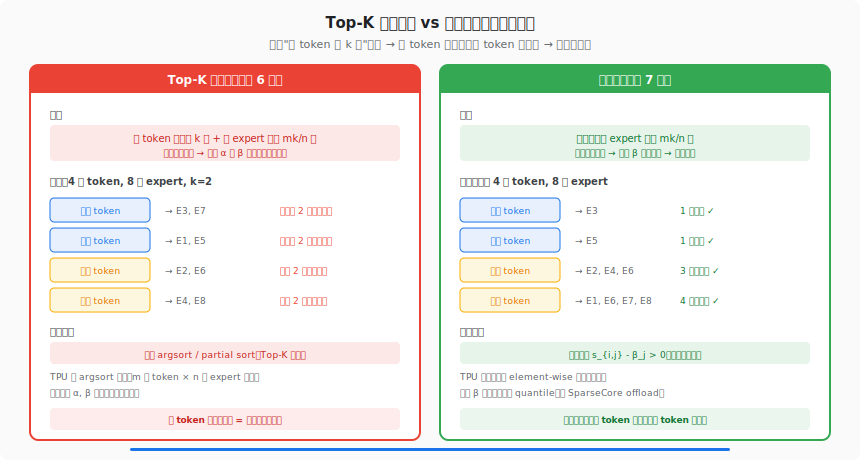
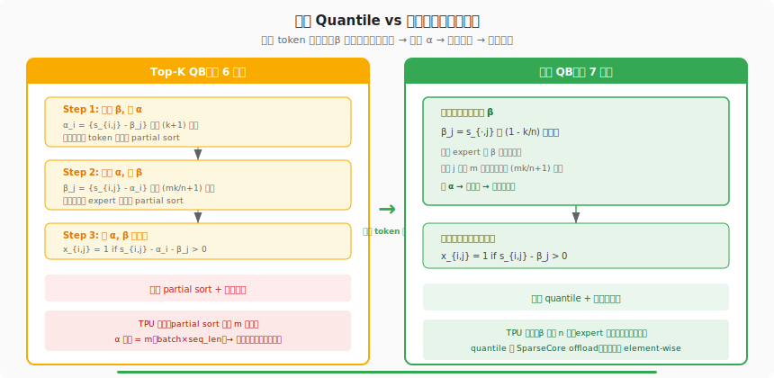
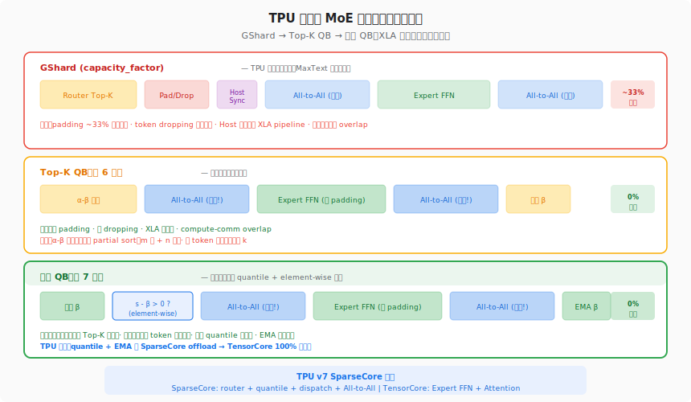

# MoE 环游记 #7：动态激活极简解 · 深度解读

> **原文**：[MoE 环游记（七）：动态激活极简解](https://kexue.fm/archives/11626)
> **作者**：苏剑林（Jianlin Su） · **日期**：2026-02-23
> **系列**：MoE 环游记 · 第 7 篇（共 9+1 篇）

---

## 一、前世今生

第 7 篇发表于第 6 篇仅一天之后（2026-02-23 vs 2026-02-22），像是一篇水到渠成的推论。

第 6 篇建立了 Quantile Balancing 的完整理论——通过线性规划对偶推导出分位数求解。但那个版本有两个等式约束："每 token 选 k 个 expert"和"每 expert 处理 mk/n 个 token"。苏剑林在第 7 篇问了一个关键问题：**第一个约束真的必要吗？**

答案是不必要。我们真正需要的只是"每个 expert 负载均衡"——这一个约束就够了。"每个 token 选 k 个"不过是一种人为对称性约束。去掉它之后，解的形式大幅简化：从两组乘子（α, β）的交替迭代变成只有一组乘子（β）的一步求解。

这个简化不仅是数学上的优雅——它对 TPU 等加速器有深刻的工程意义：免去了排序操作、减少了跨设备通信、让 SparseCore offload 变得更自然。

更令人惊喜的是，苏剑林发现这个动态版 QB 本质上就是"Expert Choice"的 bias 形式——一种历史上因为因果律问题难以落地的方法，在 QB 的对偶框架下被自然地修复了。

## 二、产生原理：一个约束的去留

### 2.1 为什么 "每 token 选 k 个" 不是必要的

在第 6 篇的线性规划中有两个约束：

1. $\sum_j x_{i,j} = k$ — 每个 token 恰好激活 k 个 expert
2. $\sum_i x_{i,j} = mk/n$ — 每个 expert 恰好处理 mk/n 个 token

苏剑林指出：约束 2 已经隐含了"平均来说每 token 激活 k 个 expert"（因为 $\sum_{i,j} x_{i,j} = mk$），所以约束 1 是多余的——它把一个统计层面的约束强制到了每个 token 上。

去掉约束 1 后，困难 token 可以激活 3-5 个 expert，简单 token 可以只激活 1-2 个——资源自适应分配，正是第 4 篇"难处应当多投入"的理念，但这次有严格的最优性保证。

### 2.2 对偶问题的简化

只保留约束 2 后，Lagrangian 只有一组乘子 β_j：

$$\min_{\beta_j} \max_{x_{i,j} \in [0,1]} \sum_{i,j} x_{i,j}(s_{i,j} - \beta_j) + \frac{mk}{n}\sum_j \beta_j$$

内层 max 的解：$x^*_{i,j} = 1$ 若 $s_{i,j} - \beta_j > 0$，否则为 0。

代入后，β_j 的优化变成 n 个独立的一维问题——每个 expert 的 β_j 独立求解，不需要交替迭代。

## 三、要解决的问题

### 3.1 Top-K QB 的残余开销

第 6 篇的 Top-K QB 虽然消除了超参数，但仍有计算开销：
- 两次 partial sort（一次求 α，一次求 β）
- α 的维度是 m（= batch_size × seq_len），在分布式训练中 m 可能数百万级
- 交替迭代本身引入额外的同步点

### 3.2 固定 k 的资源浪费

Top-K 模式下，每个 token 必须激活恰好 k 个 expert——简单 token 被迫浪费计算在不需要的 expert 上，困难 token 又得不到足够的 expert 资源。

### 3.3 Expert Choice 的因果律问题

历史上的 Expert Choice（让 expert 选 token，而不是 token 选 expert）方法在训练中表现优秀，但有致命缺陷：它需要在全局范围内比较所有 token，导致跨序列、跨样本的选择，违反了因果律（训练时看到了未来信息），也破坏了训推一致性（推理结果依赖 batch size）。

## 四、解决了什么

### 4.1 一步 Quantile 求解

β_j 的最优解有闭合形式：将 expert j 收到的所有打分 $s_{i,j}$ 从大到小排列，β_j 恰好是第 (mk/n+1) 大的值——即 1-k/n 分位数。

$$\beta^*_j = \text{quantile}(s_{\cdot,j}, 1 - k/n)$$

一步就得到了绝对均衡的最优解。

证明极其简洁：把 $\max(0, s_i - \beta)$ 按 β 的位置分段分析，当 β 在第 (mk/n) 大和第 (mk/n+1) 大之间取得最小值——大于或小于这个位置都会增大目标。



### 4.2 激活规则：阈值比较

有了 β 之后，token i 是否激活 expert j 的判断变成：

$$x_{i,j} = \begin{cases} 1 & \text{if } s_{i,j} - \beta_j > 0 \\ 0 & \text{otherwise} \end{cases}$$

这是一个纯粹的 **element-wise 比较**——比 Top-K 的排序操作简单得多。每个 token 的激活数量不再固定为 k，而是由 "有多少个 expert 的打分超过了阈值 β_j" 决定。

### 4.3 EMA 平滑

一步最优解在当前 batch 上是精确的，但可能过拟合。实际训练中用 EMA（指数移动平均）平滑：

$$\beta \leftarrow \lambda \cdot \beta_{\text{old}} + (1-\lambda) \cdot \beta_{\text{new}}$$

苏剑林的实验中 λ=0.9（保留 90% 历史信息）。顺序仍然关键：先用旧 β 做激活决策，再更新 β。



### 4.4 Expert Choice 的 Bias 修复

苏剑林揭示了动态 QB 与 Expert Choice 之间的深层联系：

**Expert Choice 的原始形式**："每个 expert 选 Top-mk/n 个 token"——沿 token 维度（axis=0）取最大的 mk/n 个。

**动态 QB 的 Bias 形式**："token 的打分减去 expert 的偏置后，正值即激活"——等价地，每个 expert 的第 mk/n+1 大打分作为阈值。

关键区别：Expert Choice 需要在全局比较所有 token（违反因果律），而 QB 的 Bias 形式把全局信息压缩进一个 n 维向量 β 中，然后每个 token 独立用 β 做局部决策。β 用旧值（不包含当前 token 信息），因此不存在信息泄露。

苏剑林评价这个联系："不得不说，有种让人赏心悦目的美感。"

### 4.5 初始化解析式

β 的初始化在训练前几步至关重要（因为必须用旧 β 决策）。苏剑林给出了基于正态分布假设的解析解：

假设 router 初始 logits 服从 $N(0, \sigma^2)$，则 β 的初始值为：

$$\beta_0 = \sigma \cdot \Phi^{-1}(1 - k/n)$$

其中 $\Phi^{-1}$ 是标准正态分布的分位数函数。对于 Sigmoid 激活，加上 Sigmoid 变换即可；对于 Softmax，需额外除以一个模拟的归一化分母。σ 可以从 router 权重矩阵的初始化方差直接推导。

## 五、思想源泉

### 5.1 最优传输理论的影子

动态 QB 的数学结构——"在约束下最大化总得分"——与最优传输理论有异曲同工之妙。最优传输中，Kantorovich 对偶的乘子对应"运输价格"；QB 中，β_j 对应"expert 的准入门槛"。两者都是通过对偶变量把全局约束转化为局部决策。

### 5.2 从第 4 篇的直觉到精确解

第 4 篇"难处应当多投入"凭直觉设计了动态激活：打分高于阈值的 expert 就激活。第 7 篇从最优分配的线性规划出发，推导出完全相同的形式——但阈值不再是人工设定的，而是数据驱动的最优解。

苏剑林在文中明确指出："之前我们是凭直觉设计出来的，而这里是通过更本质的目标推导出来的。"

### 5.3 梯度下降的退化形式

如果不想做 quantile 操作（在某些硬件上全局排序确实昂贵），可以退化到梯度下降：

$$\frac{\partial\ell}{\partial\beta_j} = \frac{mk}{n} - \sum_i \chi(s_{i,j} - \beta_j > 0)$$

用 SignSGD 就得到 Loss-Free 的更新规则。所以动态 QB 是一个谱系——精确解是 quantile，近似解是 Loss-Free，中间还可以用 GD（保留梯度幅度信息）。

## 六、知识库交叉印证：与 TPU 的深层关联

### 6.1 XLA 静态形状的核心矛盾

根据我们知识库中的 "K3 on TPU 兼容性分析"和"Static-Shape Expert Parallel"的深度记录：

**XLA 的核心约束**：所有 tensor 形状必须在编译时确定。传统 MoE 的 Top-K 路由直接违反这一约束——每个 expert 每 step 收到的 token 数不同。

**GShard 的 workaround**：
```python
capacity = tokens_per_expert * capacity_factor  # 1.5x
expert_input = pad_to_capacity(dispatched_tokens, capacity)  # 不足补零
excess_tokens = drop(dispatched_tokens, capacity)  # 超出丢弃
```

这带来 ~33% 算力浪费（padding）和信息丢失（dropping），是 MaxText 当前默认配置（`config.capacity_factor = 1.25`）的历史包袱。

**动态 QB 的解法**：Quantile Balancing 保证每个 expert 恰好处理 mk/n 个 token → tensor 形状在编译时已知 → XLA 将整个 MoE forward（含 All-to-All 通信）编译成一个优化的 HLO 图。

### 6.2 动态 QB 比 Top-K QB 对 TPU 更友好的 3 个原因

| 维度 | Top-K QB (第 6 篇) | 动态 QB (第 7 篇) | TPU 影响 |
|------|-------------------|------------------|----------|
| 排序操作 | 两次 partial sort (α + β) | 一次 quantile (仅 β) | partial sort 在 TPU 上比 GPU 贵，减少 50% 排序量 |
| 中间变量 | α 维度 = m (batch×seq_len) | 无 α | m 可达数百万，分布式下需跨 chip 通信来求全局 α |
| 激活决策 | argtop_k (排序操作) | s - β > 0 (逐元素比较) | element-wise 比较是 TPU TensorCore 最擅长的操作 |

**特别值得注意的是 α 的消除**：在 2048-chip TPU v7 集群上训练时，m = batch_size × seq_len 可能达到数百万级。Top-K QB 的 α 需要在全局范围内对每个 token 做 partial sort——这要求跨 chip 通信来收集全局打分分布。动态 QB 完全避免了这个问题：β 只有 n 维（expert 数，通常几百到几千），可以在单 chip 内完成更新。

### 6.3 SparseCore Offload 的天然配合

根据我们知识库中 TPU v7 架构的记录，每个 v7 chip 有 4 个 SparseCore（独立于 TensorCore，2.4× FLOPS vs v6e）：

```
动态 QB 中 SparseCore 可 offload 的操作：
├─ Router logit 计算        （小矩阵乘法）
├─ 一步 quantile 求解       （排序 + 取分位数）
├─ EMA 更新 β               （逐元素加权平均）
├─ 阈值比较 s - β > 0       （逐元素比较）
└─ Token dispatch 通信      （All-to-All）

TensorCore 100% 专注于：
├─ Expert FFN 计算           （大矩阵乘法，MoE 的主要算力消耗）
├─ Attention 计算            （KDA/MLA）
└─ Dense 层计算              （embedding, layer norm 等）
```

动态 QB 的操作全部是 SparseCore 擅长的小规模排序和比较——而 Top-K QB 的 α-β 交替迭代涉及更大的矩阵操作，offload 效率更低。

### 6.4 从 GShard 到动态 QB 的 TPU 训练演进

我们知识库中记录了完整的演进路径：

```
GShart (2020) — TPU 上第一个 MoE
  ├─ capacity_factor 保证静态形状（~33% 浪费）
  ├─ Host 需要每 step 做通信规划
  └─ XLA 无法将 All-to-All 纳入编译图 → 无 overlap

MaxText 当前默认
  ├─ capacity_factor=1.25 + megablox=True
  ├─ 12 轴 mesh (含 expert 轴)
  └─ All-to-All 通过 jax.lax.all_to_all

Top-K QB (第 6 篇)
  ├─ 精确均衡 → 零 padding/dropping
  ├─ 静态 All-to-All → XLA 全编译 → compute-comm overlap
  └─ 仍需 α-β 交替 + argtop_k 排序

动态 QB (第 7 篇) — TPU 最优形态
  ├─ 一步 quantile (可 SparseCore offload)
  ├─ element-wise 比较 (TensorCore 零开销)
  ├─ 零 padding/dropping + 静态 All-to-All
  └─ 动态激活 → 难 token 多投入 → 模型质量更好
```

### 6.5 ALModel 训练的对比参照

我们内部的 ALModel 17B MoE 训练在 TPU v7 Ironwood 上使用传统路由（Top-K + capacity_factor=1.5），经历了 21 runs、8842 max steps 才达到 loss 2.385。

如果采用动态 QB：
- 消除 capacity_factor 的 ~33% 算力浪费
- 消除 token dropping 导致的信息丢失
- XLA 全编译实现 compute-comm overlap
- 动态激活让困难训练样本获得更多 expert 资源

这些改进叠加可能显著加速收敛，减少训练 runs 数量。MaxText 的改动点明确：替换 `layers/moe.py` 中的 Top-K 路由为 quantile bias + 阈值比较。

### 6.6 Expert Parallelism 通信模式的影响

根据知识库中 Expert Parallelism 的记录，EP 的工作流程是：
1. Gate 计算 → 2. All-to-All 分发 → 3. Expert 计算 → 4. All-to-All 收集

动态 QB 对 step 1（Gate 计算）的改变尤为关键：从 "计算 Top-K 并 dispatch 不均匀的 token 数" 变成 "比较 s-β>0 并 dispatch 固定的 token 数"。All-to-All 的通信量变成编译时常量，XLA 可以在编译阶段就规划好 ICI 带宽分配。

在我们记录的 Google×蚂蚁 TPU v7 预训练效率交流中，AllGather ICI 带宽利用率仅 33%-42%。动态 QB 的静态通信模式有可能通过 XLA 编译优化提升这个利用率——因为编译器知道每个 All-to-All 的精确大小，可以更好地 pipeline 计算和通信。



## 七、深度解读

### 7.1 "免排序" 的计算意义

传统 Top-K 路由需要对 n 个 expert 的打分做 argsort 或 partial sort。在 GPU 上这很快（CUDA 有高度优化的排序 kernel），但在 TPU 上排序是相对昂贵的操作——TPU 的 TensorCore 为矩阵乘法优化，排序需要大量条件分支和数据依赖的内存访问。

动态 QB 完全免除了推理时的排序：只需要一个 element-wise 减法和一个逐元素比较。训练时虽然仍需要一次 quantile 操作来更新 β，但可以 offload 到 SparseCore 或用 EMA 分摊到多个 step。

### 7.2 Expert Choice 因果律问题的优雅解决

Expert Choice 的因果律问题一直是 MoE 社区的痛点：

**问题**：Expert Choice 需要在全局（batch × seq_len × num_experts）范围内排序——这意味着序列 A 中 token 的路由决策可能受到序列 B 中 token 的打分影响。训练时这还好（反正看的是整个 batch），但推理时 batch size 变化会导致路由决策变化 → 训推不一致。

**动态 QB 的解法**：把全局排序的信息压缩进 β 向量，β 在训练过程中通过 EMA 缓慢演化。推理时 β 是固定的，每个 token 独立决策——既保留了 Expert Choice 的均衡效果，又消除了因果律问题。

### 7.3 EMA 的深层理由

为什么用 EMA 而不是直接用当前 batch 的最优 β？

1. **防过拟合**：当前 batch 只是全体数据的一个采样，其分位数可能有偏。EMA 相当于对多个 batch 的分位数取加权平均。

2. **训练稳定性**：β 突变 → 激活模式突变 → gradient spike。EMA 让 β 平滑变化，保持训练稳定。

3. **与 SGD 的类比**：EMA 的 λ=0.9 相当于 learning rate = 0.1 的在线学习——每步只更新 10% 朝向当前最优。

### 7.4 初始化的解析解 vs 经验调参

苏剑林给出的初始化解析解 $\beta_0 = \sigma \cdot \Phi^{-1}(1-k/n)$ 是一个小而美的结果：

- 它只依赖两个信息：router 初始化的方差 σ 和激活比例 k/n
- σ 可以直接从权重初始化推导：如果 router 权重 $W \sim N(0, \tilde{\sigma}^2)$，输入经过 RMS Norm 后维度为 d，则 $\sigma = \tilde{\sigma}\sqrt{d}$
- 对于 Sigmoid 和 Softmax 等非线性变换，只需在 $\beta_0$ 上应用相同变换

这比第 4 篇中的蒙特卡洛模拟方法更优雅，也更实用——不需要跑模拟就能精确初始化。

### 7.5 动态版与第 4 篇的统一

文章最后回到了梯度下降视角，证明了动态 QB 的 SignSGD 形式恰好就是第 4 篇中凭直觉设计的公式 (9)。这完成了一个美妙的闭环：

```
第 4 篇：直觉设计 → "打分高于阈值就激活"
                ↕ （本文证明等价）
第 7 篇：LP 对偶 → "最优分配的 β 阈值"
                ↕ （SignSGD 近似）
第 3 篇：Loss-Free → "bias 调排序"
```

三篇文章从不同角度得出了同一个方法——这说明这个方案不是某个特定推导路径的产物，而是问题本身的内在结构。

## 八、前后文关联

### 8.1 回顾

- **第 4 篇（动态激活）**：凭直觉设计了 "s > threshold 就激活" 的方案，但阈值需要手工设定。第 7 篇给出了阈值的最优解析解。
- **第 6 篇（Top-K QB）**：建立了完整的 LP 对偶理论。第 7 篇去掉一个约束，得到更简洁的特例。
- **第 3 篇（Loss-Free）**：Loss-Free = 动态 QB 的 SignSGD 近似。统一了三代方案。

### 8.2 前瞻

- **番外篇**将讨论 DeepSeek V4 的 Hash Routing——一种完全不同的思路：直接用哈希函数决定路由，彻底消除 router 参数。
- **第 8 篇**将把均衡从 batch 级推广到序列级——发现 batch 级均衡可能导致某些序列内部的极度不均。

## 九、概念速查表

| 概念 | 定义 | 文中角色 |
|------|------|----------|
| 动态激活 | 每个 token 激活的 expert 数不固定 | 本文的核心机制——去掉 "每 token 恰好 k 个" 约束 |
| 一步 Quantile | β 可以独立逐列求解，无需交替迭代 | 动态 QB 的求解形式——比 Top-K QB 更简洁 |
| Expert Choice | 让 expert 选 token（而非 token 选 expert） | 动态 QB 等价于 Expert Choice 的 Bias 修复版 |
| EMA | 指数移动平均，λβ_old + (1-λ)β_new | 防止 β 过拟合当前 batch |
| 信息泄露 | 用当前 batch 信息做当前 batch 决策 | 必须用旧 β 决策 → 再更新 β |
| SparseCore | TPU v7 每 chip 的 4 个独立计算核心 | 可 offload quantile/compare/dispatch |
| capacity_factor | GShard 为动态形状预留的缓冲系数 | 动态 QB 使其完全不需要（零浪费） |
| Static-Shape EP | 固定 tensor 形状的 Expert Parallel | 动态 QB 精确均衡的连锁产物 |
| 因果律 | 决策不能依赖未来信息 | Expert Choice 的核心缺陷，被 β bias 形式解决 |
| 解析初始化 | β₀ = σ·Φ⁻¹(1-k/n) | 基于正态分布假设的精确初始化 |

## 十、总结

动态 QB 是 Top-K QB 的极简版，也是更优版：

- **数学上**：去掉一个约束 → 从交替迭代简化为一步求解
- **计算上**：免排序（element-wise 比较）→ 比 Top-K 更快
- **模型上**：动态激活 → 难 token 多投入 → 模型质量更好
- **理论上**：统一了 Expert Choice、Loss-Free 和第 4 篇的直觉设计
- **TPU 上**：
  - 一步 quantile + EMA 可完全 offload 到 SparseCore
  - element-wise 比较是 TensorCore 零开销操作
  - 消除 α 变量 → 减少分布式训练中的跨 chip 通信
  - 静态 All-to-All → XLA 全编译 → compute-comm 完美 overlap
  - 对比 MaxText 当前的 capacity_factor 方案：从 ~33% 算力浪费降为 0%

从第 4 篇的直觉到第 7 篇的精确解，苏剑林用三篇文章（4→6→7）完成了从 "有感觉" 到 "能证明" 的跨越。而第 7 篇的简洁——一步 quantile 即最优——证明了好的理论终究会通向简单的解。

---

*下一篇解读：[番外：DeepSeek V4 的 tid2eid](bonus-hash-routing.md) — Hash Routing 映射表生成，另一种彻底不同的均衡思路*
