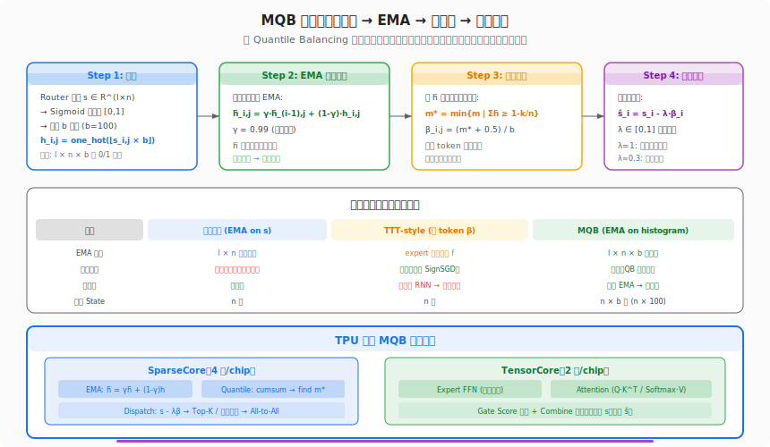
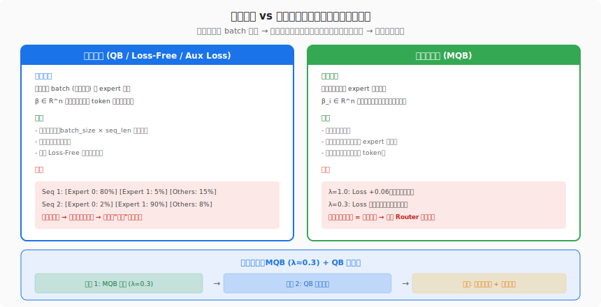
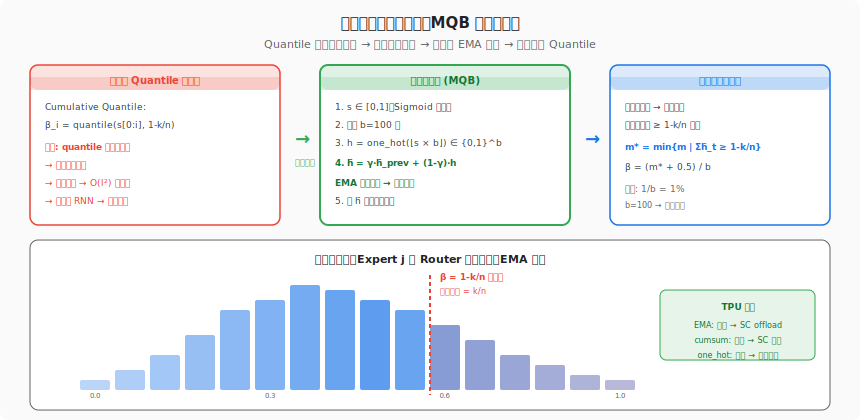

# 第 8 篇：强制序列级均衡 — Moving Quantile Balancing 深度解读

> **原文链接**：[MoE 环游记：8、强制序列级均衡](https://kexue.fm/archives/11760)
> **作者**：苏剑林（Jianlin Su）
> **发表时间**：2026-05-22
> **标签**：MQB, 序列级均衡, 直方图近似, EMA, Causal Routing

---

## 1. 前世今生：从全局到序列，均衡粒度的进化

### 系列回顾

MoE 环游记走到第 8 篇，负载均衡的故事已经讲了五篇（第 2、3、6、7 篇 + 番外）。把所有方案按两个维度分类，可以看到一个清晰的演进图谱：

| | 静态路由 (Top-K) | 动态路由 (阈值) |
|--|--|--|
| **Aux Loss** (第 2 篇) | GShard / Switch | — |
| **Loss-Free: SignSGD** (第 3、4 篇) | DeepSeek V3 | DeepSeek V3 动态版 |
| **Loss-Free: QB** (第 6、7 篇) | Kimi K3 | 动态 QB |
| **无路由** (番外) | Hash Routing | — |

但所有 Loss-Free 方案有一个共同特征：**偏置项 β ∈ R^n 是全局共享的**。整个 batch 的所有 token 用同一组 β，只保证全局意义下的均衡。

问题是：**全局均衡不等于每个序列都均衡**。

想象一个 batch 中有两个序列：序列 A 全是代码，序列 B 全是诗歌。全局看 expert 分布是均匀的，但序列 A 可能 80% 的 token 都涌向了"代码专家"，序列 B 可能 90% 的 token 都涌向了"文学专家"。**每个序列实际上只用了少数几个 expert，退化为小模型。**

Aux Loss 可以做序列级均衡（在每个序列内部计算辅助损失），但 Loss-Free 方案呢？这就是第 8 篇要回答的问题。

### 论文脉络

苏剑林在这篇文章中评估了三种序列级均衡方案，最终提出了自己的 **Moving Quantile Balancing (MQB)**：

1. **局部中心化**（@ChangJonathanC 的方案一）：对 Router 打分做 EMA，减去滑动平均 → 经验性，无理论保证
2. **TTT-style 逐 token 更新**（方案二）：沿序列维度逐步更新 β → 精确均衡，但引入非线性 RNN，不可并行
3. **MQB**（苏剑林提出）：将打分分桶为直方图 → EMA 更新分布 → 从分布求分位数 → 线性可并行 + QB 最优性

## 2. 产生原理：Quantile 的因果化困境

### 全局 QB 的回顾

第 7 篇（动态 QB）给出了偏置项的精确解：

$$\beta_j = \text{quantile}(s_{:,j},\; 1 - k/n)$$

取第 j 个 expert 的所有 token 打分的 $1-k/n$ 分位数。这需要**看完整个 batch** 才能算出来。

对于 Encoder 模型（如 BERT），这没有问题——整个序列双向可见。但对于**自回归 Decoder**（GPT 系列），位置 $i$ 只能看到 $i$ 之前的 token，**不能偷看未来**。

所以全局 QB 在 Decoder 中本质上违反了因果律——它等价于 Expert Choice（每个 expert 自己选 token），而 Expert Choice 是非因果的。

### 从 Cumulative 到 Moving

最直接的因果化思路是 **Cumulative Quantile**：位置 $i$ 的偏置 $\beta_i$ 只用前 $i$ 个 token 的打分来算：

$$\beta_i = \text{quantile}(s_{0:i}, 1 - k/n)$$

但 Quantile 是**非线性运算**，无法增量更新——每个位置都要重新排序前 $i$ 个值，总复杂度 $O(l^2)$。

退一步，用**滑动窗口**代替累积：

$$\beta_i = \text{quantile}(s_{i-w:i}, 1 - k/n)$$

复杂度降到 $O(l \cdot w)$，但单步仍需完整排序窗口内的 $w$ 个值，且 Quantile 的非线性使得这个过程无法并行。

### 关键突破：分布是可以增量更新的

苏剑林的洞察是：**虽然 Quantile 无法增量更新，但分布可以！**

知道分布 → 可以求 Quantile。而分布可以用直方图表示，直方图可以用 EMA 增量更新。这个转换把不可并行的 Quantile 计算变成了可并行的线性 EMA。

## 3. 要解决的问题

### 问题一：序列级坍缩

当全局均衡但序列内不均衡时，某些序列可能只激活少数 expert。这意味着：

- 该序列的模型容量等效于一个小型 Dense 模型（只用了 k 个 expert 中的 2-3 个）
- 长尾序列（罕见主题）受影响最严重——它们的 token 本来就倾向于集中在少数 expert

### 问题二：Loss-Free 方案缺乏序列级工具

Aux Loss 天然支持任意粒度的均衡（只需改变统计范围），但 Loss-Free 的偏置项 β 是全局共享的，没有现成的序列级版本。

### 问题三：因果性约束

自回归模型要求位置 $i$ 的路由决策只能依赖位置 $0, 1, \ldots, i-1$ 的信息。这排除了全局 Quantile（需要看完整序列）和 Expert Choice（双向选择）。

### 问题四：并行性要求

MoE 训练本身已经很慢（All-to-All 通信是瓶颈），路由决策中引入非线性 RNN 会进一步拉低训练效率。理想方案应该是**可并行的**。

## 4. 解决了什么：MQB 的四步转换

### 核心算法

MQB 的输入是 Sigmoid 归一化后的 Router 打分 $s \in [0,1]^{l \times n}$，输出是校正后的打分 $\hat{s}$：

**Step 1: 分桶 (Binning)**

将连续打分离散化为 $b$ 个桶（默认 $b = 100$）：

$$h_{i,j} = \text{one\_hot}(\lfloor s_{i,j} \times b \rfloor) \in \{0,1\}^b$$

每个 (token, expert) 对变成一个 $b$ 维 one-hot 向量，整体从 $l \times n$ 扩展为 $l \times n \times b$。

**Step 2: EMA 滑动平均**

沿序列维度做 EMA，得到局部分布估计：

$$\bar{h}_{i,j} = \gamma \cdot \bar{h}_{i-1,j} + (1-\gamma) \cdot h_{i,j}$$

$\gamma = 0.99$ 是衰减系数。$\bar{h}_{i,j}$ 是截至位置 $i$ 时 expert $j$ 的打分分布估计。

**Step 3: 从分布求分位数**

在直方图 $\bar{h}_{i,j}$ 上做累积求和，找到第一个使累积概率 $\ge 1 - k/n$ 的桶：

$$m^*_{i,j} = \min\{m \mid \sum_{t=0}^{m} \bar{h}_{i,j,t} \ge 1 - k/n\}$$

$$\beta_{i,j} = (m^*_{i,j} + 0.5) / b$$

**Step 4: 偏置校正**

$$\hat{s}_i = s_i - \lambda \cdot \beta_i, \quad \lambda \in [0,1]$$

$\lambda$ 控制序列均衡的强度：$\lambda = 1$ 完美序列均衡（但掉点严重），$\lambda \approx 0.3$ 效果无损且显著改善均衡。

### 为什么这个转换是合法的？

关键在于两个数学事实：

1. **EMA 是线性的**：$\bar{h} = \gamma \bar{h}_{prev} + (1-\gamma) h$，这是线性递推，理论上可以用 **parallel scan** 并行化
2. **直方图近似分位数的精度**：$b = 100$ 时精度为 $1/b = 1\%$，对于路由决策已经足够（Router 打分本身就有噪声）

### 与线性注意力的类比

苏剑林在文中做了一个精妙的类比：

- **局部中心化**（EMA on $l \times n$ 的原始打分）≈ 线性注意力的**低秩版**
- **MQB**（EMA on $l \times n \times b$ 的直方图）≈ 线性注意力通过**外积扩大容量**

就像线性注意力通过 $\phi(q) \cdot \phi(k)^T$ 的核展开来近似 softmax 注意力一样，MQB 通过直方图展开来近似 Quantile。维度从 $n$ 扩展到 $n \times b$，记忆容量大幅提升。

## 5. 思想源泉

### Test-Time Training (TTT)

@ChangJonathanC 的第二种方案直接受 TTT 启发：沿序列维度逐步"训练" $\beta$。TTT 的核心思想是在推理时也做梯度更新——每处理一个 token，就根据观察到的 expert 激活分布更新偏置项。

MQB 汲取了 TTT 的"逐步更新"精神，但用**分析解（Quantile）**替代了**梯度更新（SignSGD）**，避免了非线性依赖。

### Sliding Window Attention (SWA)

MQB 的滑动窗口设计与 SWA 异曲同工：

- SWA：每个 token 只关注最近 $w$ 个 token → 局部注意力
- MQB：每个 token 的 $\beta$ 只基于最近的分布 → 局部均衡

两者都用局部性换并行性，都用线性复杂度替代平方复杂度。

### 直方图估计：经典统计与流式计算

直方图估计分位数是流式算法（Streaming Algorithm）中的经典技巧。在大数据处理中（如 Apache Spark 的 `approxQuantile`），精确分位数需要排序（$O(n \log n)$），而直方图近似只需 $O(n)$。MQB 借用了这个思想，把批处理的直方图变成了流式的 EMA 直方图。

## 6. 知识库交叉印证：与 TPU 的深层关联

### 6.1 EMA 是 SparseCore 的天然负载

在之前的文章中，我们分析了 TPU v7 的 SparseCore 如何 offload MoE 路由计算。MQB 引入的 EMA 操作天然适合 SparseCore：

| MQB 操作 | 计算类型 | TPU 执行单元 |
|----------|---------|-------------|
| one_hot(⌊s×b⌋) | 离散化（整数运算） | SparseCore |
| EMA: γh̄ + (1-γ)h | 线性递推 | SparseCore |
| cumsum → find m* | 累积求和 + 搜索 | SparseCore |
| s - λβ | 逐元素减法 | SparseCore |
| Top-K / 阈值比较 | 路由决策 | SparseCore |
| Expert FFN | 矩阵乘法 | **TensorCore** |

MQB 的全部额外计算（分桶、EMA、分位数估计）都是轻量级运算，完全可以在 SparseCore 上完成。TensorCore 的负载**零增加**。

根据知识库中 Google × 蚂蚁预训练效率交流的记录，TPU v7 的 AllGather 已经在用 SparseCore offload（`use_single_sparse_core=true`）。MQB 的 EMA 计算可以搭这趟"免费车"——在 SparseCore 处理 AllGather 的空隙中插入 EMA 更新。

### 6.2 Parallel Scan 与 XLA 编译

EMA 的递推 $\bar{h}_i = \gamma \bar{h}_{i-1} + (1-\gamma) h_i$ 是一个**线性扫描**（Linear Scan），可以用 **parallel prefix sum**（并行前缀和）在 $O(\log l)$ 步内完成：

$$\bar{h}_{i} = \gamma^i \bar{h}_0 + (1-\gamma) \sum_{t=1}^{i} \gamma^{i-t} h_t$$

这等价于对 $h$ 做卷积，卷积核是指数衰减 $[\gamma^0, \gamma^1, \gamma^2, \ldots]$。在 TPU 上：

- JAX 的 `jax.lax.associative_scan` 原生支持 parallel prefix sum
- XLA 可以将整个 scan 编译为静态计算图
- 与 Mamba/RWKV 等线性 RNN 使用的 `nn.scan` 是同一套基础设施

### 6.3 n × b 的 State 大小：HBM 影响分析

MQB 需要维护 $n \times b$ 大小的 State（每个 expert 一个 $b$ 维直方图），推理时需要额外存储。

以 Kimi K3 为例（$n = 896$ expert，$b = 100$）：
- State 大小：896 × 100 × 4 bytes (FP32) = **350 KB per layer**
- K3 有 ~60 个 MoE 层 → 总计 **~21 MB**

相比 K3 的 2.8T 参数（加载需要数百 GB HBM），21 MB 的额外 State 完全可以忽略。

对比 KV Cache（K3 的 128K context 下可达数十 GB），MQB 的 State 小了 3-4 个数量级。

### 6.4 序列级均衡对 TPU All-to-All 的影响

序列级均衡对 TPU 最直接的好处是：**减少 All-to-All 通信中的 straggler 效应**。

在 Expert Parallelism 中，All-to-All 的完成时间取决于最慢的一对 device。如果某个序列的 token 集中在少数 expert → 这些 expert 所在 device 收到大量 token → 它成为 straggler → 拖慢整个 All-to-All。

全局均衡只保证整个 batch 总量均衡，但单个序列的不均衡仍会导致某些 micro-batch 的 All-to-All 出现 straggler。MQB 把不均衡从序列级消除，让每个 micro-batch 的 All-to-All 都更均匀。

在 TPU 的 ICI 网络上，这意味着：

- 更少的 ICI 带宽浪费（不均衡 = 某些链路空闲、某些链路拥堵）
- 更好的 compute-comm overlap（All-to-All 完成时间更稳定 → 更容易与 FFN 计算 overlap）

### 6.5 K3 的 Static-Shape EP 与 MQB 的兼容性

根据知识库中的 Kimi K3 架构分析，K3 使用 Static-Shape Expert Parallel：QB 保证每个 expert 收到恰好 $\lfloor mk/n \rfloor$ 个 token → All-to-All 形状静态 → XLA 全图编译。

MQB + QB 的两阶段方案与 K3 的 Static-Shape EP 完美兼容：

1. **MQB 阶段**（$\lambda = 0.3$）：削平序列内的极端不均衡，输出 $\hat{s} = s - 0.3\beta$
2. **QB 阶段**：在 $\hat{s}$ 上做全局 QB → 保证精确均衡 → 静态形状

MQB 阶段不改变 All-to-All 的形状（形状由 QB 阶段决定），只改善了送入 QB 的打分分布质量。这意味着 MQB 可以**零修改**地嵌入现有的 Static-Shape EP 流水线。

### 6.6 ALModel 与序列级均衡

根据知识库中的 ALModel 资料，蚂蚁百灵 v2.5 Mini（17B MoE，256 expert，Top-4）在 TPU v7 上训练时使用 Auxiliary-Loss-Free 方案。

ALModel 的配置（256 expert，Top-4 routing）下 $k/n = 4/256 \approx 1.56\%$，与 V4（6/384 ≈ 1.56%）几乎相同。这意味着序列级不均衡的问题同样存在——低 $k/n$ 意味着每个 expert 的"配额"很少，高频 token 很容易让少数 expert 溢出。

如果 ALModel 引入 MQB：

- $b = 100$ 桶，$n = 256$ expert → State = 256 × 100 × 4 = **100 KB/layer**
- EMA 在 SparseCore 上执行 → TensorCore 零影响
- 与现有 Aux-Loss-Free 方案的 SignSGD 偏置兼容（MQB 输出 + SignSGD 全局均衡）

## 7. 深度解读

### 7.1 三种方案的数学统一

苏剑林评估的三种方案可以用统一的框架描述：

**通用形式**：$\hat{s}_i = s_i - \beta_i$，区别在于 $\beta_i$ 的计算方式。

| 方案 | $\beta_i$ 的定义 | 数学性质 |
|------|-----------------|---------|
| 局部中心化 | $\beta_i = \text{EMA}(s)_i$（打分的滑动平均） | 线性，可并行，无均衡保证 |
| TTT-style | $\beta_i = \beta_{i-1} + \eta(f_{i-1} - 1/n)$ | 非线性 RNN（$f$ 依赖 Top-K），不可并行 |
| MQB | $\beta_i = \text{quantile}(\text{EMA}(\text{histogram}(s))_i)$ | 线性 EMA + 非线性 quantile，可并行 |

MQB 的巧妙之处在于：把非线性运算（quantile）从**递推链**中摘出来，放在**每步的最后**——递推链本身（EMA）是线性的，quantile 只是一个"逐点"的后处理。

### 7.2 λ 的物理含义

$\lambda \in [0,1]$ 控制"序列均衡 vs 模型效果"的 trade-off：

- **$\lambda = 0$**：完全不做序列级均衡，等价于只用全局 QB
- **$\lambda = 1$**：完美序列级均衡，但 Router 的语义选择被压制 → Loss +0.06
- **$\lambda \approx 0.3$**：sweet spot，轻微削峰但保留 Router 自由度

直觉理解：$\lambda$ 越大，$\beta_i$ 对打分的校正越强，Router 的"自由意志"越小。当 $\lambda = 1$ 时，Router 的作用被 MQB 完全接管——token 被强制分配到"本地最缺人的 expert"，而不是"最适合的 expert"。

苏剑林实验中 $\lambda = 0.3$ 的 Loss 基本无损，暗示了一个重要事实：**大部分序列级不均衡是"不必要的"**——它们源于 Router 的随机波动而非语义需求，轻度校正就足以消除。

### 7.3 EMA 系数 γ 与有效窗口

$\gamma = 0.99$ 的 EMA 等效于一个**指数衰减窗口**：

$$\text{有效窗口长度} \approx \frac{1}{1 - \gamma} = \frac{1}{0.01} = 100 \text{ tokens}$$

这意味着位置 $i$ 的 $\beta_i$ 主要由最近 100 个 token 的打分分布决定。对比：

- $\gamma = 0.9$：窗口 ~10 token → 过于局部，分布估计不稳定
- $\gamma = 0.999$：窗口 ~1000 token → 接近全局，失去序列级粒度
- $\gamma = 0.99$：窗口 ~100 token → 在稳定性和局部性之间的平衡

### 7.4 分桶精度 b 的选择

$b$ 的选择涉及精度-效率 trade-off：

- **$b$ 过小**（如 10）：分位数估计粗糙，$\beta$ 的量化误差大
- **$b$ 过大**（如 1000）：State 大小线性增长，EMA 的计算和存储成本上升
- **$b = 100$**：1% 精度，State = $n \times 100$，苏剑林实验验证已够用

对于 Router 打分在 $[0,1]$ 上的典型分布（近似正态，集中在 0.3-0.7 附近），1% 的量化精度远小于打分本身的噪声。

### 7.5 门控权重不受 MQB 影响

一个重要的设计细节：**MQB 只影响路由决策（选哪些 expert），不影响门控权重（各 expert 的贡献比例）**。

```
原始打分: s_i
路由决策: 用 ŝ_i = s_i - λβ_i 做 Top-K / 阈值
门控权重: 用原始 s_i 计算 softmax/sigmoid → g_i
输出: y = Σ g_{i,j} · FFN_j(x)
```

这是所有 Loss-Free 方案的共同特点——偏置项只参与"选谁"的决策，不参与"权重多大"的计算。这保证了：

1. MoE 层的梯度不受均衡干预项的直接影响
2. 即使 $\lambda = 1$，Expert FFN 收到的梯度信号仍然基于语义相关性（原始 $s$）
3. 均衡干预是"最小侵入"的——只改变路由，不改变模型的数学形式

### 7.6 序列级均衡：必要性的开放讨论

苏剑林在文末坦承，"是否需要序列级均衡"仍是开放问题。他的初步理解是：

> "序列级的极度不均衡，可能会对序列本身的效果有所影响（坍缩为一个小模型），所以希望鼓励一定程度的序列级均衡。"

从 TPU 训练的角度，序列级均衡有一个额外的实用价值——**减少 All-to-All 的 tail latency**。即使不关心模型效果，仅仅为了训练效率，适度的序列均衡也是值得的。

## 8. 图示

### 图 1：MQB 核心流程



### 图 2：全局均衡 vs 序列级均衡



### 图 3：直方图近似求分位数



## 9. 总结

这篇文章的核心贡献是一个**优雅的工程转换**：把"不可并行的滑动分位数"变成"可并行的 EMA + 逐点分位数"。关键步骤是直方图近似——用 $n \times b$ 的分布表示替代 $n$ 维的分位数，让非线性运算脱离递推链。

从 TPU 的视角来看，MQB 几乎是"免费"的：

- **计算**：EMA 和 cumsum 都是 SparseCore 的原生工作负载
- **存储**：$n \times b$ 的 State 远小于 KV Cache
- **通信**：MQB 减少了 All-to-All 的 straggler 效应
- **兼容性**：与 Static-Shape EP 的 QB 阶段无缝衔接

更深层的启示是：MQB 展示了一种"**用分布代替统计量**"的通用思路——当某个统计量（如分位数）无法增量更新时，改为维护产生这个统计量的分布，分布往往可以增量更新。这个思路不限于 MoE 均衡，在任何需要"流式估计复杂统计量"的场景中都有价值。

---

**系列导航**：
- 上一篇：[番外 · Hash Routing](bonus-hash-routing.md)
- 下一篇：[第 9 篇 · 门控归一化之争](09-gate-normalization.md)（待写）
- [系列总目录](README.md)
