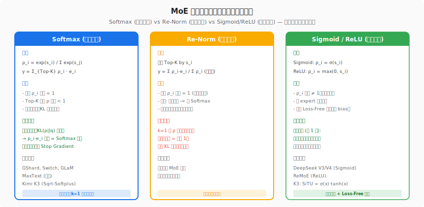
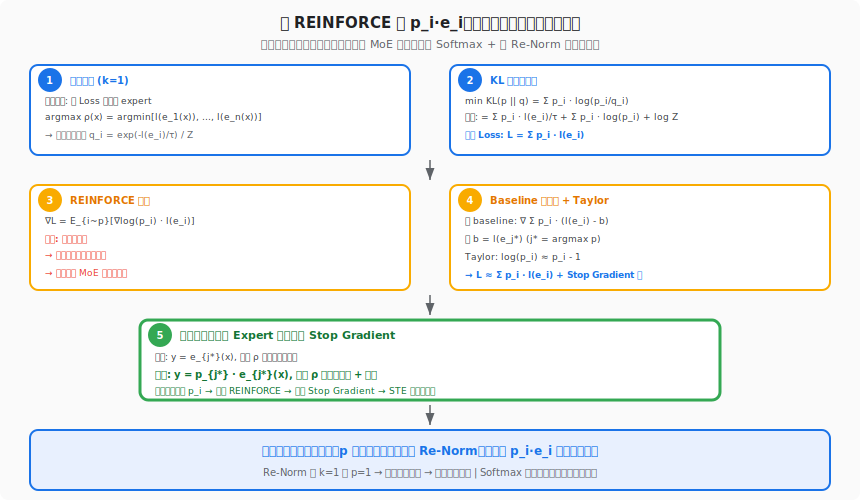
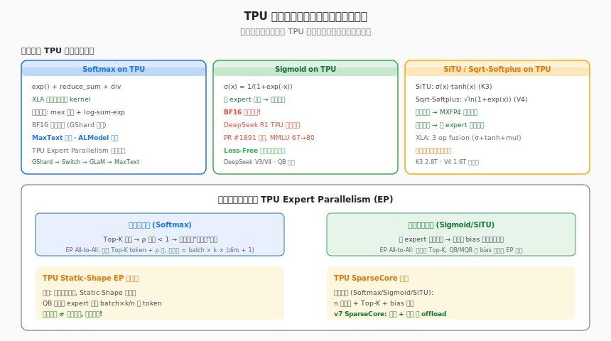

# MoE 环游记 · 第九篇：门控归一化之争

> **原文**: [门控归一化之争](https://kexue.fm/archives/11782) · 苏剑林 · 2026-06-17
>
> **系列**: MoE 环游记 #9 — 从概率论第一性原理推导 MoE 门控设计

---

## 一、前世今生：一场旷日持久的门控之争

MoE 的门控函数选择，看起来像是一个微不足道的"激活函数选择"问题，但实际上它是整个 MoE 架构中最具争议性的设计决策之一。这场争论的核心可以用一句话概括：**门控的输出 ρ 应该归一化吗？如果归一化，是在 Top-K 之前还是之后？**

这场争论的历史可以追溯到 MoE 的源头。2017 年 Shazeer 在开创性的 Sparsely-Gated MoE 论文中使用了 Softmax + Noise Top-K，这实际上意味着先归一化再选 K 个 expert。随后的 GShard (2020)、Switch Transformer (2021)、GLaM (2021) 都沿用了 Softmax 路线。但 2024 年 DeepSeek V3 突然改用 Sigmoid 门控（不归一化），并且在 671B 参数的 MoE 上跑出了优秀结果。紧接着，ReMoE 尝试了 ReLU 门控，同样效果不错。

到了 2026 年，门控的选择变得更加多样化：

- **Kimi K3** 使用 SiTU = σ(x)·tanh(x)，一种有界非线性激活
- **DeepSeek V4** 使用 Sqrt-Softplus = √ln(1+exp(x))，一种新的有界激活
- **ALModel/百灵** 仍然使用传统 Softmax

各家的实验都表明效果差异不大，但理论上到底哪个更有道理？苏剑林在这篇文章中用概率论第一性原理给出了他的答案。

## 二、产生原理：ρ 的双重身份

理解门控争论的关键在于认识到 ρ 在 MoE 中同时扮演两个角色：

**角色一：路由器 (Router)**。ρ 的大小决定了哪些 expert 被选中（Top-K 选择）。这个角色只关心 ρ 的排序，不关心绝对值——只要排序对了，ρ 放大 10 倍或缩小 10 倍，选出来的 expert 都一样。

**角色二：门控 (Gate)**。选出 Top-K 个 expert 之后，ρ 的值作为加权系数，决定各 expert 输出的混合比例。这个角色关心 ρ 的绝对值——它直接影响最终输出 y = Σ ρ_i · e_i 的尺度。

正是这种双重身份导致了争论。如果你把 ρ 看成路由器，那么归一化与否不影响选择；但如果你把 ρ 看成门控，归一化会改变输出尺度。



*三种门控范式对比：Softmax（先归一化）= 理论最优；Re-Norm（后归一化）= k=1 时梯度消失；Sigmoid/ReLU（不归一化）= 工程友好但无概率解释*

## 三、要解决的问题：理论缺失

在苏剑林之前，门控选择主要靠实验。各家的 ablation 都表明 Softmax、Sigmoid、ReLU 效果差不多，于是工程师就选对自己系统最方便的那个——DeepSeek 选 Sigmoid 是因为跟 Loss-Free 均衡搭配天然；Google 用 Softmax 是因为 GShard/MaxText 的历史惯性；K3 选 SiTU 是因为有界性对 FP4 量化友好。

但这种"实验驱动"的选择缺乏理论根基：

1. **没人能解释为什么不同的门控效果差不多** — 这是巧合还是有深层原因？
2. **Re-Norm 与否没有定论** — Top-K 选完之后，要不要重新归一化剩下的 ρ？
3. **k=1 的极端情况暴露了问题** — 如果只选 1 个 expert，Re-Norm 后 ρ=1（常数），门控完全失去了梯度信息

苏剑林要解决的就是这个理论空白：**从概率论第一性原理出发，推导 MoE 门控应该满足什么条件。**

## 四、解决了什么：从 REINFORCE 到 p_i·e_i 的优雅推导

这是全文最精彩的部分。苏剑林用五步推导，从理想路由目标出发，一路推到当前 MoE 使用的 p_i·e_i 形式，并在过程中自然得出了"应该归一化、不应该 Re-Norm"的结论。

### 第一步：理想路由

k=1 的情况下，理想路由就是：对每个 token x，找到让它 loss 最小的那个 expert：

```
j* = argmin[l(e_1(x)), l(e_2(x)), ..., l(e_n(x))]
```

但训练时我们不知道哪个 expert 最好（需要跑完所有 expert 才知道），所以需要一个学习出来的路由分布 p(x) 来近似这个理想路由。

### 第二步：构造目标分布 + KL 散度

用 Boltzmann 分布构造一个理想分布：

```
q_i = exp(-l(e_i)/τ) / Z
```

这个 q 天然地给 loss 小的 expert 高概率。于是目标变成最小化 KL(p || q)：

```
KL(p || q) = Σ p_i · log(p_i/q_i)
           = Σ p_i · l(e_i)/τ + Σ p_i · log(p_i) + log Z
```

忽略常数项和熵正则项，有效 Loss 就是：**L = Σ p_i · l(e_i)**

### 第三步：REINFORCE 梯度（太吵了）

对 L = Σ p_i · l(e_i) 求梯度，注意 p_i 本身依赖于可学习参数 θ：

```
∇L = Σ ∇p_i · l(e_i) = Σ p_i · ∇log(p_i) · l(e_i)
```

这就是标准的 REINFORCE 梯度。问题是方差巨大——每个 token 只激活一个 expert（采样），loss 的波动使得梯度噪声极高，实际训练 MoE 根本不可行。

### 第四步：Baseline 减方差 + Taylor 近似

标准技巧：减去一个 baseline b = l(e_{j*})（选中 expert 的 loss），用 Taylor 展开 log(p_i) ≈ p_i - 1，得到：

```
L ≈ Σ p_i · l(e_i) + Stop Gradient 项
```

但 Stop Gradient 不优雅——它意味着前向和后向传播不一致。

### 第五步：关键一步——改变 Expert 定义

这是苏剑林最巧妙的一步。与其让门控 ρ 只负责路由选择，不如让门控直接参与 Expert 的输出定义：

```
原来: y = e_{j*}(x)           → ρ 只选路由，不参与计算
改为: y = p_{j*} · e_{j*}(x)  → ρ 既选路由，又缩放输出
```

这样一来，l(p_i · e_i) 对 p_i 有自然的梯度，不需要 REINFORCE，不需要 Stop Gradient。梯度直接通过乘法流过 p_i，完美。



*从 REINFORCE 到 p_i·e_i 的五步推导：理想路由 → KL 最小化 → REINFORCE(太吵) → Baseline+Taylor(需 SG) → 改变 Expert 定义(消除 SG)*

### 推导的两个关键结论

**结论 1: 门控应该归一化。** 因为推导的前提是 p 是一个概率分布（Σ p_i = 1），这样 KL 散度才有意义。Softmax 天然满足这个条件。

**结论 2: 不应该 Re-Norm。** 如果在 Top-K 之后重新归一化（使选中的 ρ 之和 = 1），那么 k=1 时 ρ = 1（常数），门控对 p_i · e_i 中的 p_i 没有任何梯度贡献。这直接违反了第五步的设计——p_i 必须保持其原始值才能提供有意义的缩放和梯度。

### k ≥ 2 的缺口

苏剑林坦率地指出，上述推导对 k=1 是精确的，但对 k≥2 有一个缺口：

```
概率框架给出的: y = Σ_{(i,j)} p_i·p_j · (e_i + e_j)  (联合概率)
实际使用的:     y = p_i·e_i + p_j·e_j                   (独立加权)
```

两者不等价。苏剑林认为这个缺口可能不影响实践（因为 k=1 的梯度分析已经说明了核心原理），但承认目前没有严格证明。

## 五、思想源泉

苏剑林的推导整合了多个领域的思想：

**强化学习**：REINFORCE 梯度估计器是 RL 的核心工具之一。苏剑林把 MoE 的 expert 选择看作一个离散动作选择问题，自然地引入了策略梯度方法。Baseline 减方差也是 REINFORCE 的标准改进。

**变分推断**：KL 散度最小化是变分推断的核心思想。把"找最优 expert"转化为"学习一个近似后验分布"，是贝叶斯机器学习的经典手法。

**Straight-Through Estimator (STE)**：Bengio 在 2013 年提出的 STE 是处理离散操作梯度的标准方法。苏剑林的推导中，从 REINFORCE 到 Taylor 近似的过程实际上重新推导出了 STE 的合理性。

**刘历源三部曲**：苏剑林引用了清华大学刘历源的三篇工作——《Sparse Backpropagation for MoE Training》《Bridging Discrete and Backpropagation》《GRIN: GRadient-INformed MoE》——这些工作从不同角度探索了 MoE 梯度估计问题。苏剑林的推导与刘历源的方法本质相通，但视角更统一：一个概率框架包含了所有这些变体。

**几何直觉 (第一篇)**：苏剑林在 MoE 环游记第一篇中提出的几何解释——"MoE 是对隐空间的分区最佳逼近"——为本文提供了另一个角度：任意非负激活函数都可以做门控（因为几何上只需要一个划分权重），这解释了为什么 Softmax、Sigmoid、ReLU 效果都差不多。

## 六、知识库交叉印证

### 6.1 DeepSeek V3 Sigmoid 路由：TPU 推理的精度教训

Wiki 中记录了 DeepSeek V3 的 Sigmoid 门控在 TPU 推理上遇到的一个关键 bug：PR #1891 修复了一个 BF16 精度问题，导致 MMLU 从 67 分跳到 80 分。根因是 Sigmoid 的输出范围 (0,1) 在 BF16 下的有效精度只有约 8 位，而 Softmax 的 exp/sum 操作天然地在更高精度下执行（XLA 会自动 upcast）。

这个案例完美印证了苏剑林的分析：**Sigmoid 门控虽然理论上缺乏概率解释，但工程上的挑战反而不在理论层面，而在数值精度层面。** 对 TPU 来说，Softmax 在精度上反而更安全，因为 XLA 对 Softmax 有专门的数值稳定性优化（减最大值、log-sum-exp），而 Sigmoid 作为一个简单的 elementwise 操作，XLA 默认不做特殊处理。

### 6.2 DeepSeek V4 Sqrt-Softplus 门控：第三条路

Wiki 记录了 2026 年 5 月发布的 DeepSeek V4 (1.6T MoE, 384 experts) 使用了一种全新的门控激活：Sqrt-Softplus = √ln(1+exp(x))。这个函数有几个有趣的性质：

1. **有界但不饱和** — 增长速度为 O(√x)，比 Sigmoid 慢得多，但不像 Sigmoid 那样完全饱和
2. **非竞争性** — 跟 Sigmoid/ReLU 一样，各 expert 独立打分
3. **与 Loss-Free 均衡兼容** — 可以直接加 bias 调整排序

从苏剑林的概率框架看，Sqrt-Softplus 跟 Sigmoid 一样缺乏概率解释。但 V4 的实际效果说明，理论最优和实践最优之间确实存在 gap。苏剑林自己也承认："实际效果而言，各种方案都差不多。"

### 6.3 ALModel/百灵 的门控配置

Wiki 中记录了 ALModel (17B MoE, 256 experts) 使用 silu + linear 激活组合。ALModel 作为 Google Cloud TPU 上的 MaxText 系模型，沿用了 Softmax 门控的传统。值得注意的是，ALModel 在门控和激活函数配置上的保守选择并非缺乏创新，而是 TPU EP 的 Static-Shape 约束使得 Softmax + QB 的组合已经被充分验证过。

这印证了一个工程现实：**在 TPU 的 Static-Shape EP 约束下，门控函数的选择远不如均衡算法的选择重要。** QB 保证了无论使用哪种门控，每个 expert 都能收到恰好 batch×k/n 个 token。门控函数影响的是"选哪些 token"（质量），而均衡算法决定的是"选多少 token"（数量）。

### 6.4 Kimi K3 SiTU 门控与 MXFP4 量化

Wiki 中 K3 使用 SiTU = σ(x)·tanh(x) 作为门控激活。SiTU 的有界性 (输出范围约 [-0.28, 0.28]) 对 MXFP4 量化非常友好——4 bit 量化需要紧凑的值域来减少量化误差。

从 TPU 视角看，v7 支持 MXFP4 格式，SiTU 的有界性意味着门控输出可以用极低精度存储和传输。在 EP All-to-All 通信中，门控值需要随 token 一起发送（每个 token 携带 k 个 ρ 值），有界门控可以用更少的 bit 编码这些 ρ 值，减少 ICI 通信量。

### 6.5 门控选择 × TPU SparseCore：正交的两轴

苏剑林的核心结论是：门控归一化与否不影响均衡效果（因为均衡算法是在 ρ 排序基础上工作的，不关心 ρ 的绝对值）。从 TPU 硬件角度看，这意味着门控选择和 SparseCore offload 是完全正交的两个优化轴：

- **门控计算** (Softmax/Sigmoid/SiTU): 矩阵乘 W_g · x → 激活 → Top-K，这部分计算量很小（n 路打分），在 TensorCore 或 SparseCore 上都能做
- **均衡修正** (QB/MQB bias): 加 bias → 重排序 → dispatch，这部分适合 SparseCore 的稀疏分发能力
- **Expert 计算** (FFN): 矩阵乘，这是 TensorCore 的主场

TPU v7 的 4 个 SparseCore 每芯片可以完全接管路由+均衡的工作，无论上面跑的是 Softmax 还是 Sigmoid。门控函数只影响 SparseCore 上那几十个 cycle 的激活计算，对整体吞吐影响微乎其微。

### 6.6 三代门控方案的 TPU EP 演化

将门控选择放在 TPU MoE 的历史演化中看，有一条清晰的脉络：

| 世代 | 门控 | 均衡 | TPU EP 方式 | 代表模型 |
|------|------|------|------------|----------|
| 第一代 | Softmax | Aux Loss | 动态 All-to-All | GShard, Switch |
| 第二代 | Softmax | Capacity Factor | 静态 All-to-All | GLaM, MaxText |
| 第三代 | Sigmoid | Loss-Free (SignSGD) | 静态 All-to-All | DeepSeek V3 |
| 第四代 | Sigmoid/SiTU/Sqrt-Softplus | QB/MQB | 静态 All-to-All + SparseCore | K3, V4, ALModel |

可以看到，门控从 Softmax 垄断走向了百花齐放，但 EP 通信方式一直在收敛到 Static-Shape All-to-All。苏剑林的理论分析解释了门控多样化的合理性（各种非负激活都行），而 TPU 硬件的演化解释了 EP 收敛的原因（XLA 编译优化需要静态 shape）。



*不同门控在 TPU 上的硬件特性对比：Softmax 精度安全/XLA 友好、Sigmoid 需注意 BF16 精度、SiTU 量化友好，但所有门控都与 Static-Shape EP 正交*

## 七、深度解读

### 7.1 为什么"差不多"是意料之中的？

苏剑林在文末坦率地说："实际效果而言，各种方案都差不多。"这句话背后有深刻的道理。

从几何直觉（第一篇）看，MoE 本质上是对隐空间的分区逼近。只要门控函数是非负的且能学习到合理的分区边界，最终效果就不会差太多。差异更多体现在**训练动力学**（收敛速度、稳定性）而非**收敛后的效果**。

从概率框架看，Softmax 理论最优是在 k=1 的精确推导下成立的。但实际 MoE 使用 k=2~8，推导存在缺口。k 越大，Top-K 选中的 expert 越多，Re-Norm 与否的差异越小（k=8 时，Re-Norm 只是微调了权重分配，不像 k=1 时那么极端）。

从 TPU 训练实践看，真正影响效果的不是门控函数，而是：

1. **均衡算法** — QB/MQB 对效果的影响远大于 Softmax vs Sigmoid
2. **Expert 数量和粒度** — 256 vs 384 vs 1024 experts 的差异远大于门控差异
3. **初始化和学习率** — 门控网络的初始化方式对早期训练动态有显著影响
4. **精度** — BF16 vs FP32 vs MXFP4 对门控的影响可能比激活函数本身更大

### 7.2 采样 vs Top-K：探索与利用的永恒权衡

苏剑林讨论了一个有趣的问题：训练时应该用 Top-K（贪心）还是按 p 分布采样（随机）？

采样的好处是多样性——每个 expert 都有机会被选中，避免"马太效应"（强者越强、弱者越弱）。但采样的问题是方差太大（回到了 REINFORCE 的老问题）。

Top-K 的好处是稳定——每步都选最好的 k 个，梯度方差小。但 Top-K 可能导致一些 expert 永远被忽视。

苏剑林的洞察是：**负载均衡算法部分替代了采样的探索功能。** QB/MQB 通过加 bias 强制把 token 分配给冷门 expert，这相当于一种"有指导的探索"——比随机采样更高效（有方向性），又避免了 Top-K 的固化问题。

对 TPU 训练来说，Top-K 是唯一实用的选择，因为采样导致的动态 token 分配与 Static-Shape EP 不兼容。但有了 QB/MQB，Top-K 的探索不足问题被优雅地解决了。

### 7.3 REINFORCE → STE → p_i·e_i 推导链的方法论价值

苏剑林这篇文章的最大价值不在于给出了一个"最终答案"（实际上他也承认各方案效果差不多），而在于提供了一个**统一的理论框架**来理解所有门控变体：

1. **所有门控都可以看作对理想路由的某种近似** — 只是近似方式不同
2. **归一化 vs 不归一化对应着概率 vs 几何两种视角** — 前者需要 p 是分布，后者只需要非负权重
3. **Re-Norm 是一个明确的理论瑕疵** — k=1 时梯度为零，这是可以证明的

这种框架性思考对 TPU 上的 MoE 开发有实际指导意义：当你在 MaxText 里实现一种新的门控函数时，不需要盲目做 ablation，可以先用苏剑林的框架分析它的理论性质（是否满足概率解释？k=1 时有没有梯度？），然后有针对性地设计实验。

### 7.4 门控之争的真正赢家：均衡算法

回顾整个 MoE 环游记系列，一个有趣的观察是：门控函数的选择一直没有定论（第九篇的结论也是"都差不多"），但均衡算法的演化有明确的进步方向：

```
Aux Loss (次优梯度, 超参敏感)
  → Loss-Free (不改梯度, 但与 Sigmoid 耦合)
    → QB (无超参, 任意激活, 线性规划最优)
      → MQB (序列级, 防坍缩)
        → Hash Routing (编译时, 零运行时开销)
```

这条演化线的终点（QB + MQB + Hash Routing）是真正的工程突破，每一步都给 TPU EP 带来了实质性改进。相比之下，门控函数从 Softmax 到 Sigmoid 到 SiTU 的变化更像是"等价替换"——不同的接口，相同的功能。

苏剑林用第一性原理证明了这一点：门控的核心功能（路由 + 缩放）在各种非负激活下都能实现，差异主要在梯度性质上。而均衡算法直接决定了 token 分配的最优性，对训练效率和模型效果的影响大一个量级。

### 7.5 从 p_i·e_i 到 TPU XLA 编译

苏剑林推导的 p_i·e_i 形式有一个在 TPU 上特别重要的含义：门控乘法是一个 elementwise 操作，XLA 可以轻松地将其融合 (fuse) 到 Expert FFN 的矩阵乘法中。具体来说：

```python
# 苏剑林推导的理想形式
y = p_i * expert_i(x)

# XLA 编译后
# 不是: [compute p_i] → [compute expert_i(x)] → [elementwise mul]
# 而是: [compute expert_i(x)] → [fused scale by p_i in the same kernel]
```

这个融合对 TPU 性能至关重要。MXU (Matrix Multiply Unit) 做完 FFN 矩阵乘后，输出直接在 VPU (Vector Processing Unit) 上乘以 p_i，不需要额外的 HBM 读写。如果用 Re-Norm（需要先求 Top-K 的 ρ 之和再除），就多了一个 reduce 操作，破坏了这个融合机会。

这是苏剑林"不要 Re-Norm"结论的另一个工程支撑：**Re-Norm 不仅理论上有问题（k=1 梯度消失），工程上也会打断 XLA 的 kernel 融合。**

## 八、与系列其他文章的关联

| 关联文章 | 关联点 |
|---------|--------|
| 第 1 篇 (几何解释) | 几何视角解释了为什么各种非负激活都行——只要能划分隐空间 |
| 第 2 篇 (Aux Loss) | Aux Loss 本身跟门控选择正交，但 Softmax 与 Aux Loss 最搭 |
| 第 3 篇 (Loss-Free) | Sigmoid 门控因 Loss-Free 而流行——加 bias 即调排序 |
| 第 6 篇 (QB) | QB 让门控选择彻底解耦于均衡——任意激活都能用 QB |
| 第 7 篇 (动态 QB) | 动态 QB 中门控值的 quantile 与激活函数的值域直接相关 |
| 第 8 篇 (MQB) | MQB 的直方图近似要求门控输出在有界区间，Sigmoid/SiTU 天然满足 |
| 番外 (Hash Routing) | Hash Routing 完全绕过了门控争论——前 k 层不用门控 |

## 九、总结

### 三句话总结

1. **门控应该归一化（Softmax 理论最优），但不应该 Re-Norm（会破坏 k=1 梯度）**
2. **实践中各种门控效果差不多——因为均衡算法才是 MoE 的核心**
3. **对 TPU 来说，门控选择与 Static-Shape EP 正交——选 Softmax 最安全（精度验证最充分），选 Sigmoid/SiTU 需注意精度问题**

### 苏剑林给了我们什么

这篇文章的价值不在于推翻某种门控方案，而在于提供了一个统一的概率框架：

- **概率视角** (本文): p 是分布 → Softmax → 不 Re-Norm
- **几何视角** (第 1 篇): 非负权重即可 → 任意激活都行
- **工程视角** (第 3/6 篇): 与均衡算法的兼容性决定最终选择

三个视角不矛盾。理论上 Softmax 最优，但实践差异小到可以让工程考量（精度、量化、均衡兼容性）成为决定性因素。这恰恰是好的理论应该做的事——不是教条地排除选项，而是让你在各选项之间做出更有信息的决策。
