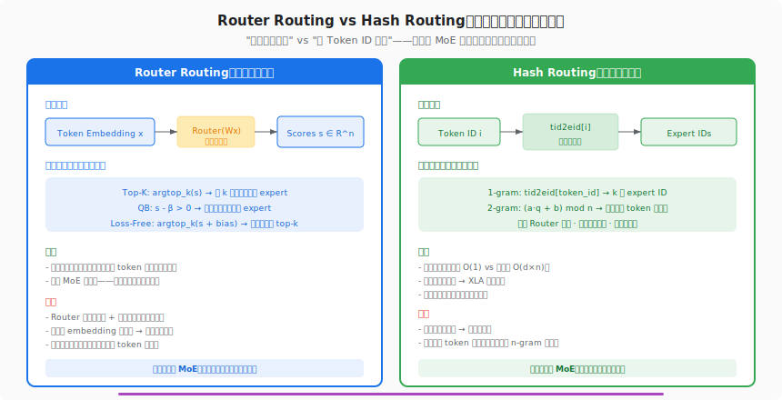
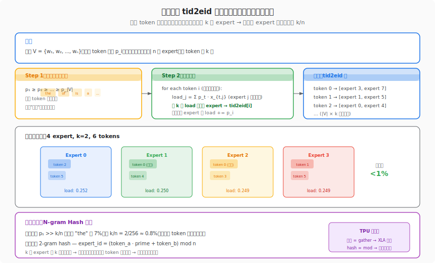
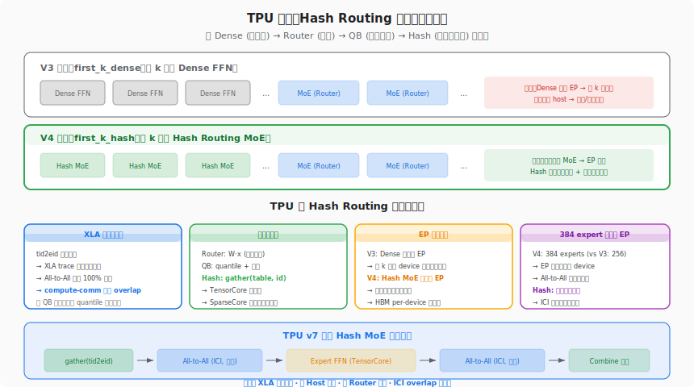

# 番外篇：DeepSeek V4 的 tid2eid — Hash Routing 深度解读

> **原文链接**：[MoE 环游记·番外篇·DeepSeek V4 的 tid2eid](https://kexue.fm/archives/11750)
> **作者**：苏剑林（Jianlin Su）
> **发表时间**：2026-05-15
> **标签**：Hash Routing, tid2eid, DeepSeek V4, N-gram Hash, 静态路由

---

## 1. 前世今生：从 "学习路由" 到 "查表路由"

### 这篇文章的起源

MoE 环游记正篇从第 1 篇到第 7 篇，一直在讨论同一个问题：**Router 怎么设计才能既选对 expert、又保持负载均衡**。整个系列的隐含前提是——路由需要一个**可学习的** Router 网络 $W \in \mathbb{R}^{d \times n}$，根据 token 的 embedding $x \in \mathbb{R}^d$ 计算打分 $s = Wx$，再做 Top-K / QB / Loss-Free 等决策。

但 DeepSeek V4 的技术报告打破了这个前提：**前几层 MoE 根本不需要看 token 内容，直接按 Token ID 查表就行**。

这个看似"粗暴"的方案背后有深刻的洞察：

- **浅层 MoE 的上下文极弱**：紧跟 Embedding 层的前几层 Transformer，hidden state 主要还是词向量本身，几乎没有上下文信息
- **Router 在浅层近似随机**：既然输入信息弱，Router 学出来的路由接近"按 token 身份分配"，不如直接按身份分配
- **负载均衡最难的地方就是浅层**：高频 token（如 "the"/"的"）在浅层会集中涌向同一批 expert，恰恰是 Aux Loss / QB 最吃力的场景

苏剑林在这篇番外里系统分析了 V4 的 `tid2eid`（Token ID to Expert ID）方案，并提出了 N-gram Hash 作为极端场景的兜底。

### 演进路线

MoE 前几层的路由策略经历了三代：

| 阶段 | 方案 | 代表模型 | 核心思路 |
|------|------|----------|----------|
| 第一代 | 所有层统一 Router | GShard, Switch | 浅层效果差但忍了 |
| 第二代 | first_k_dense | DeepSeek V3 | 前 k 层改用 Dense FFN，放弃并行 |
| **第三代** | **first_k_hash** | **DeepSeek V4** | **前 k 层用 Hash Routing MoE，保留 EP** |

V3 的 `first_k_dense` 虽然绕过了浅层路由的困难，但付出了一个代价：Dense 层不走 Expert Parallelism (EP)，每个 device 都要存全量 Dense 参数，在 256+ expert 的大规模 MoE 中是 HBM 的浪费。V4 的 `first_k_hash` 巧妙地解决了这个问题——Hash MoE 层仍然走 EP，参数均匀分布在所有 device 上，但路由开销降为零。

## 2. 产生原理：为什么 Token ID 就够了？

### 浅层路由的本质

要理解 Hash Routing 为什么可行，需要回到 Transformer 的信息流：

```
Input Token IDs → Embedding Layer → Layer 1 → Layer 2 → ... → Layer L
                    ↑                   ↑
              纯词向量，无上下文    开始有一些上下文
```

第 1 层的输入就是 Embedding 向量 $e_i$，它是 Token ID $i$ 的一一映射。此时 Router 的打分 $s = W \cdot e_i$ 实际上是一个关于 Token ID 的**确定性函数**——同一个 token 在不同位置、不同上下文中，打分完全一样。

换句话说，**浅层 Router 已经在做"按 Token ID 路由"了**，只是绕了一圈矩阵乘法。Hash Routing 把这个绕圈去掉，直接建一张查找表。

### 数学描述

设词表大小为 $|V|$，expert 数量为 $n$，每个 token 选 $k$ 个 expert。`tid2eid` 是一个映射：

$$\text{tid2eid}: \{0, 1, \ldots, |V|-1\} \to \binom{[n]}{k}$$

其中 $\binom{[n]}{k}$ 是 $\{0, 1, \ldots, n-1\}$ 的所有 $k$-元子集。

目标是使每个 expert 的"期望负载"尽量接近 $k/n$：

$$\min \sum_{j=0}^{n-1} \left( \sum_{i: j \in \text{tid2eid}(i)} p_i - \frac{k}{n} \right)^2$$

其中 $p_i$ 是 token $i$ 在训练数据中的出现频率。

## 3. 要解决的问题

Hash Routing 要同时解决三个问题：

### 问题一：浅层 Router 的低效

传统 Router 在浅层做矩阵乘法 $Wx$ 计算打分，但浅层的 $x$ 基本就是 $e_i$（词向量），Router 学到的路由策略退化为"按 token 身份分类"。这个矩阵乘法变成了昂贵的等价查表——特别是当 $n = 384$（V4 的 expert 数量）时，$W \in \mathbb{R}^{d \times 384}$ 的乘法开销不小。

### 问题二：first_k_dense 的 EP 不兼容

V3 的方案是前 k 层改成 Dense FFN。但 Dense 不走 EP，在 V4 的 384 expert 规模下：

- 每个 device 需要存全量 Dense 参数 → HBM 浪费
- Dense 层和 MoE 层的并行策略不同 → 需要在层间做数据重分布
- 在 TPU 上尤其痛苦：Dense 层可能需要 Model Parallelism 而不是 EP，打断 XLA 编译的一致性

### 问题三：高频 token 的负载均衡

浅层 MoE 负载均衡困难的根本原因是：**token 频率分布极度不均**（Zipf 分布）。"the" 的频率可能是 7%，而 k/n 可能只有 0.8%（以 V4 的 Top-6 / 384 为例），一个 token 的频率就能溢出一个 expert 的容量。传统 Aux Loss 在这种场景下力不从心，QB 也需要多步交替才能收敛。

## 4. 解决了什么：贪心构造 + N-gram 兜底

### 核心方案：频率感知的贪心分配

苏剑林在文中给出的 `tid2eid` 构造算法极其优雅：

**算法：贪心 tid2eid 生成**

1. 统计每个 token $i$ 的出现频率 $p_i$
2. 按频率**降序**排列：$p_{(1)} \ge p_{(2)} \ge \cdots \ge p_{(|V|)}$
3. 维护每个 expert $j$ 的累计负载 $L_j = 0$
4. 对每个 token $i$（按频率从高到低）：
   - 选择负载最小的 $k$ 个 expert
   - 设 $\text{tid2eid}(i)$ = 这 $k$ 个 expert 的编号
   - 更新 $L_j \mathrel{+}= p_i$ 对每个被选中的 $j$

```python
import numpy as np

def greedy_tid2eid(freqs, n_experts, k):
    """频率感知贪心分配"""
    order = np.argsort(-freqs)  # 降序
    loads = np.zeros(n_experts)
    tid2eid = np.zeros((len(freqs), k), dtype=int)
    for idx in order:
        chosen = np.argpartition(loads, k)[:k]
        tid2eid[idx] = chosen
        loads[chosen] += freqs[idx]
    return tid2eid
```

**为什么贪心有效？**

- 高频 token 先处理 → 它们被分配到负载最低的 expert → 不会让任何 expert 过载
- 低频 token 后处理 → 对总负载影响小 → 微调即可
- 最终每个 expert 的负载 $L_j \approx k/n$，偏差通常 < 1%

### 层间多样性：随机排列

如果每层都用同一个 `tid2eid`，则 token 永远去同一批 expert，缺乏多样性。苏剑林建议：

- 对 expert 编号做随机排列 $\sigma$：`expert_perm = np.random.permutation(n_experts)`
- 在排列后的 expert 上运行贪心 → 不同排列产生不同 tid2eid
- 从多个随机排列中选负载最均衡的那个（max violation 最小）

### 极端场景：N-gram Hash

当某个 token 的频率 $p_i > k/n$ 时（例如 "the" 在英文中占 ~7%，但 6/384 ≈ 1.6%），**无论怎么分配 k 个 expert，该 token 单独就会让这 k 个 expert 过载**。

苏剑林提出 **N-gram Hash** 作为兜底：

**2-gram Hash**：不只看当前 token，还看前一个 token：

$$\text{expert\_id} = (a \cdot q + b) \mod n$$

其中 $a$ 是前一个 token ID，$q$ 是质数，$b$ 是当前 token ID。

选 $k$ 个不同的质数 $q_1, \ldots, q_k$，每个质数对应一个 expert：

$$\text{experts}(a, b) = \{(a \cdot q_l + b) \mod n : l = 1, \ldots, k\}$$

**为什么 N-gram 能均衡？**

- "the" 虽然高频，但它前面的 token 种类很多（"of the", "in the", "is the", ...）
- 组合爆炸：|前缀种类| × k 个质数 → hash 值近乎均匀分布在 n 个 expert 上
- **无需查表**，纯算术运算

| 方案 | 存储 | 计算 | 均衡性 | 适用场景 |
|------|------|------|--------|----------|
| 1-gram tid2eid | $O(|V| \cdot k)$ 表 | gather | 好（频率 < k/n） | 绝大多数 token |
| 2-gram hash | 无（k 个质数常量） | 整数乘加取模 | 好（组合爆炸） | 极高频 token |
| N-gram hash | 无 | 整数运算 | 更好 | 理论兜底 |

## 5. 思想源泉：从信息论到工程直觉

### 信息论视角

Hash Routing 的理论基础是一个简单的信息论观察：

**浅层 MoE 的互信息**：$I(\text{expert selection}; \text{context}) \approx 0$

前几层的 hidden state 几乎不含上下文信息，Router 的选择主要由 token 身份决定。此时 Router 的作用退化为：

$$\text{Router}(x) \approx f(\text{token\_id}(x))$$

Hash Routing 直接建模这个 $f$，省去了学习 $W$ 的过程。

### 哈希函数的均匀性

N-gram Hash 的均衡性来自**通用哈希族**（Universal Hash Family）的经典结论：

对于 $h(x) = (ax + b) \mod p$（$p$ 为质数），当 $a, b$ 均匀随机时，$h$ 是 2-universal 的。在这里，$a$ 是前缀 token ID（在训练数据中近似均匀），所以 hash 值也近似均匀。

### 与 Consistent Hashing 的关系

分布式系统中的一致性哈希（Consistent Hashing）解决的是类似问题：将 key 均匀分配到多个 server。V4 的 tid2eid 可以看作一种**离线一致性哈希**——已知所有 key（token）及其频率，预先构造最优分配。

## 6. 知识库交叉印证：与 TPU 的深层关联

### 6.1 Hash Routing 是 TPU 上的终极静态派发

在系列第 7 篇中，我们分析了动态 QB 如何让 All-to-All 的形状变成静态的。Hash Routing 把这个优势推到了**极致**：

| 维度 | Router + QB | Hash Routing |
|------|------------|--------------|
| 路由计算 | 矩阵乘 + quantile | gather 查表 / 整数 hash |
| 决策时机 | 运行时 | **编译时**确定 |
| All-to-All 形状 | 静态（QB 保证） | **超静态**（查表值固定） |
| XLA 编译友好度 | 高（静态形状） | **最高**（常量折叠） |
| SparseCore 利用 | routing offload | **几乎无事可做** |

在 TPU v7 上，Hash MoE 层的执行流极其简洁：

1. `gather(tid2eid_table, token_ids)` → 得到每个 token 的 expert 列表（**常量表**，XLA 可在编译时展开）
2. 静态 All-to-All over ICI → 形状完全已知，通信带宽预留精确
3. Expert FFN on TensorCore → 纯计算
4. 静态 All-to-All 回收
5. Combine 加权

根据我们知识库中的 [TPU v7 架构](https://cc.higcp.com)，每个 v7 chip 有 4 个 SparseCore 和 2 个 TensorCore。在 Hash MoE 层中，SparseCore 的路由计算降为零——连 QB 的 quantile 计算都不需要了。这意味着 SparseCore 在这些层完全空闲，可以用于其他任务（如 All-to-All 的调度/同步控制）。

### 6.2 V4 的 384 Expert 在 TPU 上的 EP 映射

DeepSeek V4 拥有 1.6T 参数、384 routed experts + 1 shared expert，是目前最大的公开 MoE 模型之一。根据知识库中的 V4 技术报告概要：

- **384 experts, Top-6 routing**：每个 token 选 6 个 expert（Sqrt-Softplus 门控）
- **1M context window**：CSA (Contextualized Sparse Attention) + HCA (Hybrid Contextualized Attention)
- **FP4 QAT**：量化感知训练，推理时 FP4 精度

在 TPU v7x-8（8 devices = 4 chips = 768 GB HBM3e）上部署 V4：

- 384 experts / 8 devices = 每 device 48 experts
- Hash MoE 层的 All-to-All 通信模式在编译时完全确定 → ICI 路由表可静态优化
- QB 层（深层）的 All-to-All 也是静态形状 → 两种层都 TPU 友好

对比 V3 的 first_k_dense 方案，V4 的 first_k_hash 在 TPU 上的优势是：

- Dense 层不走 EP → 前 k 层每 device 要存全量 Dense 参数 → 对 768 GB HBM 有压力
- Hash MoE 层走 EP → 参数均匀分到 8 device → HBM 使用更高效

### 6.3 DeepSeek R1 TPU 推理的启示

根据知识库记录，我们团队在 TPU v7x 上运行 DeepSeek R1（671B MoE）时，曾遇到关键的 MoE 路由精度问题（vLLM PR #1891）：

- **Sigmoid routing 精度**：BF16 下的 Sigmoid 精度不够 → MMLU 从预期 80 掉到 67
- **修复**：在路由计算中使用 FP32 精度 → 恢复到正常水平

这个教训对 V4 的 Hash Routing 有重要启示：**Hash 层完全绕过了浮点精度问题**。tid2eid 查表是整数运算，N-gram Hash 也是整数乘加取模——**零浮点错误**。这在 TPU 的 BF16 默认环境下是一个被低估的优势。

### 6.4 与 GShard 到 QB 演进路线的关系

将 Hash Routing 放入 MoE 环游记的整体框架中：

```
GShard (Aux Loss)     → capacity_factor ~33% 浪费
  ↓ 第 3 篇
Loss-Free (Bias)      → 不影响梯度，但与 Sigmoid 耦合
  ↓ 第 6 篇
QB (Quantile)         → 无超参数，静态形状
  ↓ 第 7 篇
Dynamic QB            → 一步 quantile，动态激活
  ↓ 番外篇
Hash Routing          → 编译时确定，零路由开销
```

Hash Routing 不是替代 QB，而是**互补**：
- **浅层**（接近 Embedding）：Hash Routing → 零计算，编译时确定
- **深层**（上下文丰富）：Dynamic QB → 根据语义精确路由

这种分层策略在 TPU 上的执行特别高效：浅层 Hash + 深层 QB = 全层静态形状 = XLA 全图编译无动态分支。

### 6.5 SparseCore 在混合路由下的角色

在 V4 的分层路由架构下，TPU v7 的 SparseCore 工作负载呈现有趣的分层特征：

| 层类型 | SparseCore 任务 | TensorCore 任务 | 利用率 |
|--------|----------------|-----------------|--------|
| Hash MoE 层（浅层） | ≈ 零（查表/hash 太轻） | Expert FFN + Attention | SC 空闲 |
| QB MoE 层（深层） | quantile + dispatch | Expert FFN + Attention | SC 满载 |

这暗示了一个优化方向：**Hash 层空闲的 SparseCore 可以提前开始下一层的 quantile 计算**——形成跨层的 SparseCore pipeline。虽然目前 XLA 可能还不支持这种优化，但这是 TPU 团队值得探索的方向。

### 6.6 ALModel 对比：Google 的 MoE 路由选择

根据知识库中的 ALModel 相关资料，Google 内部的大规模 MoE 模型（如 Switch-C、GLaM、ALModel）主要使用 Aux Loss + capacity factor 的传统方案（因为 MaxText / GShard 框架天然支持）。

如果 Google 引入类似 V4 的分层路由策略：

- **短期**：浅层用 Hash Routing → 无需修改 XLA，gather 和 mod 都是原生支持
- **中期**：深层用 QB 替代 Aux Loss → 需要 MaxText 框架支持 quantile 计算
- **长期**：SparseCore 跨层 pipeline → 需要 XLA compiler 支持

Hash Routing 的引入门槛最低——它本质上是一个预计算的查找表，任何框架都能即插即用。

## 7. 深度解读

### 7.1 贪心算法的最优性分析

苏剑林在文中指出，这个贪心算法的目标函数是：

$$\min \sum_{j} \left( L_j - \frac{k}{n} \right)^2$$

其中 $L_j = \sum_{i: j \in \text{tid2eid}(i)} p_i$。

这是一个 NP-hard 的组合优化问题（等价于带约束的装箱问题），但贪心在实际中表现非常好：

- **理论保证**：类似 LPT（Longest Processing Time）算法在调度问题上的保证，频率降序 + 最小负载分配的组合有 $O(1)$ 的近似比
- **实际性能**：当 $|V| \gg n$ 时（典型值 $|V| = 128K, n = 384$），每个 expert 被分配 $|V| \cdot k / n \approx 2000$ 个 token，大数定律使得负载自然趋于均匀

### 7.2 1-gram 的局限与 N-gram 的必要性

1-gram 方案的瓶颈出现在：

$$p_i > \frac{k}{n} \quad \text{(单个 token 频率超出 expert 容量)}$$

以 V4 的参数 $k=6, n=384$ 为例，$k/n \approx 1.56\%$。在英文中，"the" 的频率约 7%，远超这个阈值。

此时，即使把 "the" 的全部 $k=6$ 个 expert 都塞满，也无法让这 6 个 expert 的负载不超过 $k/n$。

N-gram Hash 通过引入上下文打破这个瓶颈：
- "the" 的 2-gram 上下文有数千种（"of the", "in the", "at the", ...）
- 每种 2-gram 的频率远低于 "the" 本身
- Hash 函数将不同 2-gram 映射到不同 expert → 负载自然均匀

这里有一个微妙的信息论洞察：**N-gram Hash 实际上在利用浅层的少量上下文信息**，只不过用的是离散的哈希而不是连续的 Router。

### 7.3 Hash Routing 的权重问题

文中一个重要的细节是 **Hash Routing 的 combine 权重**。传统 Router 路由时，每个 expert 的输出会乘以对应的 gate score 再加和：

$$y = \sum_{j \in \text{selected}} g_j \cdot \text{FFN}_j(x)$$

Hash Routing 没有 gate score，两种处理方式：

1. **等权**：$g_j = 1/k$，所有选中 expert 等权平均
2. **学习权重**：仍然保留一个小的 Router 网络只用于计算权重（但不参与路由决策）

V4 的技术报告选择了后者——**路由用 Hash，权重用 Router**。这是一个漂亮的解耦：
- Hash 决定 "去哪些 expert"（静态，编译时确定）
- Router 决定 "各 expert 贡献多大"（动态，运行时计算）

在 TPU 上，这意味着 All-to-All 的通信模式仍然是编译时确定的（由 Hash 决定），只有 combine 权重是运行时计算的（但这是一个轻量的逐元素乘法，不影响通信）。

### 7.4 与 MiMo V2 在 TPU v7 上的对比

根据知识库记录，MiMo V2 是另一个在 TPU v7 上运行的 MoE 模型。MiMo V2 使用 Auxiliary-Loss-Free 方案（类似 DeepSeek V3 的 Loss-Free Balancing），所有层统一用 Router 路由。

V4 的分层方案（Hash + Router）在 TPU v7 上相比 MiMo V2 的统一方案有以下优势：

- **浅层计算省**：Hash 层的 TensorCore 不需要做 Router 矩阵乘法
- **浅层通信省**：All-to-All 模式固定，ICI 带宽利用率更高
- **编译更快**：Hash 层的 XLA 图更简单，编译时间更短

但也有劣势：
- **需要预训练数据的频率统计**：tid2eid 表的构造依赖训练数据分布
- **增量训练时需要更新 tid2eid**：如果词表或数据分布变化，需要重新构造

### 7.5 Demo 代码深度解析

苏剑林给出的完整 Demo 不超过 20 行，但蕴含巧妙设计：

```python
import numpy as np

def build_tid2eid(token_freqs, n_experts, k, n_tries=100):
    """构造 tid2eid 映射表
    
    Args:
        token_freqs: shape (vocab_size,), 每个 token 的频率
        n_experts: expert 数量
        k: 每个 token 选几个 expert
        n_tries: 随机排列尝试次数
    """
    vocab_size = len(token_freqs)
    target_load = k / n_experts  # 理想负载
    
    best_tid2eid = None
    best_violation = float('inf')
    
    for _ in range(n_tries):
        perm = np.random.permutation(n_experts)
        order = np.argsort(-token_freqs)
        loads = np.zeros(n_experts)
        tid2eid = np.zeros((vocab_size, k), dtype=np.int32)
        
        for idx in order:
            chosen = np.argpartition(loads, k)[:k]
            tid2eid[idx] = perm[chosen]  # 用排列后的编号
            loads[chosen] += token_freqs[idx]
        
        violation = np.max(np.abs(loads - target_load))
        if violation < best_violation:
            best_violation = violation
            best_tid2eid = tid2eid.copy()
    
    return best_tid2eid
```

关键设计：
- `np.argpartition(loads, k)[:k]`：$O(n)$ 找到最小 $k$ 个，比 `argsort` 的 $O(n \log n)$ 快
- `perm[chosen]`：通过随机排列保证不同层的 tid2eid 不同
- `n_tries=100`：多次尝试取最优，时间复杂度 $O(\text{tries} \times |V| \times n)$，词表 128K、expert 384 时只需几秒

### 7.6 对未来的启示

Hash Routing 的思想不限于 MoE 前几层：

1. **推理时的全层 Hash**：对于推理吞吐优先的场景，可以用训练好的 Router 的"平均行为"预计算全层 tid2eid，推理时完全去掉 Router → 减少延迟
2. **Prefill vs Decode 分层**：Prefill 阶段可以用 Router（有完整上下文），Decode 阶段改用 Hash（逐 token 生成，上下文增量小）
3. **嵌入空间聚类**：对 token embedding 做聚类，同一 cluster 的 token 共享 expert 分配 → 兼顾语义信息和静态性

## 8. 图示

### 图 1：Router Routing vs Hash Routing



### 图 2：贪心构造 tid2eid 映射表



### 图 3：TPU 视角 — Hash Routing 的硬件优势



## 9. 总结

这篇番外篇虽然不在 MoE 环游记的正篇编号中，但它揭示了 MoE 路由设计的一个重要维度：**不是所有层都需要动态路由**。

苏剑林通过严谨的分析展示了：
- 浅层 Router 的语义信息近似为零 → 可以用 Token ID 替代
- 贪心频率分配在实际中接近最优 → 简单方案就是好方案
- N-gram Hash 为极端场景提供了无表兜底 → 工程完备性

从 TPU 的视角来看，Hash Routing 是**所有路由方案中硬件友好度最高的**——它把"编译时确定"推到了极致。当我们在 TPU v7 上部署 V4 这样的超大规模 MoE 时，Hash Routing 让前几层的执行流几乎等价于 Dense 层的简洁，同时保留了 EP 的并行性。这是一个"化繁为简"的典范。

---

**系列导航**：
- 上一篇：[第 7 篇 · 动态激活极简解](07-dynamic-qb.md)
- 下一篇：[第 8 篇 · 强制序列级均衡](08-forced-sequence-balance.md)（待写）
- [系列总目录](README.md)
