# DeepEPv2 系列读书笔记

> 结合 Google Cloud AI Infra (TPU/GPU) 视角的深度阅读笔记。
> 不是原文摘要，而是提炼核心设计思想 + 大量类比 + 与我们 TPU/GPU 工作的关联。

**原文**:
- [第 1 篇：ElasticBuffer + Barrier + PP + Engram + AGRS](DeepEPv2分析(1).md)
- [第 2 篇：EP Dispatch/Combine 总览](DeepEPv2分析(2)-EP Overview.md)
- [第 3 篇：EP Direct Dispatch/Combine Kernel 实现](DeepEPv2分析(3)-EP Direct Dispatch-Combine Kernel.md)
- [第 4 篇：EP Hybrid Dispatch/Combine Kernel 实现](DeepEPv2分析(4)-EP Hybrid Dispatch Combine Kernel.md)

---

## 一、DeepEPv2 是什么？解决什么问题？

MoE (Mixture of Experts) 模型的核心挑战：**token 要跨 GPU 搬家**。

一个 token 经过 router 后被分配给若干 expert（比如 Qwen3.5 是 512 选 10），但这些 expert 分布在不同 GPU 上。所以需要两步通信：

1. **Dispatch**: 把 token 从"我在哪里"发到"expert 在哪里"（散射）
2. **Combine**: expert 算完后，把结果从"expert 在哪里"发回"我原来在哪里"（聚合）

DeepEPv2 就是 DeepSeek 开源的、专门做这两步通信的库。V2 相比 V1 的核心变化是**底层从 NVSHMEM 换成了 NCCL Gin**，同时扩展支持了 PP、Engram、AGRS 等通信原语。

> **类比**: 想象一个快递分拣中心。每个 GPU 是一个分拣站，token 是包裹，expert 是目的地仓库。Dispatch 就是按地址把包裹发出去，combine 就是把处理完的回执寄回发件人。DeepEPv2 就是这个分拣中心的调度系统。

---

## 二、地基：Symmetric Memory（对称内存）

所有设计的基础是一块**跨所有 GPU 共享的内存**。

每个 GPU 分配一块同样大小、同样布局的内存，通过 NVLink 的 LSA (Local Shared Address) 机制，任何 GPU 都能**直接用本地指针读写远端 GPU 的对应地址**。

```
GPU 0 的 buffer:  [workspace | region A | region B | ...]
GPU 1 的 buffer:  [workspace | region A | region B | ...]
GPU 7 的 buffer:  [workspace | region A | region B | ...]
                   ↑ 完全相同的布局，任意 GPU 可以直接寻址任意 GPU 的任意位置
```

> **类比**: 8 个人坐在一张圆桌上，桌面被划成 8 块完全相同的区域。每个人可以直接伸手在别人的区域写字，不需要传纸条、不需要打招呼。NVLink 就是"伸手可达"的物理距离。
>
> **TPU 对比**: TPU 的 ICI (Inter-Chip Interconnect) 天然就是这种模型——chip 之间直接高速互联，集合通信由 XLA compiler 自动编排。GPU 需要手动做 `ncclMemAlloc` + `ncclCommWindowRegister` 来建立这个共享空间。TPU 的优势是 compiler 保证正确性；GPU 的优势是开发者可以做任意不规则的访问模式（比如 Engram 的随机 gather）。

初始化还有个细节值得注意：RDMA 的 QP (Queue Pair) 数量。如果网卡支持 fast-RDMA-atomic（CX7 以上），需要 65 个 QP（64 数据 + 1 notify）；不支持的话需要 129 个（数据 QP 翻倍）。

> **例子**: 以一个 8 机 × 8 卡的 64 GPU 集群为例（Qwen3.5 典型部署），每个 GPU 节点内 8 卡走 NVLink（ScaleUP），节点间走 RDMA（ScaleOut）。Symmetric Memory 覆盖 NVLink 域的 8 卡，RDMA 域用 Gin 的 signal API 做跨节点同步。

---

## 三、Barrier：怎么做分布式同步？

有了共享内存，下一个问题是：怎么确保"我写完了，你可以读了"？这就是 barrier。

### ScaleUP Barrier（NVLink 域，同一台机器内）

用一个 **phase-sign 乒乓协议**：

```
第 1 次 barrier: phase=0, sign=+1 → 每个 rank 给所有 peer 的 signal 槽加 1 → 等信号值 == 8（8 个 rank 都加了）
第 2 次 barrier: phase=1, sign=-1 → 每个 rank 给所有 peer 的 signal 槽减 1 → 等信号值 == 0
第 3 次 barrier: phase=0, sign=+1 → 又回到加 1...
```

> **类比**: 地铁的进出闸机计数器。进站 +1，出站 -1，来回交替。不需要每次把计数器归零，数字在 0 和 N 之间乒乓。传统方案是"写标记 → 等标记 → 清零标记"三步，乒乓方案省了清零这步。
>
> 内存语义用 `release/acquire`：写用 `red_add_rel_sys`（release 语义原子加），读用 `ld_acquire_sys`（acquire 语义读）。这保证 barrier 前的所有写操作对 barrier 后的读操作可见。

### ScaleOut Barrier（RDMA 域，跨机器）

走 NCCL Gin 的 signal API。每个 rank 给所有远端 rank 发 signal（原子 +1），然后忙等本地 signal 达到目标值。

关键设计：**QP 0 专门做 notify**，不跟数据传输的 QP 混用。

> **类比**: 数据 QP 是高速公路车道，notify QP 是紧急车道。你不能让救护车（同步信号）跟大卡车（数据包）挤在一起。

### Hybrid Barrier（混合，最常见的实际场景）

用 **2 个 SM 并行跑**：SM0 做 ScaleUP barrier（NVLink），SM1 做 ScaleOut barrier（RDMA）。两者走不同物理通道，互不干扰。

> **具体例子**: 8 机 × 8 卡集群，rank 0 要跟所有 63 个 rank 同步。SM0 用 NVLink 跟本机其他 7 个 rank 同步（~1μs），SM1 用 RDMA 跟其他 7 台机器同步（~5-10μs）。两者并行，总时间取较慢的那个（RDMA），而不是串行加起来。

---

## 四、PP / Engram / AGRS：三种通信原语

在 Symmetric Memory + Barrier 这套基础设施之上，DeepEPv2 构建了三种通信原语。

### PP（Pipeline Parallel）

环形拓扑，每个 rank 只跟前后 neighbor 通信。Buffer 分四段：recv-from-next、recv-from-prev、send-to-prev、send-to-next，每段内是环形队列。

Send 流程：
1. 等 slot 空出来（反向流控）
2. TMA 引擎异步拷贝 tensor → send buffer（2 级 mbarrier 流水线）
3. Grid sync 确保数据可见
4. RDMA put 到对端 recv buffer + signal

> **类比**: 工厂传送带上的托盘。发货前要确认托盘是空的（流控），然后机械臂把货放上去（TMA），确认放稳了（sync），最后按按钮传走（RDMA put）。对面收到后按另一个按钮说"我拿走了，托盘空了"（release signal）。

### Engram（分布式 KV 存储）

每个 rank 存一部分 entries，fetch 时可以跨 rank 读取任意 entry。32 个 QP 并行发 RDMA get 请求。

> **例子**: 假设 64 个 rank 各存 1000 个 expert state。Rank 5 需要读 rank 37 的第 42 号 entry。Engram 会通过 RDMA get 直接去 rank 37 的 symmetric buffer 里读，32 个 QP 可以同时给不同 rank 发请求。
>
> **TPU 场景**: 类似于跨 host 的 KV cache 共享——推理时一个 host 需要读另一个 host 上缓存的 KV 对。TPU 目前没有这么灵活的不规则 gather 机制。

### AGRS（All-Gather Reduce-Scatter，零 SM）

这是最优雅的设计。**限定在 NVLink 域内**，用 `cudaMemcpyBatchAsync` 一次 driver 调用下发所有 rank 对的拷贝，纯走 NVLink DMA copy engine，**不占用任何 SM**。

```
传统 AllGather (NCCL):  SM 跑 kernel 驱动通信 → 占 SM → 跟计算抢资源
AGRS:                   DMA copy engine 自动搬 → 0 SM → 跟计算完全 overlap
```

同步用 `cuStreamBatchMemOp`（CUDA driver 级的 write/wait），Session 机制用单调递增 ID 做隔离。

> **类比**: 传统方式是让员工（SM）亲自去送文件。AGRS 是把文件放在传送带（DMA engine）上自动送，员工腾出来干正事（计算）。
>
> **TPU 对比**: TPU 的 AllGather 走 ICI 硬件 collective，天然不占 MXU 计算资源——理念跟 AGRS 完全一致。区别是 AGRS 是软件层面在 NVLink 上做到的，TPU 是硬件原生支持。
>
> **限制**: AGRS 只在 NVLink 域内有效（因为依赖 `cudaMemcpyBatchAsync` 的 P2P 语义）。跨节点的 AllGather 还是得用 NCCL。

---

## 五、EP Dispatch/Combine：核心通信流程

### Buffer Layout：时分复用

Dispatch 和 combine 共用一块 buffer，`size = max(dispatch_size, combine_size)`。

> **类比**: 一个会议室，上午用来开 dispatch 会议（散射），下午用来开 combine 会议（聚合）。只需要按最大的会议人数配椅子就行。

Dispatch token 携带完整信息（hidden + scale factor + topk_idx + topk_weight + 源地址 + 链表指针），combine token 只带 hidden + topk_weight。

> **为什么 combine 更轻？** 因为 dispatch 是"散射"——源 rank 要告诉目标 rank"我是谁、我从哪来、我的权重是多少"。Combine 是"聚合"——所有路由信息已经在 EPHandle 里存好了，不需要再传。

### Direct vs Hybrid：单层 vs 两层互联

| | Direct 模式 | Hybrid 模式 |
|---|---|---|
| 适用场景 | 单机 8 卡，或多机但禁用 hybrid | 多机（NVLink + RDMA） |
| Buffer 分区 | send + recv 两段 | scaleup_recv + scaleout_send + scaleout_recv 三段 |
| SM 内 warp 角色 | 4 Notify + N Dispatch | 4 Notify + N Scaleout + N Forward |
| 典型例子 | 1×DGX H100 做 8-expert MoE | 8×DGX H100 做 512-expert MoE |

> **容易踩的坑**: `allow_hybrid_mode=false` 时，物理上有多机 RDMA 也会走 Direct 模式，把所有 rank 折成一个 flat 域。这时 RDMA 被当成"慢 NVLink"来用。
>
> **TPU 例子**: Qwen3.5-397B 在 TPU v7x-8 上用 DP=8+EP=8。4 个 chip / 8 个 device 全在 ICI 域内，没有 DCN 跨节点通信。这相当于 DeepEP 的 Direct 模式。如果扩展到多 host（比如 4×v7x-8），就需要 Hybrid 模式——ICI 做 ScaleUP，DCN 做 ScaleOut。
>
> **GPU 例子**: DeepSeek V3 训练用 2048 张 H800。每台 8 卡走 NVLink（ScaleUP），256 台之间走 RDMA（ScaleOut）。这是典型的 Hybrid 模式。每个 SM 里 Scaleout Warp 负责 RDMA 发数据到远端节点，Forward Warp 负责把从 RDMA 收到的数据通过 NVLink 转发到同节点其他 GPU。

### Forward Warp：两级互联的代价

Hybrid 模式独有的 Forward Warp 是理解两级互联开销的关键。

```
GPU 0 (机器 A) 要发 token 给 GPU 3 (机器 B):

Dispatch:
  GPU 0 → [Scaleout Warp: RDMA put] → GPU 0 (机器 B)
  GPU 0 (机器 B) → [Forward Warp: NVLink write] → GPU 3 (机器 B)

                  跨节点 RDMA              节点内 NVLink
```

> **类比**: 你寄国际快递。先从你的城市发到对方国家的海关口岸（RDMA），然后海关把包裹转给当地快递（NVLink）送到收件人手上。Forward Warp 就是那个"海关转快递"的环节。
>
> **TPU 对比**: TPU 的 DCN → ICI 转发也有类似的两步。差异是 TPU 的 ICI 转发是 hardware 自动做的，而 GPU 需要 Forward Warp 用 SM 资源手动搬。

### 三阶段 Kernel 流水线

Dispatch 和 combine 各自由 2-3 个 kernel 组成：

**Dispatch:**
1. **Deterministic Prologue**（可选）: 预算 per-rank/per-expert 计数
2. **Main Dispatch**: 核心通信，读 token → 写远端 buffer
3. **Copy Epilogue**: 从 buffer 拷贝到用户输出 tensor（PDL 依赖）

**Combine:**
1. **Main Combine**: 读 expert 结果 → 写回源 rank 的 reduce buffer
2. **Reduce Epilogue**: 做加权求和 + 加 bias（PDL 依赖）

PDL (Programmatic Dependent Launch) 是 Hopper 以上的特性：epilogue 不需要等主 kernel 全部完成，只要主 kernel 的最后几个 SM 跑完就能启动。

> **例子**: 假设主 dispatch kernel 用 108 个 SM，epilogue 用 132 个 SM（全量）。传统方式是 108 个 SM 全跑完 → grid sync → 再启动 epilogue。PDL 方式是 108 个 SM 中最后的几个一完成，epilogue 就开始跑，跟前面还在收尾的 SM 重叠执行。

### EPHandle：Dispatch 和 Combine 的桥梁

EPHandle 保存了 dispatch 产生的 7 个 metadata tensor，combine 用它来反向路由。

```
dispatch(tokens, topk_idx, topk_weights)
    → recv_tokens, handle

expert_compute(recv_tokens)
    → expert_output

combine(expert_output, handle)      ← handle 告诉 combine 结果该发回哪里
    → combined_output
```

**缓存复用**：如果路由不变，handle 可以直接传给下一次 dispatch。

> **例子**: RL 训练的 rollout replay——同一批 token 用相同的路由重新跑一遍 forward。第一次 dispatch 花 100μs 做 layout 计算 + CPU 同步，第二次传入 handle 后这些全跳过，notify warp 降为 0，可能省到 30μs。
>
> **推理场景**: Continuous batching 中如果连续几个 decode step 的 router 输出稳定（同一批 token 路由到同一批 expert），可以复用 handle 省掉 CPU 侧开销。这对小 batch（比如 batch_size=1 的实时推理）收益巨大，因为 CPU layout 计算的固定开销占比很高。

### 通信-计算 Overlap

三个 event 控制点形成流水线：

```
Step 1: dispatch_A → compute_A (expert GEMM) → combine_A
Step 2:              dispatch_B → compute_B   → combine_B
                     ↑ 跟 combine_A 重叠     ↑ 跟 dispatch_C 重叠
```

- `previous_event`: 主通信开始前等计算完成
- `previous_event_before_epilogue`: epilogue 开始前等另一个分支
- 返回 `event`: 标记通信完成

> **TPU 对比**: TPU 用 XLA 的 async collective（`start_all_gather` / `done_all_gather`），compiler 自动在计算和通信之间插入 overlap。GPU 需要开发者手动编排这条 event 链。自由度更高，但出错概率也更高。
>
> **例子**: DeepSeek V3 的 MoE 层。Attention 算完 → dispatch 发到各 expert → expert FFN 计算 → combine 发回来 → 加残差。通过 overlap，下一层的 attention 可以跟本层 combine 的尾巴重叠。

### allow_multiple_reduction：精度 vs 内存的权衡

Combine 阶段有个关键开关：

- `true`（默认）: 边收边 reduce，每个 rank 只保留 `min(num_ranks, num_topk)` 份副本
- `false`: 保留所有 (token × topk) 副本，最后一次性求和。精度更高但内存开销翻 num_topk 倍

> **具体数字**: Qwen3.5，512 expert top-10。如果 `false`，combine buffer 比 `true` 大 10 倍。在 H100 80GB 上可能直接 OOM。所以大 MoE 几乎必须用 `true`。

---

## 六、全局架构图：从 token 到 expert 再回来

```
Token (rank 0)
    │
    ▼ Router: topk_idx=[expert_42, expert_137, ...]
    │
    ▼ Dispatch ─────────────────────────────────┐
    │   Direct: NVLink 直写远端 buffer           │
    │   Hybrid: Scaleout Warp (RDMA) + Forward Warp (NVLink) │
    │                                            │
    ▼                                            ▼
Expert 42 (rank 5)                    Expert 137 (rank 17)
    │ FFN compute                         │ FFN compute
    ▼                                     ▼
    │                                     │
    ▼ Combine ──────────────────────────┐ │
    │   反向路由（EPHandle）             │ │
    │   加权求和 + bias                  │ │
    ▼                                    ▼ ▼
Token (rank 0) = Σ weight_i × expert_i(token)
```

整个过程的内存复用：
- 同一块 Symmetric Memory buffer，dispatch 时用 dispatch layout，combine 时用 combine layout
- Workspace 里的计数器、signal、链表指针等固定不变
- EPHandle 串联两个阶段，也可以缓存给下一次

---

## 七、Kernel 内部：Dispatch/Combine 的精密机械

> 第 1-2 篇讲了 DeepEPv2 "做什么"，这一节讲"怎么做"——把 dispatch 和 combine 的 kernel 实现拆开来看。
> **原文**: [第 3 篇：EP Direct Dispatch/Combine Kernel](DeepEPv2分析(3)-EP Direct Dispatch-Combine Kernel.md)

### 7.1 Warp 分工：流水线上的角色分配

一个 Direct Dispatch kernel 启动后，每个 SM 里的 warp 被分成 **4 种角色**，各司其职。

<details>
<summary>🔧 SVG 架构图：Dispatch Kernel Warp 分工</summary>

```svg
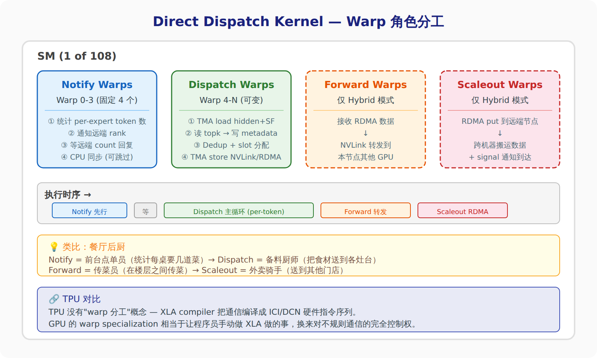
```

</details>

> **类比**: 想象一个大餐厅的后厨。Notify Warp 是前台点单员——先统计每桌要几道菜，把汇总表传到后厨。Dispatch Warp 是备料厨师——按单子把食材分配到各个灶台。Forward Warp 是楼层传菜员——只在有多层楼的大餐厅（Hybrid 模式）才需要，负责把一楼接到的菜搬到二楼。Scaleout Warp 是外卖骑手——负责送到其他分店（跨机器 RDMA）。
>
> **TPU 对比**: TPU 没有"warp 分工"的概念。XLA compiler 直接把通信编译成 ICI/DCN 硬件指令序列，不需要手动分配 SM 资源。GPU 的 warp specialization 相当于让程序员手动做 XLA 编译器做的事——代价是代码复杂度，收益是对不规则通信模式的完全控制权。

### 7.2 Dispatch 主 kernel：16 步精密编舞

Dispatch 的核心逻辑可以拆成三个阶段：**准备 → 搬运 → 触发收尾**。

**阶段一：Notify Warp 先行侦察**

1. 每个 warp 遍历自己负责的 token，读 `topk_idx`，给对应 expert 的计数器做 `atomicAdd`
2. **跨 SM 归约**（grid reduce）：用 NVLink 原子加把所有 SM 的计数合并到 SM 0
3. Notify warp 把 per-rank 计数发给远端 rank（NVLink 或 RDMA signal）
4. 等远端回复计数，算出 per-expert 的前缀和（prefix sum）→ 这就是每个 expert 在 buffer 里的起始槽位

> **类比**: 双十一前，物流系统先做"预分拣"——统计每个分拣站要处理多少包裹，预留好货架空间。不能等包裹到了再临时找位置，否则挤成一团。
>
> **具体数字**: 108 个 SM 各统计一部分 token，最后合并到 SM 0。如果每 token topk=10，1024 个 token 就是 10240 次 atomicAdd 分散在 108 个 SM 上。Grid reduce 用 NVLink 原子加，~1μs 搞定。

**阶段二：Dispatch Warp 搬运**

5. **Dual psum**（双前缀和）：每个 SM 用自己的局部 `psum_expert` 做 `atomicAdd` 抢槽位。"Dual"是指有 deterministic 和 runtime 两套 psum，后面讲
6. **TMA load**：把 hidden 向量 + scale factor 从用户 tensor 异步加载到 SMEM
7. **读 topk + 写 metadata**：从 `topk_idx`/`topk_weight` 读路由信息，写入 buffer 的 metadata 区
8. **Dedup + slot 分配**：同一个 token 被多个 expert 选中时去重，用 `atomicAdd(psum_expert + e, 1)` 抢互斥 slot
9. **等 TMA 完成**：`mbarrier_wait` 等 hidden 数据到 SMEM
10. **TMA store**：写到目标位置（NVLink 直达远端 / 或 RDMA staging buffer）
11. **RDMA put**（如果需要跨节点）：等 staging 落盘后发 RDMA

> **一个巧妙的 trick — `encode_decode_positive`**: 写 hidden 的时候，在 scale factor 的**符号位**做手脚。写入时把正数变负数（flip sign bit），收端轮询这个值——看到负数就知道数据已到达，再 flip 回来恢复原值。这样用一个 bit 实现了"ready flag"，不需要额外的同步信号。
>
> **类比**: 你在停车场等朋友。约定好：车灯灭=没到，车灯亮=到了。朋友不需要打电话告诉你"我到了"，你扫一眼车灯就知道。DeepEPv2 把"车灯"嵌入了数据本身（scale factor 的符号位），省了单独的信号通道。
>
> **TPU 对比**: TPU 的 XLA 不需要这种 trick——ICI 的 send/recv 有硬件级的完成通知。GPU 这样做是因为 NVLink 的 `st.global` 没有自带的 completion signal，只能用数据本身携带"就绪"信息。

**阶段三：触发 Epilogue**

12. 所有 warp 完成后，主 kernel 末尾调用 `cudaTriggerProgrammaticLaunchCompletion`——这是 PDL 机制，直接唤醒预排好的 epilogue kernel，**不经过 CPU**

> **例子**: 主 kernel 108 SM 跑完最后一个 token 的瞬间，epilogue kernel（132 SM）立刻启动。如果用传统方式，需要主 kernel 结束 → CPU 收到完成回调 → CPU 启动 epilogue kernel，中间可能有 5-20μs 的 CPU 调度延迟。PDL 把这段省掉了。

### 7.3 Dispatch Epilogue：从 buffer 到用户 tensor

Epilogue 的任务是把 dispatch 主 kernel 写入 buffer 的数据，**搬到用户期望的输出 tensor**（`recv_x`）。

为什么不在主 kernel 里直接写 `recv_x`？因为主 kernel 不知道数据什么时候全部到齐。Buffer 的每个 slot 由不同 rank 写入，到达时间不确定。Epilogue 等 PDL 触发后，保证所有 slot 都已写入，再统一搬运。

两种模式的搬运方式不同：

| | 非 Expand 模式 | Expand 模式 |
|---|---|---|
| 输出布局 | 一行 = 一个 token | 一行 = 一个 (token, expert) 对 |
| 槽位数 | ≤ `num_tokens_per_rank` | ≤ `num_tokens_per_rank × topk` |
| 去向索引 | `atomicAdd(psum)` 抢 slot | 从 metadata 读 `dst_tensor_idx` |
| 典型场景 | 标准 MoE | 需要精确追踪每份 topk 副本 |

> **类比**: 非 expand 就像快递站按收件人地址分拣——一个包裹对应一个地址。Expand 模式就像按"收件人 × 商品"分拣——一个包裹里的每件商品单独编号入库。

Epilogue 还维护了一个**链表结构**：同一个 token 被多个 expert 选中时，第一份的 metadata 里存着指向第二份的指针，第二份指向第三份……combine 阶段顺着链表就能找到所有副本。

### 7.4 Deterministic Prologue：可复现性的代价

这是一个可选步骤。为什么需要它？

```
普通模式:  atomicAdd(psum + expert_id, 1)  →  返回的 old_value 就是 slot 编号
问题:      多个 SM 并行 atomicAdd，谁先谁后不确定 → 每次运行 slot 分配不同
后果:      浮点加法不满足结合律！ a+(b+c) ≠ (a+b)+c
           → reduce 结果微小偏差 → 调试噩梦
```

Deterministic prologue 用 **4 轮协作式前缀和** 提前算好每个 SM 在每个 expert 上的起始 slot：

1. 每个 SM 独立统计自己负责的 token 中 per-expert 计数
2. SM 0 收集所有 SM 的局部计数
3. SM 0 做 exclusive prefix sum（跨 SM 维度）
4. 广播回各 SM

这样每个 SM 的 slot 分配完全确定，跟调度顺序无关。

> **类比**: 考试的时候，老师可以让学生自己找座位（`atomicAdd` 抢座，快的先坐），也可以按学号提前排好座位表（deterministic prologue）。前者效率高但每次座位不同，后者多花一步排座但结果可复现。
>
> **代价**: 需要一次 grid sync（所有 SM 同步），加上 SM 0 的 prefix sum 计算。在 108 SM 的 H100 上大约增加 2-5μs。对于需要可复现的训练场景（比如调试 loss spike），这个代价完全值得。

### 7.5 Combine 主 kernel：三条回家的路

Combine 是 dispatch 的逆过程——把 expert 算完的结果发回源 rank。但逆过程**不是对称的**，因为 dispatch 是"一对多散射"，combine 是"多对一聚合"，需要做 **reduce**（加权求和）。

Combine 主 kernel 的核心是一个**三分支决策**，根据 expand 模式和 `allow_multiple_reduction` 的组合，选择不同的 reduce 策略：

<details>
<summary>🔧 SVG 架构图：Combine 三分支决策树</summary>

```svg
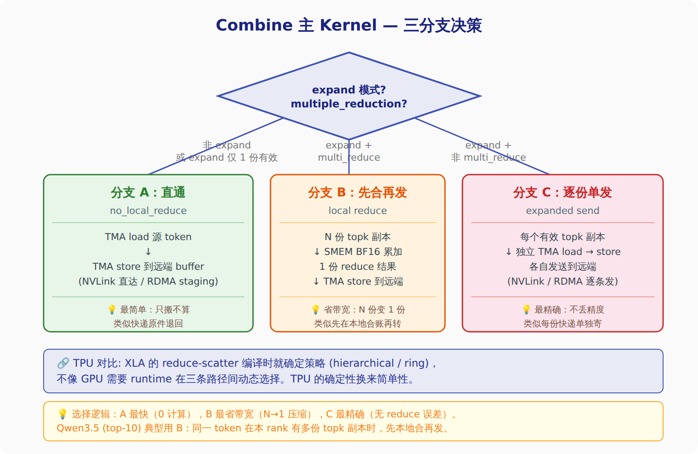
```

</details>

**分支 A（直通）**: 源 tensor 里只有 1 份有效数据（非 expand 模式，或 expand 但只有 1 个 topk 副本落在本 rank）。直接 TMA load → TMA store，不做任何计算。

> **类比**: 快递原件退回——包裹完好无损，直接贴个退回地址就寄出去。

**分支 B（先合再发）**: 本 rank 持有同一 token 的多份 topk 副本（expand + `allow_multiple_reduction`）。先在 SMEM 做 BF16 向量化累加，reduce 成 1 份，再 TMA store 发走。

> **类比**: 你有 3 张银行卡要转账到同一个人。与其转 3 笔，不如先在本地合账成 1 笔再转——省了 2 次跨行手续费（网络带宽）。
>
> **实现细节**: `combine_reduce` 用 `nv_bfloat16` 的 `hadd`（hardware add）做累加，展开因子（unroll factor）由编译期根据 hidden 大小和寄存器压力自动选择（最大 4）。`__popc(reduce_valid_mask)` 算出本 rank 持有几份副本——如果 8 个 rank 平分 topk=10，每 rank 约 1-2 份。

**分支 C（逐份单发）**: expand 但不允许 multiple reduction。每份 topk 副本单独发送，保留最高精度。

> **为什么有人不想 reduce？** 浮点加法不满足结合律。边收边 reduce 的结果可能跟最后一次性 reduce 略有不同。对于某些需要数值可复现的训练场景，宁可多花带宽也要精度一致。

**NVLink vs RDMA 双路径**: 三个分支最终都需要把数据发到源 rank。如果源 rank 在 NVLink 域内，用 `get_sym_ptr` 直接远端写入（零拷贝）。否则先 TMA store 到本地 staging buffer，再走 RDMA put。

> **具体例子**: 8 机 × 8 卡集群。Rank 5（机器 A）的 expert 算完了 rank 37（机器 E）的 token。`gin.is_nvlink_accessible(37)` 返回 false → 走 RDMA 路径：先写到本地 `send_buffer[37][token_idx]` → `gin.put` → RDMA 引擎搬到机器 E 的 `recv_buffer[5][token_idx]`。如果目标是 rank 6（同机器 A），直接 NVLink 写到 rank 6 的 recv_buffer，省了 staging 拷贝。

**Combine 结尾**: 用传统 `gpu_barrier`（不是 PDL），确保所有 RDMA/NVLink 写入完成后才进入 epilogue。

> **为什么不像 dispatch 用 PDL？** Dispatch → epilogue 是同一 rank 上的接力（主 kernel 写 buffer，epilogue 读 buffer），PDL 天然适合。Combine 涉及跨 rank 数据传输——必须等**所有** rank 都发完才能开始 reduce，这需要全局 barrier 而非单机的 PDL 触发。

### 7.6 Combine Epilogue：最终的加权求和

Combine 主 kernel 把各 rank 的结果写入 `recv_buffer` 后，epilogue 负责最后一步：**把 N 份结果 reduce 成 1 份**，写入用户的 `combined_x` tensor。

<details>
<summary>🔧 SVG 架构图：Dispatch-Combine 完整流水线</summary>

```svg
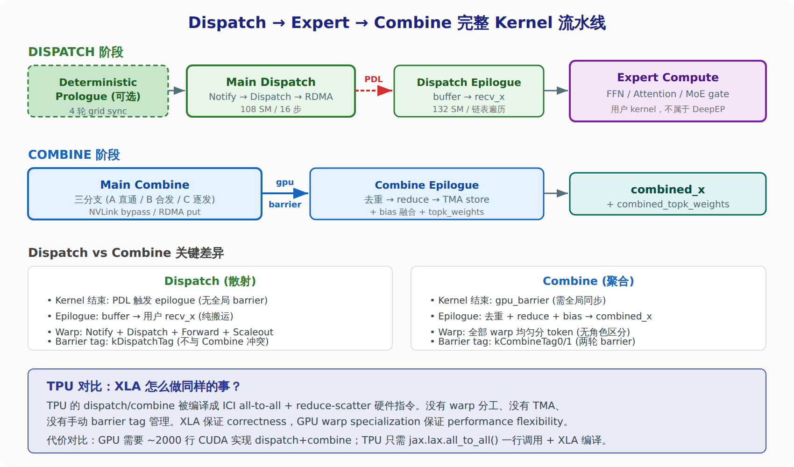
```

</details>

Epilogue 的执行流程：

1. **PDL 同步**：`cudaGridDependencySynchronize()` 等 combine 主 kernel 完成
2. **读 topk_idx → 映射 dst_rank_idx**：每个 lane 处理一个 topk 副本
3. **去重**：根据配置决定去重策略：
   - Expand + 不 reduce：不去重（每份 topk 独立）
   - Hybrid + 非 expand：按 expert 所属 rank 去重
   - 其他：按 dst_rank_idx 去重
4. **`combine_reduce`**：把所有有效副本累加到 SMEM，**同时融合 bias**（bias_0 + bias_1 在 reduce 循环内一并加，省一个 round-trip）
5. **TMA store** 到 `combined_x[token_idx]`
6. **写 topk_weights**：从 comm_buffer 拷贝到 `combined_topk_weights`

> **Bias 融合是个聪明设计**: 传统做法是 reduce hidden → 加 bias → 写出，两次 HBM 读写。DeepEPv2 把 bias 加法嵌入 reduce 的内层循环——每次从 `x[slot]` 读一个向量时，顺手加上 `bias[token_idx]` 的对应值。少了一次完整的 tensor 遍历。
>
> **TPU 对比**: XLA 的 `reduce_scatter` 后如果跟着 `bias_add`，编译器会自动做类似的 fusion（算子融合）。GPU 需要在 CUDA kernel 里手动实现，但换来了完全控制哪些操作融合、哪些不融合的灵活度。

### 7.7 小结：kernel 级设计哲学

| 设计选择 | 为什么这样做 | TPU 对应 |
|---|---|---|
| Warp specialization | 一个 kernel 内多种角色并行 | XLA 编译期静态调度 |
| TMA (Tensor Memory Accelerator) | 异步搬运 hidden 向量，不占 warp 执行单元 | DMA engine (VPU 管理) |
| PDL 触发 epilogue | 省 CPU 调度延迟 (~5-20μs) | XLA pipelining |
| encode_decode_positive trick | 用数据符号位做 ready flag | ICI 硬件 completion signal |
| 三分支 combine | 精度/带宽/复杂度三方权衡 | XLA 编译时固定策略 |
| Bias 融合 reduce | 省一次 HBM round-trip | XLA 算子融合 |
| Deterministic prologue | 训练可复现性 | XLA 编译期确定性 |
| gpu_barrier (combine) vs PDL (dispatch) | Combine 需全局同步，dispatch 不需要 | 统一用 ICI barrier |

---

## 八、Hybrid Kernel：两层互联下的 dispatch/combine

> 第 3 篇讲的是 **Direct** 模式——所有 rank 折成一个 flat NVLink 域。但真实的大 MoE（512 expert、几百张卡）跑不进单机，必须跨节点。这一节讲 **Hybrid** 模式：NVLink（机内）+ RDMA（机间）两层互联怎么协同。
> **原文**: [第 4 篇：EP Hybrid Dispatch/Combine Kernel](DeepEPv2分析(4)-EP Hybrid Dispatch Combine Kernel.md)

Direct 和 Hybrid 的本质区别，是**世界被拆成了两维**。

### 8.1 两层拓扑：world = scaleout × scaleup

Direct 模式里，rank 是一维的——64 个 rank 排成一条线，谁跟谁都能直接 NVLink 寻址。Hybrid 模式里，rank 变成**二维坐标**：

```
rank_idx = scaleout_rank_idx × kNumScaleupRanks + scaleup_rank_idx
           └── 你在哪台机器 ──┘                    └── 机器内第几张卡 ─┘
```

`scaleup` 维度走 **NVLink**（机内 8 卡直连，零拷贝对称寻址），`scaleout` 维度走 **RDMA**（机间跨网卡）。两个维度用不同的 NCCL team tag 区分：

- `ncclTeamTagLsa` = NVLink / scaleup（LSA = Local Shared Address，机内对称 VA）
- `ncclTeamTagRail` = RDMA / scaleout（Rail = 网络轨道）

<details>
<summary>🔧 SVG 架构图：两层拓扑 + rank 编址</summary>

```svg
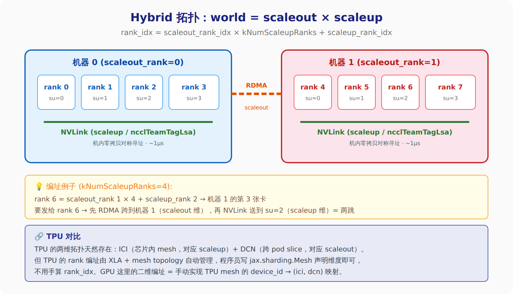
```

</details>

> **类比**: 想象一栋楼里的公司。`scaleup` 是同一层楼的工位——你伸手就能把文件递给邻座（NVLink 零拷贝）。`scaleout` 是不同楼层——得走楼梯／坐电梯（RDMA）。给二楼 3 号工位送文件，你要先坐电梯上二楼（跨 scaleout），再在二楼走到 3 号位（走 scaleup）。这就是**两跳**。
>
> **TPU 对比**: TPU 的 ICI（芯片间 mesh）+ DCN（跨 slice）就是天然的两维拓扑。区别在于 TPU 用 `jax.sharding.Mesh(devices, axis_names=('dcn','ici'))` 声明两维，rank → 坐标的映射由 XLA 自动算。GPU 这里的 `rank_idx = scaleout × N + scaleup` 是手动实现同一件事。

### 8.2 Hybrid Dispatch：三角色接力，两跳到位

Direct dispatch 是 4 Notify + N Dispatch 两类角色，一跳（NVLink 直写）到位。Hybrid dispatch 多了一维，warp 角色也变成三类，数据流变成两跳：

| | Direct 模式 | Hybrid 模式 |
|---|---|---|
| Warp 角色 | Notify + Dispatch | Notify + **Scaleout-Send** + **Forward** |
| Buffer 分段 | send + recv | **scaleup** + **scaleout_send** + **scaleout_recv** |
| 数据流 | 1 跳（NVLink 直写） | 2 跳（RDMA → recv → NVLink → scaleup） |
| rank 空间 | 一维 flat | 二维 scaleout × scaleup |

数据的两跳旅程（源 rank 要把 token 发给远机的某张卡）：

```
第 1 跳 (RDMA, 跨机):   源 rank ──Scaleout-Send warp: gin.put<Rail>──► 目标机的 scaleout_recv_buffer
第 2 跳 (NVLink, 机内): 目标机的中转 rank ──Forward warp: NVLink 写──► 目标 scaleup peer 的 scaleup_buffer
```

<details>
<summary>🔧 SVG 架构图：Hybrid Dispatch 两跳数据流</summary>

```svg
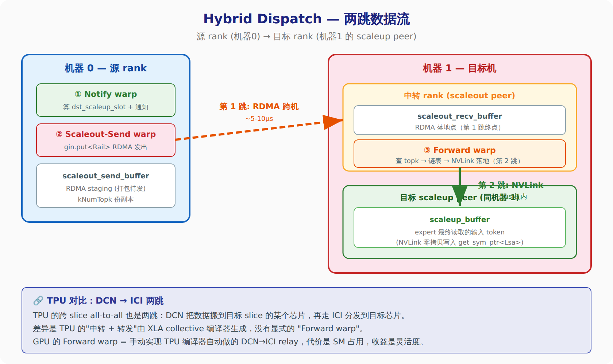
```

</details>

> **类比**: 国际转运仓。你（源 rank）把一批包裹交给国际物流（RDMA），它先运到对方国家的**中转仓**（scaleout_recv_buffer）。中转仓的分拣员（Forward warp）拆开一看地址，再用**同城快递**（NVLink）送到最终收件人（scaleup peer）。三个角色：你的打包员（Scaleout-Send）、国际物流、当地分拣员。
>
> **为什么要中转仓？** 因为 RDMA 只能点到点发到"某台机器的某块内存"，不能直接跳到那台机器里的另一张卡。跨机后必须落地一次，再靠机内 NVLink 二次分发。TPU 的 DCN → ICI 也是同理——DCN 落到目标 slice 的入口芯片，再 ICI mesh 内转发。

### 8.3 Notify warp 的四阶段（A→D）

Hybrid 的 Notify 比 Direct 复杂，因为要同时统计两个维度的计数。它分四个阶段：

- **阶段 A**：本地统计——遍历自己的 token，按 (scaleout_rank, scaleup_rank) 二维累加计数
- **阶段 B**：scaleout 维交换——通过 RDMA signal 把 per-scaleout 计数发给各远机
- **阶段 C**：scaleup 维交换——通过 NVLink 把 per-scaleup 计数在机内交换
- **阶段 D**：算两级前缀和——先算 scaleout 偏移，再算机内 scaleup 偏移，拼出每个 token 的最终落点 `dst_scaleup_slot`

> **类比**: 快递预分拣的两级版本。先统计"每个城市要发多少件"（scaleout），再统计"每个城市里每个小区要多少件"（scaleup），最后拼出每件包裹的货架编号（省级仓 + 小区网点）。一维预分拣变两级预分拣。

### 8.4 Forward warp：round-robin 轮询多个链表

Forward warp 是 Hybrid dispatch 的灵魂——它要盯着从 RDMA 收到的数据，一到就转发到 NVLink。难点在于**它同时服务多个 scaleup peer**，不能死盯一个。

DeepEPv2 的做法是**多 peer 链表 + round-robin 派发**：

1. 每个 channel 为 `kNumScaleupRanks` 个 peer 各维护一条链表（`channel_linked_list`）
2. 每轮从所有链表各读一个节点，用一个 `wip_mask`（bitmask）标记"本轮哪些 peer 有新数据"
3. 内层 while 从 `dst_scaleup_rank_idx + 1` 开始 round-robin 找下一个有效 peer，`ptx::ffs`（find first set）挑出来派发
4. 派发完这轮，链表游标 `stored_ll_idx` 前进，继续下一轮

关键是那句 round-robin：`start = (dst + 1) % N`，避免每次都从 peer 0 开始扫——否则永远优先服务 peer 0，其他 peer 饿死。

> **类比**: 一个理货员管 8 个货架，每个货架有一队待处理的货。他不能盯着 1 号货架清完再看 2 号（后面的会积压），而是**转圈巡查**：这轮处理到 3 号，下轮就从 4 号开始扫，扫一圈回来。`wip_mask` 是"哪些货架这轮有货"的速查表，`ffs` 是"从当前位置往后第一个有货的货架"。
>
> **链表索引变换的巧思**: 链表节点存的是 `token_idx`，但要还原成源全局坐标 `src_global_token_idx = (scaleout_rank × scaleup_ranks + scaleup_rank) × max_tok + token`——就是 §8.1 那个二维编址的逆运算。Forward warp 读出 token 后，靠这个公式反推它从哪台机器的哪张卡来。

### 8.5 Hybrid Combine：反着走的两跳

Combine 是 dispatch 的逆过程，所以两跳方向也反过来：dispatch 是 **RDMA 下行 → NVLink 落地**，combine 是 **NVLink 上行 → RDMA 下行回源**。

combine 用三段 buffer + 两类 warp 角色：

| Buffer 段 | 作用 |
|---|---|
| `scaleup_buffer` | expert 结果先在机内 NVLink 汇聚到中转 rank |
| `scaleout_send_buffer` | 中转 rank 打包待 RDMA 发回源机 |
| `scaleout_recv_buffer` | 源机接收 RDMA 回来的结果 |

| Warp 角色 | 职责 |
|---|---|
| **Scale-up warp** | 按链表把本 rank 的 expert 结果 NVLink 写到中转 peer 的 scaleup_buffer（第 1 跳，上行）|
| **Forward warp** | 从 scaleup_buffer 读出、（可选）本地 reduce、RDMA 发回源 scaleout peer（第 2 跳，下行）|

<details>
<summary>🔧 SVG 架构图：Hybrid Combine 反向流 + compute-comm overlap</summary>

```svg
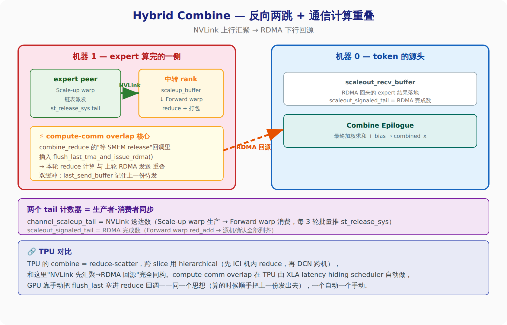
```

</details>

> **类比**: 报销流程反着走。dispatch 是"公司总部把预算下发到各分部各员工"（下行两跳）。combine 是"各员工的报销单先在分部汇总（NVLink 上行到中转 rank），分部再统一寄回总部财务（RDMA 下行回源）"。中转 rank 就是分部财务，先把本部门的账合了再往上寄，省得每个员工单独寄一次。

### 8.6 生产者-消费者：channel_scaleup_tail + 批量推送

Scale-up warp 和 Forward warp 之间靠 `channel_scaleup_tail` 做同步——这是个经典的**生产者-消费者队列**：

- **生产者** = 本 rank 的 Scale-up warp，把 token NVLink 写到 peer 的 scaleup_buffer 后，tail += 1
- **消费者** = 远端 peer 的 Forward warp，用 `stored_num_tokens_recv < cached_tail` 判断"有没有新数据"

tail 是个 **cumulative count**（累计值），不是 flag。Forward warp 缓存上次读到的 tail，只要本地消费数 < 缓存 tail，就知道有活干。

一个重要优化：`st_release_sys` 走 system scope fence，**开销大**。所以 Scale-up warp 不是每发一个 token 就推一次 tail，而是攒够 `kNumScaleupUpdateInterval=3` 个才批量推一次。

> **类比**: 餐厅后厨的取餐叫号。厨师（生产者）做好一道菜就把号码牌往前推（tail++），服务员（消费者）盯着号码牌，号大了就来端。但"推号码牌"这个动作本身有成本（要广播到全场），所以厨师攒够 3 道菜再推一次号，而不是每道都吼一嗓子。
>
> **寄存器再分配的细节**: Scale-up warp 只做"索引 + TMA store"，寄存器压力小（分 40 个）；Forward warp 要做多副本 reduce，压力大（分 216 个）。DeepEPv2 用 `warpgroup_reg_dealloc<40>` / `warpgroup_reg_alloc<216>` 在两组 warp 间**重新分配寄存器**，让 reduce 侧吞吐更高。这是 Hopper warp-group 级的资源调度，TPU 上没有对应物——TPU 的 VMEM/寄存器分配由 XLA 编译期静态决定。

### 8.7 compute-comm overlap：flush_last 双缓冲

这是整个 Hybrid Combine 隐藏 RDMA 延迟的关键，也是最精妙的一处。

Forward warp 每处理一个 token 要做两件事：**本地 reduce**（算，占 SM）+ **RDMA 发回源**（发，占网卡）。如果串行做，网卡发数据时 SM 干等。

DeepEPv2 的解法是**双缓冲 + 回调注入**：

```
combine_reduce(..., 回调 = flush_last_tma_and_issue_rdma)
                          ↑ 在"等 SMEM buffer release"的空隙里，
                            触发上一轮 token 的 RDMA put
```

`combine_reduce` 内部有个"等 SMEM release"的等待点（等上一份数据被消费才能复用 buffer）。DeepEPv2 把 `flush_last_tma_and_issue_rdma()` 塞进这个等待回调——**这一轮在 reduce 计算的时候，上一轮的 RDMA 正在网卡上飞**。用 `last_send_token_buffer_ptr` 等变量记住上一份待发数据，形成一条 reduce ‖ RDMA 的流水线。

> **类比**: 洗衣店的洗+烘流水线。你不会等第一桶衣服烘干了才去洗第二桶——而是第二桶在洗的时候（reduce），第一桶正在烘（RDMA）。`flush_last` 就是"启动上一桶的烘干机"这个动作，恰好塞在"往洗衣机放第二桶"的空隙里。
>
> **TPU 对比**: TPU 的 XLA latency-hiding scheduler 会自动分析数据依赖，把 collective 和 compute 重叠——你写朴素的 `reduce_scatter` 后接矩阵乘，编译器自己插好 overlap。GPU 这里是手动把通信塞进计算的等待缝隙，思想完全一致，一个编译器自动、一个程序员手动。这正是 §五讲的 "XLA 自动 vs GPU 手动 event 链" 的 kernel 内部版本。

### 8.8 小结：Hybrid 比 Direct 多付出了什么

| 维度 | Direct | Hybrid | 多出的代价 |
|---|---|---|---|
| 拓扑 | 一维 flat | 二维 scaleout × scaleup | 手动 rank 编址 + 逆变换 |
| 数据流 | 1 跳 NVLink | 2 跳 RDMA→NVLink | 中转仓落地 + 二次分发 |
| Warp 角色 | Notify + Dispatch | + Scaleout-Send + Forward | Forward warp 吃 SM 资源 |
| 同步 | 单层 barrier | scaleup_tail + scaleout_signaled_tail 双计数 | 两级生产者-消费者 |
| Combine reduce | 就地 | NVLink 上行汇聚 + RDMA 下行 | hierarchical reduce |
| overlap | event 链 | flush_last 塞进 reduce 回调 | 手动双缓冲 |

> **一句话**: Hybrid 就是把 Direct 的每个环节都"竖切一刀"分成机内（NVLink）+ 机间（RDMA）两层，中间加一个 Forward warp 做中转。多出来的所有复杂度，本质都是"跨机这一跳不能直达目标卡，必须落地再转发"逼出来的。这跟 TPU 的 DCN → ICI hierarchical collective 是同一个物理约束下的两种工程答案——TPU 交给编译器，GPU 交给 warp。

---

## 九、与 TPU/GPU 工作的关联速查

| DeepEP 设计 | GPU 上的体现 | TPU 对应 | 对我们的启发 |
|---|---|---|---|
| Symmetric Memory | NVLink LSA + ncclMemAlloc | ICI 直连 | TPU compiler 自动处理，GPU 需要手动管理 |
| ScaleUP Barrier | NVLink 原子操作 | ICI barrier | 都是 ~1μs 级 |
| ScaleOut Barrier | RDMA Gin signal | DCN AllReduce | DCN 延迟 ~5-10μs，是主要瓶颈 |
| Hybrid 2-SM | SM0 NVLink + SM1 RDMA 并行 | ICI + DCN 并行 | 两层通信必须并行化 |
| AGRS 零 SM | DMA copy engine | ICI hardware collective | 理念相同：通信不占计算资源 |
| Forward Warp | RDMA → NVLink 中转 | DCN → ICI 中转 | 两级互联的固有代价 |
| Direct vs Hybrid | 单机 vs 多机 | 单 host vs 多 host | 相同的 sharding 选择空间 |
| EPHandle 缓存 | 推理 continuous batching | prefill/decode 路由复用 | 路由稳定时省 CPU 开销 |
| PDL epilogue | Hopper kernel 依赖 | XLA pipelining | 更细粒度的异步控制 |
| Event overlap | 手动 event 链 | XLA async collective | GPU 手动 vs TPU 自动 |
| Multiple reduction | 大 MoE combine 内存 | 大 MoE reduce 精度 | 512+ expert 必须边收边 reduce |
| Warp specialization | 4 种 warp 角色并行 | XLA 静态编译 | GPU 手动分工 vs TPU 编译器自动 |
| TMA 异步搬运 | Tensor Memory Accelerator | VPU DMA engine | 专用硬件搬数据，释放计算单元 |
| encode_decode_positive | 符号位当 ready flag | ICI 完成信号 | 没有硬件信号时的软件 trick |
| Bias 融合 reduce | 嵌入 reduce 内循环 | XLA 算子融合 | 手动 vs 自动 fusion |
| Deterministic prologue | 4 轮 grid sync 前缀和 | XLA 编译期确定性 | 可复现性的工程代价 |
| 二维 rank 编址 | scaleout × scaleup 手算 | jax.sharding.Mesh 声明 | GPU 手动映射 vs TPU 声明式 |
| 两跳数据流 | RDMA→recv→NVLink→scaleup | DCN→入口芯片→ICI→目标 | 跨机不能直达目标卡的固有约束 |
| Forward warp (Hybrid) | RDMA 落地后 NVLink 转发 | DCN→ICI relay | GPU 吃 SM 做中转 vs TPU 编译器生成 |
| ncclTeamTag 分维 | Lsa(NVLink)/Rail(RDMA) | ICI/DCN axis | 两维通信显式区分 |
| channel_scaleup_tail | 生产者-消费者累计计数 | XLA 数据依赖调度 | 每 3 轮批量推省 fence 开销 |
| warpgroup 寄存器再分配 | dealloc 40 / alloc 216 | VMEM 编译期静态分配 | Hopper 动态资源调度，TPU 无对应 |
| flush_last 双缓冲 overlap | reduce 回调塞 RDMA | XLA latency-hiding | kernel 内 compute-comm 重叠，手动 vs 自动 |
| Hierarchical combine | NVLink 汇聚+RDMA 回源 | ICI reduce+DCN reduce-scatter | 两层 reduce 同构 |

---

## 十、番外：NCCL Gin & Symmetric Memory —— DeepEPv2 底下的地基

> 前面九节讲的是 DeepEPv2 这栋楼。这一节往下挖，看它踩的**地基**：`Symmetric Memory`（对称内存）和 `NCCL Gin`（GPU 主动发起的网络通信）。第 1 篇里我们说过「V2 把底层从 NVSHMEM 换成了 NCCL Gin」——换的就是这块地基。把地基夯实，回头看上层的 dispatch/combine 会通透很多。
> **原文**: [NCCL Gin & Symmetric Memory](NCCL Gin & Symmetric Memory.md)（DeepSeek V4 番外篇）

### 10.1 为什么要「设备发起」通信？

传统 GPU 通信是**主机发起模型**（host-initiated）：CPU 当指挥，每做一次通信，都要 CPU 启动一个通信 kernel、做一次 Host↔Device 同步。NCCL、MPI 都是这个路子——基于**消息传递**（message passing）的松耦合模式。

问题出在**计算和通信要贴身融合**的场景（EP 并行、JAX/Triton 编译器生成的通信）。这类场景里，通信是算到一半临时要发的，如果每次都回到 CPU 绕一圈，那点 CPU 协调开销就成了瓶颈。

> **类比**: 主机发起模型像「厨师每切一刀菜，都要跑去问经理『下一步干啥』」。经理（CPU）和后厨（GPU）之间来回跑腿的时间，比切菜本身还久。设备发起模型（device-initiated）是「把菜谱直接给厨师，让他自己一口气做完」——GPU 线程在 kernel 里**自己**发起网络通信，不回 CPU。

推动这件事的有三股力：
1. **NVSHMEM 先蹚了路**——证明了 GPUDirect Async Kernel-Initiated（GDA-KI）可行，DeepEP V1 就用它。
2. **NVL72 超节点出现**——传统 NCCL 在 NVLink 上延迟和开销都太大，且 DeepEP 生态搞出一堆通信库，维护多个库很烦。于是 **NCCL 从 v2.28 开始支持 Device API**，让 GPU 线程能在 kernel 里直接发网络通信，这就是 **Gin（GPU-Initiated Networking）**。
3. **两个愿景**——DeepSeek 想统一 ScaleUP/ScaleOut 的语义复杂性；PyTorch 想把一整个 GPU 集群编程成「一个拥有海量内存的巨型 GPU」。

> **TPU 对比**: TPU 上根本没有「主机发起 vs 设备发起」这个纠结。XLA 编译器在编译期就把集合通信排进计算图，`all-gather`/`reduce-scatter` 是编译器生成的算子，天然和计算重叠，没有运行时回 CPU 的开销。GPU 这套 Gin 本质上是在**用软件手工补齐 TPU 编译器免费给的东西**。

### 10.2 什么是 Symmetric Memory（对称内存）？

核心思想借自 HPC 的 **PGAS**（Partitioned Global Address Space，分区全局地址空间）：一个分布式系统里，所有执行单元共享一块 global 地址空间，这块空间又被切成若干块分给每个单元。

具体到 GPU：**每个 GPU 都在相同的虚拟地址空间里分配内存**，任意 GPU 可以根据别人的 rank 编号，算一个 offset 就访问到那个 GPU 的内存。它有两个关键性质：

- **对称性**：所有进程里，这块内存的 VA 大小和布局**完全一致**——给开发者一个统一的编程视角。
- **语法统一**：访问本地显存 vs 访问远程 GPU 的显存，无论远端是走 NVLink 还是走 RDMA，**代码写法完全相同**，底层复杂性被屏蔽。

于是设备端内核访问 peer `x` 的同名内存，就是一句纯算术：

```
peer 地址 = lsaFlatBase + x * bigSize + bigOffset + 用户offset
            └ 统一基址 ┘  └ 第几个 rank ┘ └ 这块 window 的偏移 ┘
```

> **类比**: 这就是第二节讲 DeepEPv2 时那个「**圆桌伸手**」的正式版。8 个人坐一张圆桌，桌面切成 8 块**布局完全一样**的区域。你要在 3 号位的区域写字，不用喊他、不用传纸条——手往「我的位置 + 3 个身位」一伸就到了。Symmetric Memory 就是把这张圆桌的坐标系数学化：`基址 + rank×步长 + 偏移`。

> **TPU 对比**: 这正是 TPU 程序员**习以为常**的世界。`jax.sharding` 里你声明一个 `Mesh`，数组自动按 mesh 分片，访问哪个分片由 XLA 算——你从来不用手写「基址 + rank×步长」。GPU 的 Symmetric Memory 是在**手动搭一套 TPU 早就内建的对称寻址模型**。

### 10.3 一张地址，两条腿：LSA vs GIN

对称内存给了「统一的地址视图」，但**底层真要搬数据时，语义并不统一**——这是全文最重要的一个分野，务必记牢：

| | LSA (Load Store Access) | GIN (GPU-Initiated Networking) |
|---|---|---|
| 用于 | 同节点内 peer（NVLink/PCIe P2P） | 跨节点 peer（RDMA ScaleOut） |
| 语义 | **内存语义**：直接 `LD`/`ST` 读写对端显存 | **消息语义**：`put`/`get` 发 RDMA 请求 |
| 怎么发 | 一条访存指令，硬件直达 | 构造 RDMA WQE 敲门铃 / 写描述符给 CPU 代理 |
| 对应维度 | scaleup（第 8 节的 `ncclTeamTagLsa`） | scaleout（第 8 节的 `ncclTeamTagRail`） |

一句话总结：**Symmetric Memory 让「算地址」这件事统一了，但「搬数据」这件事仍然分两条腿走**。机内伸手直接抓（LSA），跨机得发快递（GIN）。

<details>
<summary>🔧 SVG 架构图：一张对称 VA，两条搬运腿（LSA / GIN）</summary>

```svg
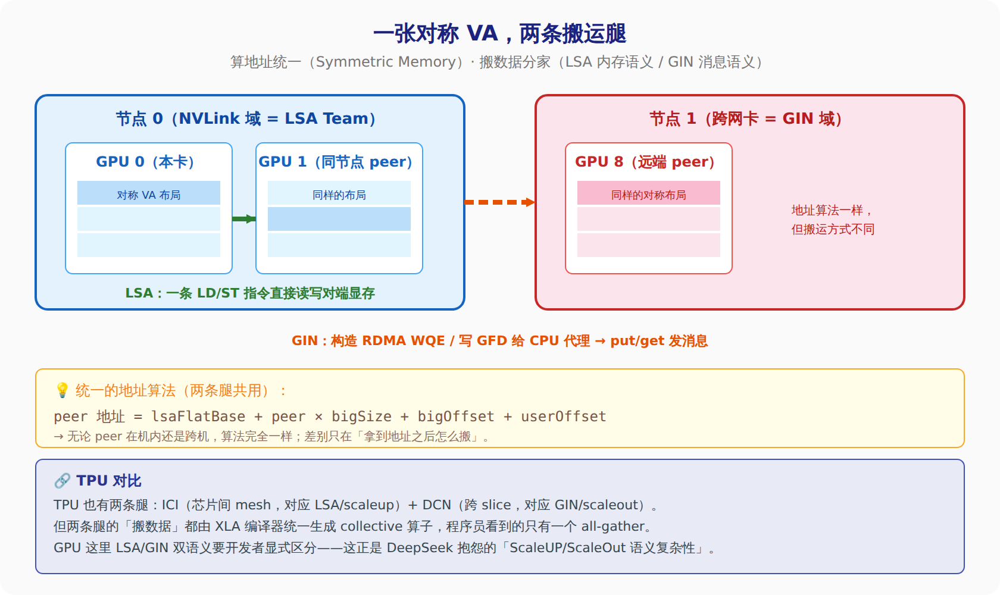
```

</details>

> **渣注（原作者的点睛）**: Symmetric Memory & Gin 只是把复杂通信包了个「统一对称地址」的糖衣，方便写并行算子。底层执行依然很脏——Gin 要么构造 RDMA WQE（GDA-KI 模式），要么构造 GFD 描述符（Proxy 模式）；再叠加 GPU 内部 TMA 的 Async Proxy、直接 LD/ST、RDMA 同步，整体极其复杂。作者原话：「**RDMA 并不是一个对 GPU 友好的接口**」。未来的硬件方向是把 ScaleOut 网卡接进 ScaleUP 域，软件层彻底消除 LSA/GIN 双语义。

> **本波小结**: 记住三件事——(1) 为什么要设备发起：省掉计算中途回 CPU 的开销；(2) Symmetric Memory 是什么：对称的 flat VA，算地址靠 `基址+rank×步长+偏移`；(3) 一张地址两条腿：机内 LSA 走内存语义（LD/ST 直达），跨机 GIN 走消息语义（RDMA put/get）。下一波我们钻进 **10.4 统一抽象**——这张对称 VA 到底是怎么用 `cuMem` 一块块拼出来的，以及 window 注册干了什么。

### 10.4 统一抽象：对称 VA 是怎么拼出来的

上一波说「算地址就是 `基址 + rank×步长 + 偏移`」。但这个「基址一致、步长一致、偏移一致」不是天上掉下来的，得手工搭。这一波拆三步：**分内存 → 记账保证对称 → 注册成 window**。

#### 第一步：为什么不能用 `cudaMalloc`，要用 `cuMem`

平时分显存用 `cudaMalloc`，但它有个致命缺陷：**它给你的地址是「私有」的，别的 rank 根本导不出、也 map 不进来**。

对称内存必须用 `cuMem` 系列 API，它的关键是**把「物理内存」和「虚拟地址」解耦**成四步：

```
cuMemCreate         → 分配物理页（拿到一个可导出的 handle）
cuMemAddressReserve → 预留一段虚拟地址（VA）
cuMemMap            → 把 VA 映射到物理页
cuMemSetAccess      → 开放读写权限
```

关键在第一步产出的那个 **handle（句柄）**：只有 `cuMem` 分配的物理段，才能用 `cuMemExportToShareableHandle` 导出，交给别的 rank 用 `cuMemImportFromShareableHandle` + `cuMemMap` 映射到**同一个地址**。`cudaMalloc` 出来的 buffer 没有这种可导出的句柄。

> **类比**: `cudaMalloc` 像「租一间精装公寓」——能住，但房子和地址是绑死的私有物，你没法把「同一个门牌号」共享给别人。`cuMem` 像「先买地皮（物理页），再单独申请门牌号（VA），再把门牌挂到地皮上」——三件事分开办。好处是那张「地契（handle）」可以复印给邻居，邻居就能在自己那边挂一块**一模一样门牌号**的地皮。这就是跨 rank 同地址的来源。

#### 第二步：`bigSpace` 记账器——对称性到底哪来的

这是全节最精妙的地方。「所有 rank 拿到相同的 `bigOffset`」怎么保证？答案出乎意料地朴素：**用一个纯 CPU 端的整数分配器记账**。

- 每个 rank 在「全局对称视图」里占一段固定大小的 VA 窗口，叫 `bigSize`（比如按 4GB 对齐、取所有 rank GPU 显存的最大值）。
- 分配时并不真去碰物理 VA，只在一个叫 `bigSpace` 的**整数线段分配器**上「切一刀」，返回一个相对偏移 `bigOffset`。
- 精髓在这句：**所有 rank 都按相同顺序调用同一套注册流程**，`bigSpace` 是**确定性演化**的——同样的输入、同样的顺序，每个 rank 独立算，必然得到**完全相同**的 `bigOffset`。不需要任何跨 rank 通信来对齐偏移量！

> **类比**: 想象一场婚礼，1000 个宾客要排座位。笨办法是让一个人排好、再打电话通知每桌坐几号（要通信）。聪明办法是：**给每个人发一份一模一样的排座规则**（「按报名先后，每桌满 10 人换下一桌」），每个人自己一算就知道自己坐哪、也知道张三坐哪——**零沟通，结果却完全一致**。`bigSpace` 就是这份「排座规则」，它的确定性保证了对称性。

#### 第三步：flat VA 布局 + 窗口注册

物理段分好、偏移记好之后，`symMemoryObtain` 把本地和所有 peer 的同名物理内存，挂到一整片**连续的 flat VA** 上：

```
[ lsaFlatBase ]
| rank 0 的 bigSize | rank 1 的 bigSize | ... | rank N-1 的 bigSize |
        ↑                    ↑
   +bigOffset            +bigOffset       ← 每个 rank 的同名 window 落在各自段里同样的偏移
```

于是设备端访问 peer `x` 只需一句纯算术：`lsaFlatBase + x*bigSize + bigOffset + userOffset`——**这就是 10.2 那条地址公式的物理来源**。

用户侧的入口是 `ncclCommWindowRegister`：把一段显存 `(buff, size)` 注册成所有 rank「同一逻辑视图」的 **window**。为什么必须注册、不能拿裸指针直接用？三个原因：

1. **对称 VA 统一视图**：裸 `cudaMalloc` 的地址各 rank 互不相关，注册后才建立 `lsaFlatBase` 统一布局。
2. **物理句柄跨 rank 交换**：export / import / map 这套流程必须由 NCCL 用 bootstrap 集合操作完成，用户自己调不了。
3. **多后端聚合注册**：同一块内存要同时在多条路上注册——LSA Team 内（`cuMemMap` P2P）、NVLS multicast（`cuMulticastBindAddr`）、GIN（RDMA 远端）、RMA Proxy（CPU 代理）。一次注册全搞定。

最终产出一个设备端可见的 `ncclWindow_vidmem` 结构，里面装着 flat 基址、步长（`stride4G`）、多播偏移、GIN 句柄数组等——**这是设备 kernel 能访问内存的唯一通路**。所有这些句柄（LSA 的、GIN 的）最后都被打包进一个统一的 `ncclSymkDevComm`，kernel 启动时一把拿到。

<details>
<summary>🔧 SVG 架构图：cuMem 解耦 → bigSpace 记账 → flat VA 拼装</summary>

```svg
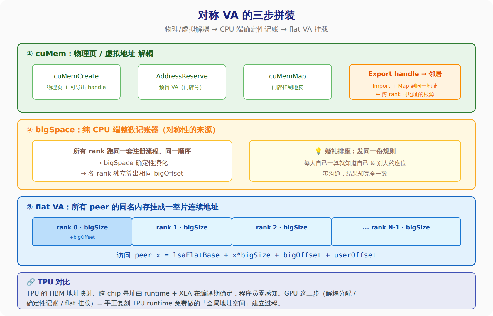
```

</details>

> **本波小结**: 对称 VA 三步拼出来——(1) 用 `cuMem` 而非 `cudaMalloc`，因为它把物理页和 VA 解耦，还能导出句柄给别的 rank 挂同地址；(2) `bigSpace` 是个纯 CPU 端整数记账器，靠「所有 rank 跑同样流程 → 确定性演化」保证大家算出相同 `bigOffset`，**零通信实现对称**；(3) `ncclCommWindowRegister` 把裸内存注册成 flat VA 上的 window，同时在 LSA/NVLS/GIN/Proxy 多条路上聚合注册，产出设备端唯一入口 `ncclWindow_vidmem`。下一波进 **10.5 LSA**：机内这条腿具体怎么用 LD/ST 和 NVLink 多播搬数据、怎么做 barrier 同步。

### 10.5 LSA：机内这条腿怎么搬数据

先把名词摊开，别默认你知道：

- **LSA** = **L**oad **S**tore **A**ccess（有的地方也写 Local Shared Access）。本质就一句话：**机内的 GPU 之间，直接用普通的访存指令（load / store）读写对方的显存**，靠 NVLink / NVSwitch 硬件直达，不用走任何软件通信协议。它是「一张地址两条腿」里的**机内那条腿**。
- **NVLink** = NVIDIA 机内 GPU 之间的高速互联线（比 PCIe 快一个数量级）。**NVSwitch** = 把机内多张 GPU 全连起来的交换芯片。
- **P2P** = Peer-to-Peer，指一张 GPU 能直接访问另一张 GPU 的显存，不用先拷回 CPU。

有了对称 VA，LSA 搬数据简单到「就是普通访存」。三种地址算法：

```
本地指针      = lsaFlatBase + 本rank * stride + offset     // 读写自己
peer 指针     = lsaFlatBase + peer   * stride + offset     // 读写第 peer 个 GPU  ← 核心
多播指针      = mcBasePtr   + mcOffset + offset            // 一次写，广播给所有 GPU
```

算出 peer 指针后，读对端显存就是 `v = peerPtr[i]`，写对端显存就是 `peerPtr[i] = v`——**跟读写本地数组一模一样**，这就是对称内存最爽的地方。

#### 普通 LD/ST vs NVLink 多播（NVLS）

搬数据分两档。第一档是刚说的普通 `LD`/`ST`：一个一个 peer 地址去读、去写。

第二档用上了 **NVLS**（NVLink Switch，也叫 NVLink SHARP）——**让交换机帮你干活**。有两条硬件指令（统称 `multimem` 指令族，意思是「操作多播内存」）：

- **STMC**（`multimem.st`，store-multicast）：**一次写，广播给所有 GPU**。你发一份数据给 NVSwitch，交换机复制成 N 份，分发到所有 peer 的同一地址。
- **LDMC**（`multimem.ld_reduce`，load-multicast-reduce）：**一次读，硬件顺手求和**。你下一条指令，交换机把所有 peer 对应地址的数据**在交换芯片里加总**，再把 reduced 结果返回给你。

> **类比**: 普通 LD/ST 像「你要把同一份通知发给 8 个同事，得挨个走到工位放一张」。NVLS 的 STMC 像「你把通知交给前台广播，前台一次复印 8 份分发」——发一次就够。而 LDMC 更狠：「前台不光帮你收 8 个人的表格，还当场把 8 张表的数字加好总数再给你」——**求和在交换机硬件里完成**，GPU 一条指令就拿到聚合结果。老平台（没 NVSwitch SHARP，比如 RTX 6000 pro）用不了多播，只能退回挨个 unicast。

> **TPU 对比**: LDMC 这种「网络里顺手做 reduce」，正是 TPU ICI 的看家本领——TPU 的 `all-reduce` 天生就是在 ICI mesh 上边传边加，硬件 reduce 是默认路径。GPU 要到 Hopper + NVSwitch SHARP 才补上这一课，而且还得程序员显式发 `multimem` 指令。TPU 上你写个 `jax.lax.psum`，XLA 自动就用了。

#### LSA Barrier：怎么确认「大家都到齐了」

搬完数据得同步——「我写完了，你能读了吗？」这就是 **barrier**（栅栏，一种「所有人到齐才放行」的同步）。这块其实第三节讲 DeepEPv2 时提过乒乓协议，这里看 NCCL 的正式实现，同样分两档，取决于平台支不支持多播：

- **多播（multimem）模式**：`arrive`（我到了）用一条 `multimem.red.add` PTX 指令，硬件把「+1」多播到所有 rank 的同一个计数槽。因为 N 个 rank 同时 arrive，每个槽最终 `+N`，所以 `wait` 的条件就是「计数 ≥ 起点 + N」。**只需一个 leader 线程发指令**，交换机负责扩散。
- **单播（unicast）模式**（老平台）：每个 rank 挨个往「对端的信箱」写「我到了 epoch+1」，`wait` 时并行盯着 N-1 个 peer 的信箱。多个线程分摊 N-1 个目标，负载均衡。

这里冒出个关键词 **epoch**（轮次计数器）：barrier 会被同一块资源**连续多个 kernel 反复复用**，靠 epoch 区分「这是第几轮同步」。构造 barrier 时读回上次的 epoch，同步完析构时写回——这样下一个 kernel 接着用不串味。

> **类比**: `epoch` 像地铁闸机的「本班次编号」。同一个闸机（barrier 资源）一趟趟地放人，靠班次号区分「这拨人属于哪一趟」，不会把上一趟没走完的人算进这一趟。多播模式像「闸机联网，一刷卡所有站点计数器同步 +1」；单播模式像「每个站点各自记数，你得挨个站点去问『你那到齐没』」。

> **本波小结**: LSA = 机内 GPU 用普通 load/store 指令直接读写对方显存，靠 NVLink/NVSwitch 硬件直达。算出 peer 指针后读写跟本地数组一样。搬数据两档：普通 LD/ST 挨个搬；NVLS 多播让交换机代劳——STMC 一次写广播全员，LDMC 一次读还硬件求和（这正是 TPU ICI 的天生本事）。同步用 barrier，多播平台一条 `multimem.red.add` 全员 +1，老平台退回挨个写信箱；用 `epoch` 轮次号支持资源反复复用。下一波讲 LSA 上最精巧的一招——**LLA2A 低延迟 AllToAll**：怎么用一次 16B 原子写，同时把「数据」和「我发好了」的通知一起送到。

### 10.6 LLA2A：一次原子写，数据和通知一起送

先摊名词：

- **A2A** = **A**ll-**to**-**A**ll，全交换。每个 GPU 都要给其他每个 GPU 发一块**各不相同**的数据（EP 的 dispatch/combine 本质就是 A2A）。
- **LLA2A** = **L**ow-**L**atency **A**ll-to-**A**ll，低延迟全交换。NCCL 在 LSA 对称内存之上，专为**小消息、要快**的场景做的一个原语。
- **uint4** = CUDA 里的 16 字节向量类型（4 个 32 位整数打包）。关键硬件事实：**NVLink 保证对 16B 的 store 是原子的**——要么 16 字节整块落地，要么没落地，不会出现「写了一半」。

#### 问题：数据到了，怎么知道它「到齐了」？

普通做法是「数据数组 + 一个单独的 flag 标志位」：先写数据，再写 flag，接收方轮询 flag。问题是这要两次写，而且还要小心「flag 比数据先到」的乱序 bug。

LLA2A 的绝招：**把「8B 数据 + 标志」塞进同一个 16B 事务里，一次原子写同时完成「送数据」和「通知完成」**。格式是这样：

```
一个 16B slot (uint4) = { data_lo , epoch , data_hi , epoch }
                          └─数据低8B─┘  └标志┘ └─数据高8B─┘ └标志┘
                              x        y       z        w
```

数据被拆成低 8 字节和高 8 字节，**中间和末尾各夹一个 epoch 标志**（y 和 w 两份）。发送方一条 `st.relaxed.sys.v4.u32` 把这 16B 原子写到对端的 slot。

接收方轮询时，判据极简：**只要 `y == epoch` 并且 `w == epoch`，就断定数据已完全可见**。为什么两份标志都要查？因为 16B 是原子写——如果**头尾两个标志都等于当前 epoch**，说明这一整块 16B 是作为一个整体落地的，中间夹的 data_lo/data_hi 必然是完整、配套的，不可能是上一轮的残留和这一轮的混搭。

> **类比**: 传统「数据 + flag」像「先把包裹放你家门口，再单独打个电话说『包裹到了』」——两个动作，还可能电话比包裹先到（你去开门扑空）。LLA2A 像「包裹本身的封条上就印着今天的日期，而且**前后各贴一张**」。你一看包裹，前后封条都是今天的日期 → 立刻确定：包裹到了、而且是完整的、是今天这批的。**封条就是通知，不用再打电话**。前后两张封条是防调包——万一运输途中被拆换过，两张日期对不上你就能发现。

> **为什么标志叫 epoch、还要前后两份**: `epoch`（轮次号）每轮 +1，用来区分「这是第几批数据」。夹两份是利用 16B 原子性做**自校验**——单看一份可能撞上残留值，头尾都对才铁定是完整的新数据。

#### 双缓冲 + epoch 为什么 +2

两个细节把这招做稳：

- **双缓冲**：靠 epoch 的奇偶，奇数轮和偶数轮写**不同的半区**。这样即使接收方读第 N 轮读得慢，第 N+1 轮的写也不会覆盖它正在读的那半区。
- **epoch +2**：跨 session 复用时 epoch 不是 +1 而是 +2。因为上一轮残留的 slot 可能带着 `last_epoch` 或 `last_epoch+1` 的旧标志，直接 +2 才能保证新标志**绝不可能**撞上任何残留值，杜绝误判。

代价是**占 2 倍带宽**——每 8B 真数据都拖着 8B 标志，一半管道在传「封条」。所以 LLA2A **只用于小消息低延迟**场景，大消息用这个太浪费。

顺带一提，把「广播（bcast）」和「接收时顺手 reduce（recvReduce）」两个操作一组合，就地攒出一个**低延迟 AllReduce**——这正是小 batch 推理时想要的。

<details>
<summary>🔧 SVG 架构图：LLA2A 16B 自校验 slot</summary>

```svg
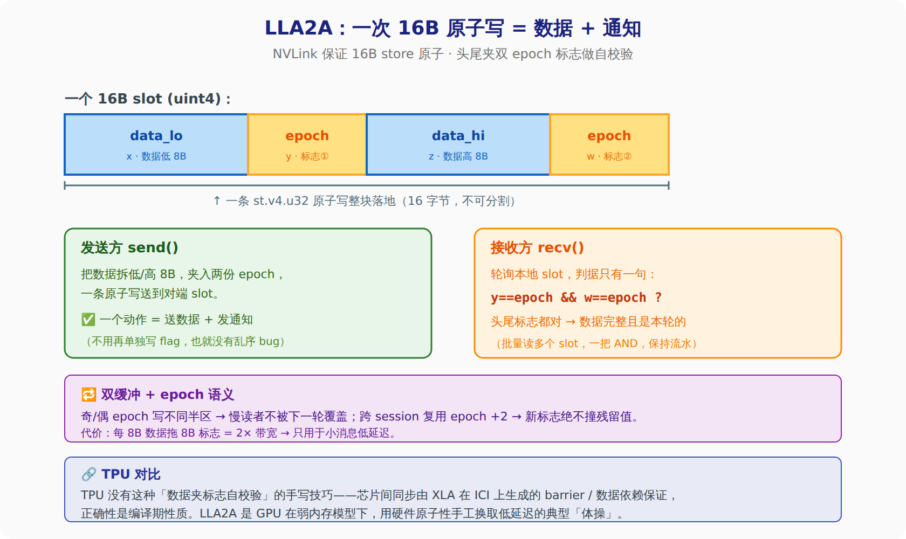
```

</details>

> **本波小结**: LLA2A 是小消息低延迟全交换。核心一招——把 8B 数据和 epoch 标志打包进一个 16B slot（`{data_lo, epoch, data_hi, epoch}`），利用 NVLink 对 16B 写的原子性，**一次原子写同时送数据 + 发通知**，接收方只需查「头尾两份标志都等于本轮 epoch」就确认数据完整。头尾夹两份是自校验防残留；奇偶 epoch 做双缓冲防覆盖；跨轮 +2 防误判。代价是 2× 带宽，故只用于小消息。这是 GPU 在弱内存模型下用硬件原子性换低延迟的典型手艺，TPU 侧对应的正确性由 XLA 编译期保证。

### 10.7 GIN：跨出机器，让 GPU 自己发网络包

前面 LSA 那条腿只在**一台机器内部**跑（NVLink/NVSwitch）。要发到别的机器上，就得走网卡、走 RDMA。这条腿叫 **GIN**。

先摊名词：

- **GIN** = **G**PU-**I**nitiated **N**etworking，GPU 发起的网络通信。就是 NCCL v2.28 那套 Device API 的代号。「GPU 发起」的意思是——**GPU 自己在 kernel 里就能把网络包发出去**，不用像老 NCCL 那样每次都回到 CPU 去调一个发送函数。
- **RDMA** = **R**emote **D**irect **M**emory **A**ccess，远程直接内存访问。网卡直接读写**对端机器的内存**，中间不惊动对端 CPU。这是跨机高速通信的地基。
- **WQE** = **W**ork **Q**ueue **E**ntry，工作队列条目。你想让网卡干活，就往它的队列里塞一张「工单」——工单上写明「把这块内存搬到那台机器的那个地址」。
- **doorbell**（门铃）= 一个寄存器。你塞完工单，敲一下门铃（写这个寄存器），网卡才知道「有活了」，去处理队列。

#### 两种后端：谁来填工单、谁来敲门铃

同样是「GPU 发起」，NCCL 有两种实现，区别就在**填工单 + 敲门铃这两个动作由谁做**：

- **GDA-KI**（GPUDirect Async — Kernel Initiated）：**GPU 自己**在 kernel 里直接填 RDMA 工单、直接敲网卡门铃。全程不碰 CPU。走的是 DOCA / GPUNetIO 那套。延迟最低，但要求网卡和驱动支持这种「GPU 直接指挥网卡」的模式。
- **PROXY**（代理）：GPU 不直接碰网卡。它把一张 128 字节的描述符（**GFD**，GPU 发出的 fabric descriptor）写进一个**环形缓冲区**（ring buffer），旁边有个 **CPU 代理线程**一直盯着这个 ring，看到新描述符就帮忙去调真正的网卡发送（IBRC verbs，也就是 `ibv_post_send` 那套）。多一个中间人，但兼容性好，任何支持标准 RDMA 的网卡都能跑。

> **类比**: GDA-KI 像「GPU 自己走到邮局柜台，自己填单、自己按铃寄件」——快，但要求这家邮局支持自助。PROXY 像「GPU 把要寄的东西和一张填好的单子丢进门口的『代寄篮子』，旁边有个跑腿小哥（CPU 线程）一直盯着篮子，看到就替你跑柜台」——多一趟手，但哪家邮局都认。

#### GIN 提供的动作：put / get / signal / counter / flush

跨机这条腿的操作比 LSA 丰富，因为网络是异步的、要显式管「完成」和「通知」：

- **put**：把本地一块数据写到远端某地址（最常用，dispatch 就是一堆 put）。
- **get**：反过来，从远端读一块回来。
- **putValue**：写一个小立即数过去（不用先准备一整块 buffer）。
- **signal**（`ncclGin_SignalInc`）：给远端的一个计数器 +1。这是**跨机通知**机制——「我给你发完了」，对端轮询这个计数器就知道数据到了。对应 LSA 那条腿里 LLA2A 的「夹在数据里的 epoch 标志」，只是跨机场景下拆成了独立的 signal。
- **counter**（`ncclGin_CounterInc`）：本地完成计数器，用来数「我发出去的 put 完成了几个」。
- **flush**：确保前面发的东西**真的落地了**再往下走。网络是异步的，不 flush 你不知道对方收没收到。

#### Team：给通信划范围

GIN 用 **Team**（`ncclTeam`）来指定「这次通信在哪个范围内做」：

- **ncclTeamTagLsa**：机内范围（其实就退回 NVLink 那条腿）。
- **ncclTeamTagRail**：跨机、但只在**同一条 rail** 上（rail = GB200/GB300 里同号 GPU 连到同一组交换机形成的那条快速轨道）。
- **ncclTeamTagWorld**：全局，所有 rank。

这样上层写 A2A 时，可以对「机内的 peer 走 LSA、跨机的 peer 走 GIN Rail」做分层——这正是 DeepEPv2 Hybrid kernel 的做法。

<details>
<summary>🔧 SVG 架构图：GIN 两种后端 —— 谁填工单谁敲门铃</summary>

```svg
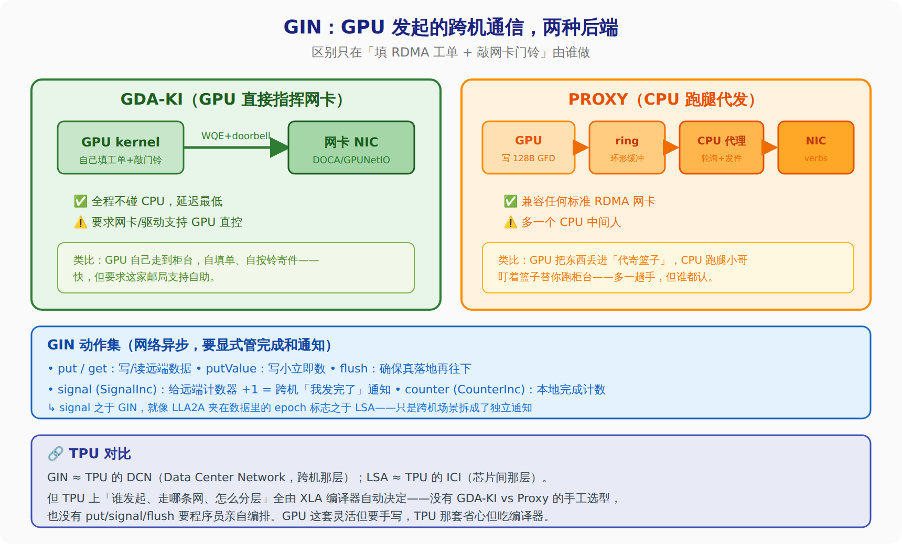
```

</details>

> **本波小结**: GIN = GPU-Initiated Networking，跨机那条腿，让 GPU 在 kernel 里自己把 RDMA 包发出去。两种后端只差「填工单 + 敲门铃谁来做」：**GDA-KI** 是 GPU 自己直控网卡（DOCA，最快，要硬件支持），**PROXY** 是 GPU 写 128B 描述符进 ring、CPU 代理线程代发（最通用）。动作集 put/get/putValue/signal/counter/flush——其中 **signal 给远端计数器 +1，是跨机版的「我发完了」通知**，对应 LSA 里 LLA2A 夹在数据里的 epoch 标志。Team（Lsa/Rail/World）划通信范围，让上层能「机内走 LSA、跨机走 GIN」分层。类比 TPU：GIN≈DCN、LSA≈ICI，但 TPU 那套由 XLA 自动编排，GPU 这套要手写换灵活。

### 10.8 压轴：两条腿拼进一个 Hybrid AlltoAll kernel

前面把两条腿分开讲了——LSA 管机内、GIN 管跨机。现在看它们怎么在**同一个 kernel** 里拼起来，干一件完整的活：**Hybrid AlltoAll**（混合全交换）。NCCL 官方示例在 `docs/examples/06_device_api/03_alltoall_hybrid/main.cu`。

一句话概括这个 kernel 干嘛：每个 rank 要把自己 sendbuf 里的数据，按「哪块给谁」分发到所有其他 rank 的 recvbuf。**同节点的 peer 走 LSA 直写，跨节点的 peer 走 GIN put**——两条腿并行跑，最后一个 barrier 收口。

先补一个名词：**CTA**（Cooperative Thread Array），就是一个**线程块**（thread block）——GPU 上一组绑在一起、能共享 shared memory、能一起同步的线程。这个例子开了 16 个 CTA、每个 CTA 一堆线程，总共 8192 个线程一起干活。

#### 七个阶段（0 到 6），一步步拆

- **阶段 0 · 初始化 + 信号快照**：每个 CTA 用自己的编号 `blockIdx.x` 当作专属的 **signal 槽位**（signalIndex）。进 kernel 第一件事——`readSignal` 记下这个槽位**当前的计数值**当基线。为什么要记基线？因为后面要靠「计数涨了多少」判断收了多少包，得先知道起点。

- **阶段 1 · acquire 屏障（开工前对齐）**：用 world team（全体 rank）+ GIN 做一次 barrier，语义是 `memory_order_acquire`。意思是——**等所有 rank 都进了 kernel、recv buffer 都准备好接收了，本 rank 才开始发**。不然你往对方的 recvbuf 写，对方 kernel 还没启动，就写飞了。

- **阶段 2 · 给跨机 peer 发 GIN put**：8192 个线程联合分片，遍历所有**跨节点** rank，每个远端 put 由某一个线程发起。put 时挂上 `ncclGin_SignalInc{signalIndex}`——告诉网络层「这个 put 到达对端后，在对端那个 signalIndex 槽位上 +1」。这就是跨机的「我发到了」通知。

- **阶段 3 · 给机内 peer 做 LSA store**：用 `ncclGetLsaPointer` 拿到**同节点**其他 rank 的 recvbuf 虚拟地址（NVLink 直达），直接把本地 sendbuf 对应段写过去。注意——这里**不需要**每次都单独发通知，机内的可见性由最后阶段 6 的 release barrier 统一保证。

- **阶段 4 · 接收端等 GIN put 到齐**：挑唯一一个 CTA 负责等待本 rank 的槽位，`waitSignal` 一直等到计数 = `基线 + 跨机 peer 数`。到这个数，就说明所有该收的跨机包都到了。（机内那条腿不在这等，它靠 barrier 收口。）

- **阶段 5 · flush 网络**：`gin.flush` 确保本 CTA 发出去的所有 GIN 操作在**网卡侧真正排空**，没有未决请求挂着。前面说过网络异步，不 flush 你不敢往下走。

- **阶段 6 · release 屏障（收工同步）**：再来一次 barrier，语义 `memory_order_release`——把本 rank 完成的**所有 LSA 写入发布给所有 peer**，同时同步 LSA 和 GIN 双方。这一步做完，主机端 `cudaStreamSynchronize` 回来后，recvbuf 里的全部内容（不管来自 NVLink 还是 RDMA）就都齐了、都可见了。

> **两条腿的通知机制不一样，这点最值得记**：跨机 GIN 用**显式 signal 计数**（阶段 2 挂 SignalInc、阶段 4 waitSignal）；机内 LSA 不逐个通知，靠**头尾两个 barrier**（阶段 1 acquire 开工、阶段 6 release 收工）统一保证可见性。前者精确到「收了几个」，后者是「大家都到齐了才放行」。一个是点对点回执，一个是集体哨声。

<details>
<summary>🔧 SVG 架构图：Hybrid AlltoAll kernel 七阶段时间线</summary>

```svg
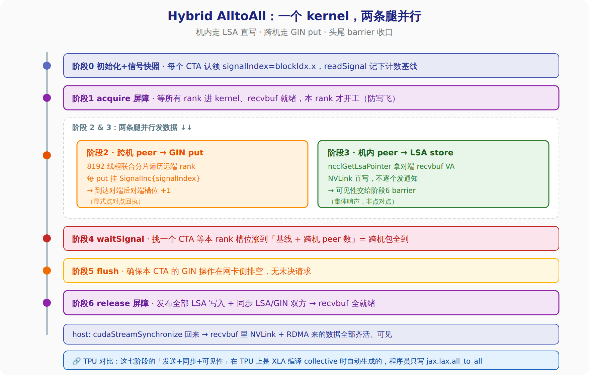
```

</details>

#### 回接 DeepEPv2：地基和上层打通

现在把这篇「地基」接回本文前九节讲的 DeepEPv2：

- DeepEPv2 的 **dispatch**（把 token 按 router 结果散到各 expert 所在 rank）和 **combine**（算完再收回来），本质就是 **AlltoAll**——正是这个 kernel 干的事。
- DeepEPv2 V2 用 **NCCL Gin 当后端**，它的 Hybrid kernel「机内 NVLink 汇聚 + 跨机 RDMA 回源」的两层结构，就是上面**阶段 2/3 两条腿**的放大版：机内 peer 走 LSA、跨机 peer 走 GIN。
- 前面第九节那张对比表里「Hierarchical combine = NVLink 汇聚 + RDMA 回源」这一行，现在你知道底下具体是**怎么用对称 VA + LSA store + GIN put** 实现的了。

> **本波小结（也是全章小结）**: Hybrid AlltoAll kernel 用七个阶段把两条腿拼成一次完整全交换——阶段0 记信号基线、阶段1 acquire barrier 对齐开工、阶段2 给跨机 peer 发 GIN put（挂 SignalInc 通知）、阶段3 给机内 peer 做 LSA 直写（不逐个通知）、阶段4 waitSignal 等跨机包到齐、阶段5 flush 排空网卡、阶段6 release barrier 发布可见性。**两条腿通知机制不同是精髓**：GIN 用显式 signal 计数（点对点回执），LSA 用头尾 barrier（集体哨声）。这正是 DeepEPv2 dispatch/combine 底下的地基——机内 NVLink + 跨机 RDMA 的分层全交换。整篇对照 TPU：GPU 这套「对称 VA + 手写两条腿 + 手工 barrier/signal」灵活但要程序员亲自编排，TPU 那套把发送、同步、可见性全塞进 XLA 编译期，你只写一行 `jax.lax.all_to_all`。灵活 vs 省心，这就是两条技术路线最根本的分野。

---

📖 **第十章完**。NCCL Gin & Symmetric Memory 地基篇，从「为什么要设备发起」一路拆到「两条腿怎么拼成一个 Hybrid AlltoAll」，中间过了对称 VA 三步拼装、LSA 机内直写、LLA2A 原子写、GIN 跨机 put。这套地基撑起了本文前九节的 DeepEPv2。

---

## 十一、总纲：从 NCCL 到 DeepEP 到 Hybrid —— 一条演进线

> 换个「演进史」的角度，把前面十章串成一条线。一句话定调：**DeepEP 的出现，是因为通用的 NCCL 对 MoE 这种通信模式「太粗」了，DeepSeek 自己下场写了一个专用的。**

### 11.1 原来 NCCL 怎么做 MoE 通信，缺点在哪

NCCL 是 NVIDIA 的集合通信库，给你的是一套**通用**原语——AllReduce、AllGather、ReduceScatter、AllToAll。MoE 的 dispatch/combine，本质就是一个 **AllToAll**：每张卡都要按 router 的结果，把不同的 token 发给不同卡上的 expert，算完再收回来。

问题是这个通用 AllToAll 用在 MoE 上有**四个硬伤**：

1. **通信要占 SM**——NCCL 传统上用 GPU 的 SM（计算核心）去驱动通信 kernel，通信和计算互相抢资源，没法真正 overlap。
2. **CPU 在关键路径**——老 NCCL 是 host-initiated，每次通信都要绕回 CPU 去 launch。小消息、细粒度的 MoE 场景，CPU launch 开销占比大，延迟难看。
3. **太通用，不懂 MoE 的特殊性**——MoE 的 token 数量是动态的（取决于 router 怎么分）、还要随数据带一堆路由元信息（topk_idx / topk_weight / 源地址）。通用 API 对这些一律不管。
4. **对两层拓扑不敏感**——机内是 NVLink、机器之间是 RDMA，带宽差一个数量级。通用 collective 不会自动帮你做「同一份数据跨机只发一次、落地了再用机内 NVLink 转发」这种分层省带宽的活。

> **类比**: NCCL 像一家「通用快递公司」，同城、跨城、大件、小件都用同一套标准流程。对偶尔寄件的人够用；但你要是天天有海量、规格特殊的货（MoE 通信），这套通用流程就处处别扭。

### 11.2 DeepEP 的变革 + 优缺点

DeepEP 是 **DeepSeek 开源的、专门做 MoE EP 通信的库**。它不做通用 collective，只专心做 dispatch 和 combine 这一件事，但做到极致。

**四个变革**：

1. **拓扑感知的两层分发**——机内走 NVLink、跨机走 RDMA，且「同一份数据跨机只发一次，落地后机内 NVLink 转发」，省跨机带宽（对应第五节 Forward Warp）。
2. **通信-计算 overlap**——专门的 warp 分工，甚至有零占 SM 的路子（AGRS 用 DMA copy engine），让通信藏在计算后面。
3. **分两种模式**——normal（高吞吐，给训练 / prefill）和 low-latency（低延迟，给 decode），对着 MoE 推理的两个阶段分别调。
4. **设备发起（device-initiated）**——GPU 在 kernel 里自己发通信，CPU 不在关键路径。

| | 优点 | 缺点 |
|---|---|---|
| **专用** | 针对 MoE 极致优化，吞吐 + 延迟都甩通用 NCCL AllToAll 一大截 | 只服务 MoE dispatch/combine，不是万能 |
| **底层** | 直接吃硬件能力（对称内存 / RDMA atomic / DMA engine） | 挑硬件、挑驱动、挑依赖库 |
| **手写** | 灵活，能做任意不规则访问模式 | 弱内存模型下人工管 barrier/signal，复杂、难维护、易踩 race bug |

### 11.3 DeepEP v1 → v2：换地基 + 扩原语

v1 到 v2 最关键的一步是**换地基**：

- **v1 底层用 NVSHMEM**——NVIDIA 另一套 shared memory 通信库，属于额外依赖。
- **v2 底层换成 NCCL Gin**——NCCL v2.28 那套 Device API（GPU-Initiated Networking）。NVIDIA 把「设备发起」直接做进了官方 NCCL，更主流、更好维护；而且 Gin 给一套统一抽象——**一张对称虚拟地址，配两条腿**：机内走 LSA、跨机走 GIN（对应第十章）。

除了换地基，v2 还**扩了原语**：除了 dispatch/combine，又加了 pipeline 的 **PP**、分布式 KV 存储的 **Engram**、零占 SM 的 **AGRS**（对应第四节）。

> **一句话**: v2 = 换了更稳的地基（NVSHMEM → NCCL Gin）+ 加盖了更多楼层（PP / Engram / AGRS）。

### 11.4 Hybrid 到底是什么？跟 DeepEP 什么关系？

**这里要把概念摆正**：Hybrid **不是**另一个库、**不是**别人做的东西。它就是 DeepEP 里 dispatch/combine 的**一种模式**，是 DeepSeek 自己的 DeepEP 的一部分。

DeepEP 有两种工作模式（对应第五节 Direct vs Hybrid 表）：

- **Direct**：单层的。适合单机 8 卡，或者多机但压成一个扁平域来用。
- **Hybrid**：两层的。也就是第十章那节讲的「两条腿」——机内走 NVLink（LSA）、跨机走 RDMA（GIN），中间还有 Forward Warp 负责把跨机收来的数据在机内转发。多机大规模跑 MoE，走的就是 Hybrid。

> **怎么记**: DeepEP 是 DeepSeek 做的专用 MoE 通信库，是**产品名**；Hybrid 是它内部应对多机两层网络那个工作**模式的名字**，不是独立产品。你听到「Hybrid EP」，指的就是 DeepEP 开了 Hybrid 模式在多机上跑，还是同一个 DeepSeek 的东西。

### 11.5 一条线串起来

```
通用 NCCL          →   DeepEP (DeepSeek)   →   v1 → v2         →   Hybrid 模式
太粗 / 占 SM /          专用 / 设备发起 /       换地基            多机两层：
CPU 在关键路径 /        拓扑分层 /              NVSHMEM→NCCL Gin  机内 NVLink +
不懂 MoE /             通信计算 overlap /      + 扩原语          跨机 RDMA
不懂两层网络           训练/推理两种模式        (PP/Engram/AGRS)  (DeepEP 的一副面孔)
```

> **TPU 对照收尾**: GPU 这条线的本质，是「用户手写通信换极致灵活」——从 NVSHMEM 到 NCCL Gin，从 Direct 到 Hybrid，每一步都是程序员在弱内存模型上亲手编排发送、同步、可见性。TPU 走的是另一条路：把这一切塞进 XLA 编译期，你只写一行 `jax.lax.all_to_all`，剩下编译器保证正确性和拓扑映射。**灵活 vs 省心，这就是两条技术路线最根本的分野。**

---

📖 **全文完**。本文从 DeepEPv2 的上层设计（前九章）一路挖到 NCCL Gin 的底层地基（第十章），最后用一条演进线（第十一章）把「为什么会有 DeepEP、它变革了 NCCL 什么、v1→v2 改了什么、Hybrid 是什么」串成整体。
